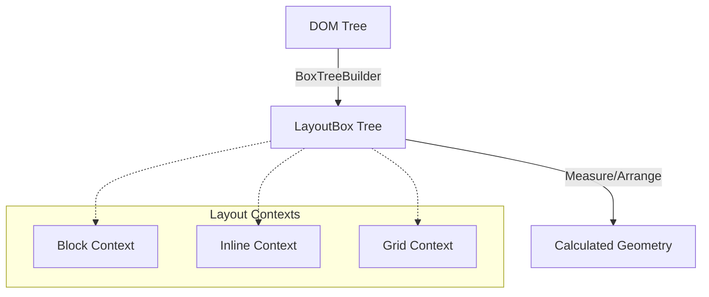
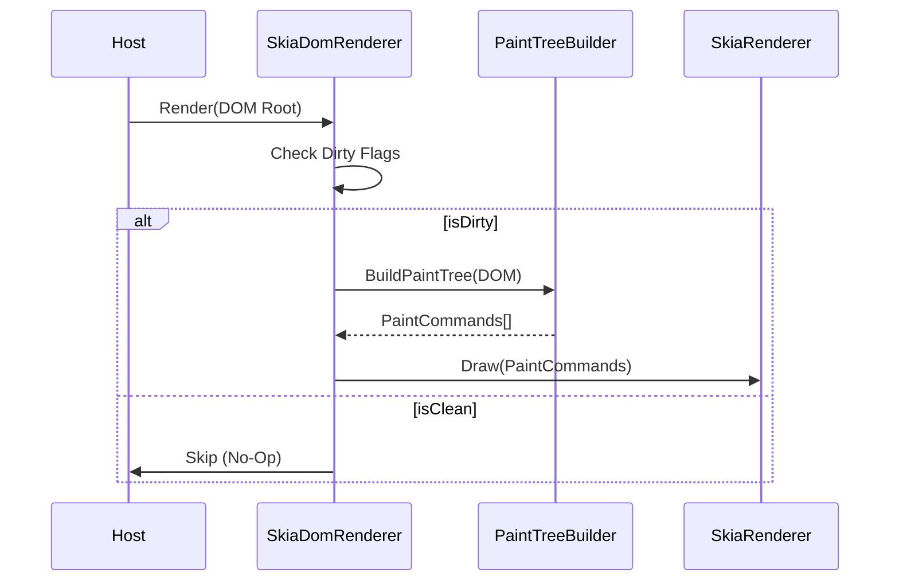

# FenBrowser Codex - Volume III: The Engine Room

**State as of:** 2026-02-27
**Codex Version:** 1.0

## 1. Overview

`FenBrowser.FenEngine` is the core logic assembly of the browser. It is responsible for the entire pipeline from HTML source code to pixels on the screen. It integrates Parsing, Layout, Scripting, and Rendering into a coherent loop.

## 2. The Layout Engine (`FenBrowser.FenEngine.Layout`)

The layout engine acts as a pure function: `(DOM Tree + Styles + Viewport) -> Geometry`.

### 2.1 The Pipeline

1.  **Box Tree Construction**: The `BoxTreeBuilder` traverses the DOM and generates a `LayoutBox` tree.
    - _Note:_ One DOM node can generate multiple boxes (e.g., specific for `display: list-item` markers).
2.  **Context Resolution**: The engine determines the **Formatting Context** for each box.
    - `BlockFormattingContext`: Vertical stacking.
    - `InlineFormattingContext`: Horizontal flow with line breaking.
    - `Grid/Flex`: Advanced 2D layouts.
3.  **Measure & Arrange**:
    - **Measure Pass**: Calculates desired sizes (Intrinsic/Extrinsic).
    - **Arrange Pass**: Assigns final X/Y coordinates relative to the parent.
4.  **Absolute Logic**: The `LayoutEngine` post-processes the tree to calculate absolute screen coordinates for the renderer.

### 2.2 Key Components

- `LayoutEngine.cs`: The facade that drives the process.
- `BoxModel.cs`: The data structure holding the 4 boxes (Content, Padding, Border, Margin).
- `FloatingExclusion`: Manages "floats" (elements taken out of normal flow).

### 2.3 Recent Layout Hardening (2026-02-20, L-8 -> L-10)

- `GridLayoutComputer.Arrange(...)` no longer double-applies content alignment offsets when placing grid items; track starts now remain the single source of aligned origin (`FenBrowser.FenEngine/Layout/GridLayoutComputer.cs`).
- `LayoutHelpers.GetChildrenWithPseudos(...)` fallback behavior for non-element roots now enumerates child nodes instead of returning the fallback node itself, preventing recursive non-element traversal artifacts (`FenBrowser.FenEngine/Layout/Algorithms/LayoutHelpers.cs`).
- `MinimalLayoutComputer.ShouldHide(...)` now keeps `Document` nodes visible to layout traversal so document-root measure/arrange passes can produce descendant box geometry (`FenBrowser.FenEngine/Layout/MinimalLayoutComputer.cs`).
- `TableLayoutComputer.MeasureColumns(...)` now enforces a minimum positive width for participating columns when measurement collapses to zero, preventing invisible/zero-width painted table cells under auto layout (`FenBrowser.FenEngine/Layout/TableLayoutComputer.cs`).
- `TableLayoutComputer` table slot sizing now maps column contributions by `TableCellSlot.ColumnIndex` and distributes rowspan-required height across spanned rows, preventing rowspan edge cases from polluting unrelated column widths or collapsing span height (`FenBrowser.FenEngine/Layout/TableLayoutComputer.cs`).
- `MinimalLayoutComputer.ShouldHide(...)` now keeps core table semantic elements visible and evaluates `ChildNodes` for content presence, preventing text-only table-cell content from being dropped during intrinsic sizing (`FenBrowser.FenEngine/Layout/MinimalLayoutComputer.cs`).
- `InlineLayoutComputer.Compute(...)` now traverses `ChildNodes` (not element-only `Children`) in recursive/default inline flow paths, and `MinimalLayoutComputer` inline measure/re-layout entrypoints now pass pseudo-aware sources; this restores intrinsic sizing for text-only inline/table-cell content (`FenBrowser.FenEngine/Layout/InlineLayoutComputer.cs`, `FenBrowser.FenEngine/Layout/MinimalLayoutComputer.cs`).
- `GridFormattingContext` now delegates box-tree grid layout to `GridLayoutComputer`, removing the legacy simplified explicit-column path and aligning typed computed-style grid behavior (`FenBrowser.FenEngine/Layout/Contexts/GridFormattingContext.cs`), with integration coverage in `FenBrowser.Tests/Layout/GridFormattingContextIntegrationTests.cs`.
- Replaced-element fallback sizing now propagates SVG `viewBox` intrinsic dimensions through inline/block/flex/positioning fallback paths, preventing icon-style SVG controls from inflating to 300x150 when explicit CSS size is missing (`FenBrowser.FenEngine/Layout/ReplacedElementSizing.cs`, `LayoutPositioningLogic.cs`, `Contexts/InlineFormattingContext.cs`, `Contexts/BlockFormattingContext.cs`, `Contexts/FlexFormattingContext.cs`).
- Inline SVG sizing now treats material-icon coordinate viewBoxes (e.g. `0 -960 960 960`) as icon-scale fallback when no explicit dimensions are present, preventing 960x960 hit-target inflation that caused accidental navigations on Google-like pages (`FenBrowser.FenEngine/Layout/ReplacedElementSizing.cs`, `Layout/MinimalLayoutComputer.cs`).
- Layout integration regressions were hardened against parser tree-shape variability by using robust descendant discovery and stable `GetBox(...)` lookups in:
  - `FenBrowser.Tests/Layout/Acid2LayoutTests.cs`
  - `FenBrowser.Tests/Layout/TableLayoutIntegrationTests.cs`.
- Owner verification for the layout tranche on 2026-02-20 confirmed:
  - `GridFormattingContextIntegrationTests`: 2/2 pass
  - `FenBrowser.Tests.Layout`: 90/90 pass.

### 2.4 Standards Hardening (2026-02-25)

- `WPTTestRunner.RunSingleTestAsync(...)` now fails fast when no navigator delegate is configured, returning deterministic `CompletionSignal="no-navigator"` and avoiding false timeout-based failures in verification pipelines (`FenBrowser.FenEngine/Testing/WPTTestRunner.cs`).
- `CssLoader` container-query flatten/evaluation now supports width+height axes, top-level logical operators (`and` / `or` / `not`), range comparisons (`width >= 640px`, `1200px > width`), and chained range syntax (`400px <= width <= 900px`) with `px`/`em`/`rem`/`%` units (`FenBrowser.FenEngine/Rendering/Css/CssLoader.cs`).
- Container-query condition pre-processing now preserves logical-negation forms (`not (...)`) while still stripping optional container names, preventing false negatives in negated condition evaluation (`FenBrowser.FenEngine/Rendering/Css/CssLoader.cs`).
- `ParseRules(...)` now threads viewport height through container-query evaluation so height-based container conditions can affect cascade outcomes (`FenBrowser.FenEngine/Rendering/Css/CssLoader.cs`).
- `CssLoader` parsed-rule caching now keys by CSS text + viewport dimensions, preventing viewport-specific `@container`/media flatten results from being reused across incompatible viewport runs (`FenBrowser.FenEngine/Rendering/Css/CssLoader.cs`).
- Html5lib tree-builder entity-content regression now validates text nodes via `ChildNodes` (DOM-standard node list) rather than `Children` (element-only list), aligning verification with DOM V2 node-model semantics (`FenBrowser.Tests/Html5lib/Html5libTreeBuilderTests.cs`).
- `CssValueParser.ParseNumeric(...)` now distinguishes scientific notation from unit suffixes by requiring exponent digits after `e/E`; values like `1.5em` no longer mis-parse as invalid exponent tokens and now produce typed length values (`FenBrowser.FenEngine/Rendering/Css/CssValueParser.cs`).
- Benchmark regression tests now resolve fixture scripts from multiple workspace-relative candidates and treat absent benchmark fixtures as optional (early return), removing machine-specific hard failures from non-benchmark CI/local runs (`FenBrowser.Tests/Engine/BenchmarkTests.cs`).
- Added regression coverage:
  - `FenBrowser.Tests/Engine/CssContainerQueryTests.cs`
  - `FenBrowser.Tests/Engine/WptTestRunnerTests.cs`
- CSS syntax parser hardening (2026-02-26):
  - `CssSyntaxParser` now parses `@font-face { ... }` into `CssFontFaceRule` with descriptor declarations.
  - malformed declaration recovery at the declaration parser now explicitly consumes invalid declaration remainder to keep parser progress deterministic.
  - custom-property declaration names now preserve authored case (`--MyVar` remains `--MyVar`) while standard property names stay normalized to lowercase.
  - parser safety caps now bound stylesheet expansion under hostile inputs:
    - `MaxRules` (default `200000`) caps emitted rules per parse.
    - `MaxDeclarationsPerBlock` (default `8192`) caps declaration count per block and skips remaining malformed/overflow declarations safely.
  - `CssLoader` now exposes centralized `ActiveParserSecurityPolicy` and applies CSS parser limits at all stylesheet parse entrypoints.
  - inline style declaration parsing (`CssLoader.ParseDeclarations`) now uses top-level-aware scanning, so semicolons/colons inside functions and quoted values (for example `url(data:image/svg+xml;...)`) no longer break declaration boundaries.
  - global custom-property storage in `CssLoader` is now case-sensitive (`StringComparer.Ordinal`) to match CSS variable semantics.
  - `SelectorMatcher` parsing now enforces malformed-selector progress guarantees and parse-complexity caps:
    - hard forward-progress guard in selector-chain parsing to prevent zero-advance loops on hostile tokens,
    - selector recursion-depth and selector-length caps for nested functional pseudo-class arguments.
- Renderer hardening (2026-02-26):
  - `SkiaDomRenderer` now sanitizes viewport dimensions before layout (`NaN`, `Infinity`, non-positive values fallback to defaults; extreme values clamp to safe maximum), preventing invalid geometry propagation into layout/paint paths.
  - `SkiaDomRenderer` now exposes `RendererSafetyPolicy` and a render-thread watchdog that:
    - measures paint/raster/frame timing against policy budgets,
    - logs over-budget stages with explicit reasons,
    - optionally skips raster work when budget is already exceeded before raster begins (fail-safe path).
  - regression coverage:
    - `FenBrowser.Tests/Engine/CssSyntaxParserTests.cs`
    - `FenBrowser.Tests/Engine/CssCustomPropertyEdgeCaseTests.cs`
    - `FenBrowser.Tests/Core/RendererViewportHardeningTests.cs`
    - `FenBrowser.Tests/Rendering/RenderWatchdogTests.cs`
    - `FenBrowser.Tests/Engine/ParserSecurityPolicyIntegrationTests.cs`

---

## 3. The Rendering Pipeline (`FenBrowser.FenEngine.Rendering`)

Rendering is the process of converting the Layout Tree into Skia draw commands.

### 3.1 SkiaDomRenderer

The main entry point (`Render()` method).

- **Re-entrancy Guard**: Prevents recursive paint calls.
- **Dirty Checks**: Optimally skips layout if no relevant state changed.
- **Layering**: Coordinates the `InputOverlay` system (native controls for `<input>`) on top of the Skia canvas.

### 3.2 The Paint Tree

Unlike the Layout Tree (which is about geometry), the Paint Tree is about **Z-Order** and **Stacking Contexts**.

- **NewPaintTreeBuilder**: Converts layout boxes into a flat list of draw commands, sorted by CSS `z-index` and painting order rules (background -> border -> content -> outline).

#### 3.2.1 Rendering Updates (2026-02-16)
- Gradient backgrounds are parsed into `SKShader` instances during paint-node creation (`FenBrowser.FenEngine/Rendering/PaintTree/NewPaintTreeBuilder.cs:1440-1570`), enabling linear/radial gradients in the new pipeline.
- Stacking contexts now carry `filter`/`backdrop-filter`; `SkiaRenderer` parses them via `CssFilterParser` and applies Skia save-layers (`SkiaRenderer.cs:198-245`, `SkiaRenderer.cs:275-286`).
- Input placeholders honor `::placeholder` computed color/opacity when rendering (`NewPaintTreeBuilder.cs:2290-2335`).
- Animated GIFs are decoded frame-by-frame with `SKCodec` (including `RequiredFrame` compositing) and cached in `ImageLoader` (`FenBrowser.FenEngine/Rendering/ImageLoader.cs:650-870`). A 50 ms timer calls `RequestRepaint` directly, and `SkiaDomRenderer.Render` forces paint-dirty whenever `HasActiveAnimatedImages` is true (`SkiaDomRenderer.cs:280-302`), enabling in-paint GIF animation without re-layout.
- Engine targets `net8.0` (solution unified via global.json).
- Web-compat guardrail: site/domain/class-specific styling hooks are prohibited in UA/layout/cascade paths; fixes must land as generic standards behavior with regression coverage (`Rendering/Css/CssLoader.cs`, `Rendering/UserAgent/UAStyleProvider.cs`, `Layout/MinimalLayoutComputer.cs`).
- Paint/Compositing tranche PC-1 (2026-02-20):
  - `RenderPipeline` now enforces strict transition invariants (`Idle -> Layout -> LayoutFrozen -> Paint -> Composite -> Present -> Idle`) and records frame-budget telemetry.
  - `SkiaDomRenderer` now explicitly enters `Present` phase before frame close and integrates invalidation-burst stabilization for paint-tree rebuild decisions.
  - `PaintDamageTracker` computes viewport-clamped damage regions from paint-tree deltas with bounded region-collapse policy.
  - Regression suites added:
    - `FenBrowser.Tests/Rendering/RenderPipelineInvariantTests.cs`
    - `FenBrowser.Tests/Rendering/PaintCompositingStabilityControllerTests.cs`
    - `FenBrowser.Tests/Rendering/PaintDamageTrackerTests.cs`.
- Paint/Compositing tranche PC-1.1 regression hardening (2026-02-20):
  - `FontRegistry` now evaluates full `@font-face` source fallback chains (`local(...)` entries first, then `url(...)` entries in order), stabilizing local-font resolution in rendering paths.
  - Pseudo generated-content flow now keeps pseudo text content synchronized when pseudo instances are reused (`Layout/MinimalLayoutComputer.cs`, `Core/Dom/V2/PseudoElement.cs`).
  - CSS loader UA fallback now searches both `Assets/ua.css` and `Resources/ua.css` paths and includes `mark` fallback defaults to prevent style regressions when runtime asset lookup differs (`Rendering/Css/CssLoader.cs`).
- Paint/Compositing tranche PC-1.2 font-load determinism (2026-02-20):
  - `FontRegistry.RegisterFontFace(...)` now starts `LoadFontFaceAsync(...)` directly (removes additional `Task.Run` scheduling race around pending-load tracking).
  - Local font probing now attempts style-specific family resolution with plain-family fallback to reduce false negatives on host font backends.
- Paint/Compositing tranche PC-2 damage-region consumption (2026-02-20):
  - Added `DamageRasterizationPolicy` gate for safe partial-raster usage (base-frame required + bounded damage area/region count).
  - Added `SkiaRenderer.RenderDamaged(...)` clip-based damage redraw path.
  - Host recording path now seeds from previous frame before engine render so partial-raster updates can be applied without stale background clears (`FenBrowser.Host/BrowserIntegration.cs`).

### 3.3 Backend (`SkiaRenderer`)

A stateless drawer that takes the Paint Tree and executes SkiaSharp API calls (`canvas.DrawRect`, `canvas.DrawText`).

---

## 4. The Scripting Engine (`FenBrowser.FenEngine.Scripting`)

FenBrowser runs a custom JavaScript environment integration.

### 4.1 JavaScriptEngine

A massive facilitator class that bridges the JS runtime (Jint/V8 abstraction) with the C# DOM.

- **DOM Bindings**: Implements standards like `document.getElementById`, `element.addEventListener`.
- **Event Loop**: Drives the browser pulse via `RequestAnimationFrame` and `SetTimeout`.
- **Sandboxing**: Enforces permissions (network, sensors) via `SandboxBlockRecord`.

### 4.2 BrowserHost (in `BrowserApi.cs`)

The high-level controller used by the UI.

- Implements `IBrowser` interface.
- Manages **Navigation History** (Back/Forward).
- Handles **Resource Loading** coordination.
- TLS handling: `BrowserHost` records certificate details and respects `NetworkConfiguration.IgnoreCertificateErrors` (default: strict/false) so production builds remain secure-by-default; explicit opt-in is required to bypass.
- Provides **WebDriver** hooks for automation.
- Navigation interactive lifecycle detail now carries parser-stage telemetry:
  - `tokenizing`, `parsing`, `parse`, `tokens`,
  - `tokenizeCheckpoints`, `parseCheckpoints`, `domParseCheckpoints`, `docReadyToken`, `parseRepaints`,
  - `streamPreparse`, `streamCheckpoints`, `streamRepaints`,
  - `interleaved`, `interleavedBatch`, `interleavedChunks`, `interleavedFallback`.

### 4.3 Parse Pipeline Telemetry (2026-02-20)

- `CustomHtmlEngine.RunDomParseAsync(...)` now runs parser via:
  - `HtmlTreeBuilder.BuildWithPipelineStages(PipelineContext.Current)`.
- `RenderTelemetrySnapshot` now includes parse internals:
  - `TokenizingMs`, `ParsingMs`, `TokenizingAndParsingMs`, `ParseTokenCount`,
  - `TokenizingCheckpointCount`, `ParsingCheckpointCount`, `ParsingDocumentCheckpointCount`, `DocumentReadyTokenCount`, `ParseIncrementalRepaintCount`,
  - `StreamingPreparseMs`, `StreamingPreparseCheckpointCount`, `StreamingPreparseRepaintCount`,
  - `InterleavedParseUsed`, `InterleavedTokenBatchSize`, `InterleavedBatchCount`, `InterleavedFallbackUsed`.
- Parse performance log lines now expose staged parse timing and checkpoint counts, improving diagnosis of token-heavy pages.
- Incremental parse repaint path now emits bounded partial repaint checkpoints from parse callbacks using cloned DOM snapshots to avoid concurrent mutable-tree rendering.
- DOM `Element.CloneNode(...)` now copies attributes via `SetAttributeUnsafe(...)` during internal clone operations so parser-produced non-XML attribute names do not throw and destabilize incremental parse repaint snapshots (`FenBrowser.Core/Dom/V2/Element.cs`).
- Streaming preparse path is now integrated for large documents as a controlled pre-commit assist phase (bounded checkpoints + repaints), while final DOM correctness remains anchored to the production tree builder parse.
- Production parser now supports interleaved tokenize/parse batches for large documents through `HtmlTreeBuilder.InterleavedTokenBatchSize`, and runtime parse policy chooses tiered batch sizes without introducing site-specific behavior.
- Runtime parser integration now retries with interleaving disabled if an interleaved parse attempt fails, preserving production parser correctness and surfacing the event via `interleavedFallback` telemetry.

### 4.4 JavaScript Runtime Bytecode-Only Mainline (2026-02-27)

- `Core/FenRuntime.cs`
  - `ExecuteSimple(...)` now enforces bytecode-only execution.
  - compile-unsupported scripts now return explicit bytecode-only errors (no AST interpreter fallback).
  - prototype hardening script execution routes through bytecode path.
- `Core/FenFunction.cs`
  - AST-backed user function invocation is rejected in bytecode-only mode.
  - user-defined function invocation uses VM thunk (`CallFromArray`) for bytecode-backed closures.
- `Core/ModuleLoader.cs`
  - module execution path now compiles and runs modules via bytecode VM.
  - module dependency binding/import namespace setup and export extraction are performed in bytecode flow.
- `Scripting/JavaScriptEngine.cs`
  - `ExecuteFunction` delegate now invokes through `FenFunction.Invoke(...)` bytecode path.
- `Core/Bytecode/VM/VirtualMachine.cs`
  - AST-backed call/construct fallback helpers were removed from call/construct opcodes.
  - call/construct on AST-backed functions now fail with explicit bytecode-only errors.
- `DevTools/DevToolsCore.cs`
  - console/debug expression evaluation now compiles and executes via bytecode VM against paused/global scope.

---

## 5. Interaction Model

### 5.1 Hit Testing

The engine supports a "Reverse Pipeline" to detect which element is under the mouse.

- **Process**: `HitTest(x, y)` traverses the Paint Tree (top-down visual order) to find the topmost element.
- **Events**: The `BrowserHost` captures OS mouse events and dispatches them to the DOM via `JavaScriptEngine.DispatchEvent`.

### 5.2 Scroll Management

- `Rendering/Interaction/ScrollManager` honors CSS `scroll-snap-type` on both axes and `scroll-snap-align` on children, choosing the nearest snap target and animating via smooth scrolling.
- Snap target selection now keeps X/Y candidate sets separate, applies container `scroll-padding-*` and child `scroll-margin-*` offsets, and uses recent input direction/velocity as a tie-breaker before snapping.
- `NewPaintTreeBuilder` now wires scroll-state bounds from live descendant geometry and invokes snap resolution during scrollable paint-tree construction, so snap behavior is active in the renderer path instead of remaining helper-only.
- Paint-tree snap invocation now requires recent (time-bounded) scroll input hints, preventing stale deltas/velocities from triggering late snaps after unrelated frames.

### 5.3 Input Overlays

Because drawing text inputs via Skia is complex (cursor, selection, IME), the engine renders `<input>` elements as **Native Overlays** floating above the browser canvas. The `SkiaDomRenderer` calculates their position during layout and reports it to the Host UI.

### 5.4 Recent Interaction Hardening (2026-02-07)

- `BrowserApi.DispatchInputEvent(...)` now runs click activation through `HandleElementClick(...)` for all click targets (not only anchor default-action fallback), ensuring focus/default behavior is applied consistently for controls.
- Focus synchronization now occurs on both `mousedown` and `click` paths, preventing host/input-sequencing differences from dropping focus.
- Cursor initialization and typing now handle `contenteditable="true"` elements using `TextContent`, in addition to `<input>/<textarea>`, reducing "click but cannot type" regressions on modern DOM structures.
- Pointer input dispatch now executes immediately (instead of being queued), and `mousemove` updates `ElementStateManager` hover chain with repaint trigger, restoring `:hover` visual feedback and interactive responsiveness.
- `Rendering/Interaction/ScrollManager` now guards null element access in scroll-state APIs, preventing `ArgumentNullException (Parameter 'key')` during paint-tree build when scroll queries receive a transient null element.
- `Rendering/BrowserApi.HandleElementClick(...)` now forces native control default activation (`input`, `textarea`, `button`, `select`, and `contenteditable`) even when wrapper-level script handlers call `preventDefault()`, restoring reliable focus/typing and form submit behavior on modern script-heavy pages.
- `Rendering/BrowserApi` now exposes viewport-space DOM fallback hit testing (`HitTestElementAtViewportPoint(...)`) so host integration can recover click targets when paint-tree `NativeElement` is transiently unavailable.

---

## 6. Comprehensive Source Encyclopedia

This section maps **every key file** in the FenEngine library, covering the Layout, Rendering, and Scripting subsystems.

### 6.1 Layout Subsystem (`FenBrowser.FenEngine.Layout`)

#### `MinimalLayoutComputer.cs` (Lines 1-2976)

The implementation of the User Agent CSS and Layout Algorithms.

- **Lines 57-191**: **Style Computation**: `GetStyle` resolving UA defaults and explicit styles.
- **Lines 1536-1833**: **`ArrangeBlockInternal`**: The core Block formatting context algorithm.
- **Lines 2373-2404**: **`MeasureBlock`**: Determines intrinsic sizes.
- **Lines 2661-2765**: **`ShouldHide`**: Visibility logic (`display: none`, `visibility: hidden`).

#### `GridLayoutComputer.cs` (Lines 1-1011)

CSS Grid implementation.

- **Lines 113-366**: **`ComputePlacements`**: The auto-placement algorithm (sparse/dense).
- **Lines 485-585**: **`Measure`**: Track sizing (fr/auto/px).

#### `InlineLayoutComputer.cs` (Lines 1-980)

Inline Formatting Context (Text & Inline-Block).

- **Lines 31-940**: **`Compute`**: Handles line breaking, bidi reordering, and float exclusions.
- **Lines 100-220, 240-360**: `FlushLine` now applies `text-overflow: ellipsis` by trimming overflowing runs and appending an ellipsis glyph within the available band, honoring container fonts.

#### `FlexFormattingContext.cs` (Lines 1-1640)

Flex formatting context (row/column).

- **Lines 40-476**: Measurement, intrinsic probing, and main-axis grow/shrink resolution for flex items.
- **Lines 436-463, 1254-1420**: Collapsed flex-item recovery now handles near-zero widths and uses deep descendant extents to restore control/icon clusters that would otherwise collapse in intrinsic probe passes.
- **Lines 493-852**: Wrap logic splits items into flex lines, supports `flex-wrap: wrap` and `flex-wrap: wrap-reverse`, and positions lines in cross-axis order. Per-line `justify-content` and auto margins are applied; align-items `stretch` reflows children to the line's cross size.
- **Lines 881-1165**: `ResolveContainerDimensions` covers explicit/percent/expression sizing, min/max constraints, and intrinsic fallbacks for controls/replaced elements under flex sizing.
- **Lines 1124-1143**: Replaced-element fallback sizing in flex containers is normalized through shared `ReplacedElementSizing` logic.

#### `Contexts/InlineFormattingContext.cs` (Lines 1-948)

Inline formatting context for text runs and atomic inline boxes.

- **Lines 322-385**: Final atomic placement now re-layouts controls/replaced inline candidates with final size inputs and enforces monotonic line-item ordering to prevent post-measure overlap.
- **Lines 427-463**: `TryLayoutReplacedInlineBox` applies intrinsic replaced-element sizing with proper box-model sync.
- **Lines 740-763**: Replaced inline tags (`img`, `svg`, `canvas`, `video`, `iframe`, `embed`, `object`) now resolve via shared `ReplacedElementSizing` policy.
- **Lines 598-626**: `ShouldRelayoutAtomicInline` identifies intrinsic/replaced inline candidates (`input`, `button`, `img`, `svg`, etc.) for final stabilization.
- **Lines 897-929**: `ResolveContextWidth` now prefers containing-block width for unconstrained probes and subtracts non-content spacing before final content width assignment.

#### `Contexts/BlockFormattingContext.cs` (Lines 1-600)

Block formatting context implementation for vertical flow and floats.

- **Lines 114-183**: Float placement now iterates float-exclusion bands (`GetAvailableSpace`) so multiple `float:left`/`float:right` siblings pack into the same row correctly instead of anchoring at identical X positions.
- **Lines 114-121, 548-551**: Auto-width floated blocks now probe with unconstrained child measurement while keeping a finite initial content width, enabling shrink-to-fit text measurement instead of zero-width/full-width mis-sizing.
- **Lines 216-245**: In-flow block placement now consults active float exclusions; explicit-width blocks are advanced below floats when the current band is too narrow.
- **Lines 109-131**: Right-float placement now clamps unresolved/probe widths to avoid negative-X placement during shrink-to-fit passes.
- **Lines 224-253**: Shrink-to-fit auto-width pass computes widest in-flow child width while ignoring out-of-flow descendants.

#### `Contexts/FloatManager.cs` (Lines 1-86)

Maintains float occupancy bands for BFC placement and clearance.

- **Lines 15, 75-84**: Added `HasFloats` and `GetNextVerticalPosition(...)` to drive exclusion-aware placement loops in `BlockFormattingContext` without ad-hoc Y stepping.

#### `ReplacedElementSizing.cs` (Lines 1-229)

Shared replaced-element sizing policy used by minimal/block/inline/flex/positioned paths.

- **Lines 14-33**: Defines supported replaced tags and spec-aligned fallback sizes (300x150 family defaults).
- **Lines 35-88**: Provides reusable length-attribute parsing and SVG `viewBox` intrinsic size extraction.
- **Lines 90-157**: Resolves used size from CSS specified dimensions, attributes, intrinsic dimensions, and optional auto-width constraint.
- **Lines 159-229**: Encodes aspect-ratio precedence (`aspect-ratio` property, then intrinsic ratio, then attribute ratio, then fallback ratio).

#### `LayoutEngine.cs` (Lines 1-383)

The public facade for the layout system.

- **Lines 63-153**: **`ComputeLayout`**: Orchestrates the 2-pass Measure/Arrange protocol.
- **Lines 296-360**: **`HitTest`**: Converts physical coordinates (x,y) back to DOM nodes.

#### `BoxTreeBuilder.cs` (Lines 1-520)

**Core Pipeline Stage**. Converts DOM Nodes to Layout Boxes.

- **Lines 80-150**: **`BuildBox`**: Determines if a node needs a box (`display != none`).
- **Lines 200-250**: **`CreateAnonymousBlocks`**: Fixes malformed block/inline hierarchies.
- **Lines 210-221**: Custom elements (tag names containing `-`) now default to inline display in the absence of author CSS, matching UA default behavior used by major engines.

#### `BoxModel.cs` (Lines 1-120)

Data structure representing the CSS Box Model (Content, Padding, Border, Margin).

#### `FloatExclusion.cs` (Lines 1-220)

Manages the geometry of floating elements (`float: left/right`) and collision detection.

#### `ContainingBlockResolver.cs` (Lines 1-250)

Determines the reference rectangle for sizing calculations (handling `position: absolute/fixed`).

#### `MarginCollapseComputer.cs` (Lines 1-180)

Implements the complex CSS margin collapsing rules for Block contexts.

#### `TableLayoutComputer.cs` (Lines 1-600)

Implements HTML Table layout (Auto and Fixed algorithms).

#### `TextLayoutComputer.cs` (Lines 1-400)

Handles text measurement, shaping (via Skia), and line height calculations.

### 6.2 CSS Subsystem (`FenBrowser.FenEngine.Rendering.Css`)

#### `CssParser.cs` (Lines 1-500)

Implements the primary CSS parser path with broad CSS Syntax support, including Media Queries Level 4 range-context forms used in responsive stylesheets.
- `CssLoader` background shorthand extraction is now function-aware for complex color tokens (e.g. `oklab(...)`, modern `rgb(... / ...)`) and honors last-layer color semantics in multi-layer backgrounds.
- `CssParser.ParseColor(...)` now accepts modern CSS Color 4 space/slash `rgb()/rgba()` syntax (for example `rgb(10 20 30 / 50%)`) in addition to legacy comma syntax.

- **Lines 50-120**: **`ParseStylesheet`**: Top-level entry point.
- **Lines 200-300**: **`ParseRule`**: Handles selectors and declarations.
- **Lines 350-450**: **`ConsumeBlock`**: Tokenizer consumption logic for `{ ... }`.

#### `CssLoader.cs` (Lines 1-3900+)

Builds computed style objects from cascaded declarations and applies compatibility overrides used by the layout pipeline.

- Enforces standards-first compatibility: no domain/class-specific style rewrites in computed-style generation.
- Cascade-stage compatibility interventions now flow through a centralized behavior-class registry (no site/domain keys), with kill-switch and metrics support (`Compatibility/WebCompatibilityInterventions.cs`).

#### `SelectorMatcher.cs` (Lines 1-1100+)

Runtime selector matcher used by cascade matching and selector specificity selection.

- Selectors-4 tranche CSS-1 (2026-02-20):
  - `:nth-child(...)` and `:nth-last-child(...)` now support `of <selector-list>` filtering in match evaluation.
  - `:has(...)` now evaluates full relative selector chains (`>`, `+`, `~`, descendant) using combinator-aware traversal from the anchor element.
  - `:empty` now follows selector semantics (comments ignored; text/element children disqualify).
  - Attribute selector parser now uses quote-aware bracket/operator scanning with robust value/flag extraction (`i` / `s` parsing support; `i` applied as case-insensitive comparison).
- Parser hardening tranche CSS-2 (2026-02-26):
  - selector-chain parser now force-advances on malformed tokens to guarantee progress under random/hostile selector input.
  - selector parsing now applies recursion-depth, selector-list, and selector-length caps to prevent runaway nested pseudo-selector parsing.

#### `Compatibility/WebCompatibilityInterventions.cs` (Lines 1-290)

Central compatibility intervention subsystem.

- Provides behavior-class keyed intervention registration (`WebCompatibilityBehaviorClass`) and pipeline stage routing (`WebCompatibilityPipelineStage`).
- Enforces centralized execution via `WebCompatibilityInterventionRegistry` with:
- global enable/disable switch (`FEN_COMPAT_INTERVENTIONS` environment variable),
- per-intervention evaluation/application/skip metrics,
- expiry gating for auto-retirement workflow.

### 6.3 Rendering Subsystem (`FenBrowser.FenEngine.Rendering`)

#### `BrowserApi.cs` (Lines 1-2446)

The monolithic Interface Layer between Host and Engine.

- **Lines 187-2440**: **`BrowserHost`**: Manages the `EngineLoop`, Navigation, and DOM connectivity.
- **Lines 597-883**: **`NavigateAsync`**: The central navigation controller.
- **Lines 1110-1119**: **`Pulse`**: Drives the Event Loop (Tasks and Microtasks).
- Navigation hardening tranche NL-1 (2026-02-20):
  - integrated deterministic lifecycle transitions through `NavigationLifecycleTracker`
  - removed forced `window.load` fallback dispatch from top-level navigation correctness path
  - removed delayed repaint (`Task.Delay(1500)`) correctness fallback and replaced with lifecycle-driven progression.
- Navigation hardening tranche NL-2 (2026-02-20):
  - response lifecycle transitions now carry redirect metadata from fetch pipeline (`Redirected`, `RedirectCount`)
  - commit lifecycle transitions now carry commit-source classification (`network-document`, `error-document`, `synthetic-history`)
  - interactive lifecycle detail now includes staged render telemetry (parse/css/visual/script/total timings)
  - complete lifecycle is no longer immediate post-render; it waits for bounded subresource/event-loop settle signals.
- Navigation hardening tranche NL-3 (2026-02-20):
  - `FontRegistry` now exposes deterministic pending-load state (`PendingLoadCount`, `PendingLoadCountChanged`)
  - lifecycle completion settle-gate now includes pending webfont loads in addition to image/event-loop state.
- Navigation hardening tranche NL-4 (2026-02-20):
  - `BrowserApi` now wraps render-phase CSS/image fetch delegates with navigation-scoped subresource accounting.
  - completion settle gate now includes navigation-local render subresource pending count (`renderSubresourcesPending`) to avoid cross-navigation bleed.
- Navigation hardening tranche NL-5 (2026-02-20):
  - `BrowserApi` now marks active render navigation scope and tracks external script/module fetches in the same navigation-scoped subresource counter used by completion settle gating.
  - top-level `Complete` transition now closes only after render-time script/module/CSS/image/font dependency classes are settled (or timeout-annotated).

#### `SkiaRenderer.cs` (Lines 1-839)

The final painting stage.

- **Lines 52-99**: **`Render`**: Entry point for drawing a Paint Tree to a Skia canvas.
- **Lines 151-286**: **`DrawNode`**: Recursive visitor processing Display List commands.
- **Lines 515-615**: **`DrawText`**: Text rendering with anti-aliasing.

#### `RenderCommands.cs` (Lines 1-503)

The Display List command definitions.

- Defines `DrawRect`, `DrawText`, `DrawImage`, `SaveLayer` (opacity/blending).

#### `CustomHtmlEngine.cs` (Lines 1-1419)

Alternative legacy/wrapper engine for specialized environments.

- **Lines 1065-1283**: **`RenderAsync`**: Direct HTML-to-Visual pipeline.
- `RenderTelemetrySnapshot` now captures staged render timings (`TokenizingAndParsingMs`, `CssAndStyleMs`, `InitialVisualTreeMs`, `ScriptExecutionMs`, `PostScriptVisualTreeMs`, `TotalRenderMs`) for navigation lifecycle telemetry wiring.

### 6.3 Scripting Subsystem (`FenBrowser.FenEngine.Scripting`)

#### `JavaScriptEngine.cs` (Lines 1-3570)

The custom logic runtime and bridge.

- **Lines 515-708**: **`SetupPermissions`**: Sandbox security enforcement.
- **Lines 1311-1340**: **`RequestAnimationFrame`**: Timing loop implementation.
- **Lines 1141-1254**: **Event Dispatch**: Bridge between internal C# events and JS `DispatchEvent`.

#### Recent Hardening Notes (2026-02-06)

- `ElementWrapper.focus()` and `ElementWrapper.blur()` now update `document.activeElement` and dispatch non-bubbling focus/blur events through the DOM event pipeline.
- `LayoutEngine` debug tree dump markers now log at debug level instead of error level to reduce false-positive error noise in runtime diagnostics.
- `ErrorPageRenderer` SSL and connection templates were normalized to ASCII-safe literals to prevent mojibake artifacts in `dom_dump.txt` and rendered text diagnostics.
- `EngineLoop` now drains V2 dirty flags (`Style`, `Layout`, `Paint`) through a deadline-checked tree traversal, reducing repeated stale-dirty frame churn.
- `CSSStyleDeclaration.Keys()` in `ElementWrapper` now enumerates parsed inline style property names, fixing empty-key enumeration in JS style reflection paths.
- `BrowserApi` now registers rendered text length and active DOM node count from `GetTextContent()` into `ContentVerifier`, aligning verification metrics with exported `rendered_text_*.txt` output.
- `CssAnimationEngine.StartAnimation` now handles comma-separated `animation-name` lists and index-aligned animation sub-properties, resolving false `Keyframes not found` logs for multi-animation declarations (e.g., `fillunfill, rot`).
- `BoxTreeBuilder` now enforces closed-`
` behavior at box construction time (`details:not([open]) > :not(summary)`), preventing hidden disclosure descendants from entering the Box Tree.
- `MinimalLayoutComputer` now applies closed-`
` visibility rules for direct children in `ShouldHide`, and routes `DETAILS` measurement through `MeasureDetails` to avoid incorrect flow sizing.
- `Layout.Algorithms.LayoutHelpers.ShouldHide` now mirrors the same closed-`
` rule so delegated `BlockLayoutAlgorithm` passes do not reintroduce hidden disclosure children into measured layout flow.
- Closed-`
` suppression now resolves parent via `ParentElement` or `ParentNode as Element` across `BoxTreeBuilder`, `LayoutHelpers`, and `MinimalLayoutComputer`, closing a path where direct text/comment adjacency could bypass disclosure hiding.
- `BoxTreeBuilder` and `MinimalLayoutComputer.ShouldHide` now drop whitespace-only text nodes for non-inline, non-`pre*` containers, preventing indentation/newline nodes from inflating block/flex heights.
- `Rendering.Interaction.HitTester` now ignores non-hit-testable candidates (`pointer-events:none`, `visibility:hidden/collapse`, `display:none`) before selecting a target, reducing overlay interception and restoring clicks to underlying controls.
- `Rendering.Interaction.HitTester` now also excludes `hidden` elements and fully transparent (`opacity:0`) elements from hit eligibility, preventing invisible overlays from stealing hover/click focus.
- `Rendering.BrowserApi.DispatchInputEvent` now syncs pointer hits into BrowserApi focus state on `mousedown`, including promotion from wrapper containers to descendant editable controls (`input`/`textarea`/`contenteditable`) so typing works after click in modern wrapped search fields.
- `Interaction.InputManager.ProcessEvent(...)` now resolves hit-test targets for `mouseup` (and touch move/end) in addition to down/move/click, so DOM `mouseup` reliably dispatches to controls and JS click state machines no longer miss release-phase events.
- `NewPaintTreeBuilder` single-line fallback text now early-returns for whitespace-only runs and uses resolved draw bounds without mutating `box.ContentBox`, removing ghost fallback text nodes and stabilizing paint geometry.
- `FenEngine.HTML.HtmlTreeBuilder` now uses `SetAttributeUnsafe` during tree construction (active-formatting reconstruction and element insertion paths), aligning parsed-HTML attribute preservation with Core parser semantics.
- `Core.Parser.ParseImportExpression` now parses `import(...)` using argument-list semantics instead of grouped-expression semantics, fixing false `expected ... RParen` parse errors in dynamic-import tests.
- `Core.Parser` module syntax handling now correctly accepts and advances `export * from ...`, `export * as <IdentifierName> from ...`, and `import { default as x } from ...` forms by treating `IdentifierName` tokens (including keywords like `default`) as valid export/import names where grammar allows them.
- `Testing.Test262Runner` now parses `flags` metadata (`onlyStrict`, `noStrict`, `async`) and applies `onlyStrict` by injecting a strict directive in the test prelude, improving conformance setup parity for strict-mode Test262 cases.
- `Core.Lexer.ReadIdentifier` now advances after successful `\uHHHH` escape decoding, preventing accidental re-consumption of the final hex digit in escaped identifiers.
- `Layout.LayoutHelper.GetRenderableTextContent*` now excludes non-renderable text containers (`style`, `script`, `template`, `noscript`) from intrinsic control-label measurement, preventing style/script text from inflating `<button>` intrinsic widths.
- `Layout.LayoutPositioningLogic` and `Layout.MinimalLayoutComputer` now use `GetRenderableTextContentTrimmed(...)` for button intrinsic-label fallbacks, keeping control width heuristics aligned across legacy and formatting-context paths.
- `Contexts.InlineFormattingContext` now re-layouts atomic inline/replaced controls before final line placement and applies a monotonic post-pass to prevent overlap when intrinsic widths expand after probe measurement.
- `Contexts.FlexFormattingContext` now recovers near-zero row-item widths using deep descendant extents (not only direct children), fixing collapsed control clusters and footer link groups under intrinsic probe passes.
- `Contexts.BlockFormattingContext` now clamps right-float placement when probe-time container width is unresolved, preventing transient negative-X anchor placement in header action rows.
- `Contexts.BlockFormattingContext` now performs exclusion-band float placement for both left and right floats, applies float intrusion constraints to in-flow blocks, and advances explicit-width blocks below floats when required inline space is unavailable.
- `Layout.ReplacedElementSizing` now centralizes replaced-element used-size resolution (CSS width/height and `aspect-ratio`, HTML attributes, intrinsic dimensions, and 300x150-family fallbacks), and `MinimalLayoutComputer`, `InlineFormattingContext`, `FlexFormattingContext`, and `LayoutPositioningLogic` now consume this shared policy to avoid cross-context sizing drift.
- `Contexts.FloatManager` now exposes `HasFloats` and `GetNextVerticalPosition(...)` to support deterministic float band stepping and avoid overlap loops.
- `Rendering.Css.CssLoader` removed domain/class-specific compatibility rewrites (Google/WhatIsMyBrowser style injections); compatibility fixes must come from standards-compliant parser/cascade/layout behavior.
- `Compatibility.WebCompatibilityInterventionRegistry` added as the single intervention execution point (behavior-class keyed, metrics-backed, kill-switchable, and expiry-aware), and is wired into `CssLoader.ResolveStyle(...)` for cascade-stage compatibility controls.
- `Scripting.JavaScriptEngine` removed the deprecated blocking `SetDomAsync(...).Wait()` bridge and now uses a non-blocking compatibility wrapper (`SetDom(...)`) with fault logging.
- `Scripting.JavaScriptEngine` added async module-graph prefetch + in-memory module-source cache so module resolution avoids sync network bridging in the module loader callback path.
- `Tests/Engine/JavaScriptEngineModuleLoadingTests.cs` adds regression coverage for:
  - non-blocking deprecated `SetDom(...)` bridge behavior
  - static module dependency prefetch execution (`main.js` -> `dep.js`) without sync fetch bridging.
- `Workers.WorkerRuntime` now prefetches static literal `importScripts(...)` dependency graphs during worker script load and executes imports from prefetched cache, removing sync async-bridging from `importScripts` execution path.
- `Tests/Workers/WorkerTests.cs` adds `WorkerRuntime_ImportScripts_ReusesPrefetchedSourceAcrossRepeatedImports` to lock cache reuse behavior (single fetch, repeated execution).

#### `JavaScriptEngine.Dom.cs` (Lines 1-1203)

The DOM bindings (JS Objects wrapping C# Components).

- **Lines 399-906**: **`JsDomElement`**: Implements element properties and methods (`innerHTML`, `setAttribute`).

#### `CanvasRenderingContext2D.cs` (Lines 1-800)

Bridge for the `<canvas>` 2D API.

- **Lines 100-300**: **`DrawImage`**: Interop with SkiaSharp for bitmap rendering.
- **Lines 400-500**: **`FillRect/StrokeRect`**: Geometry primitives.

#### `ModuleLoader.cs` (Lines 1-200)

Handles `import` / `export` ES6 module resolution.

- **Lines 50-100**: **`ResolvePath`**: Normalizes relative paths.

#### `ProxyAPI.cs` (Lines 1-100) & `ReflectAPI.cs` (Lines 1-150)

Implementation of JS Proxy/Reflect built-ins.

### 6.6 Supplemental Files (Gap Fill)

#### Layout Infrastructure (`FenBrowser.FenEngine.Layout`)

- **`LayoutResult.cs`**: The output object of a layout pass.
- **`LayoutValidator.cs`**: Debugging assertions for layout integrity.
- **`ScrollAnchoring.cs`**: Prevents scroll jumps during layout reflows.
- **`TransformParsed.cs`**: Parsed representation of CSS `transform` matrices.
- **`Contexts/BlockFormattingContext.cs`**: Manages float exclusion zones and margin collapse state.
- **`Contexts/InlineFormattingContext.cs`**: Manages line boxes and text runs.
- **`Coordinates/ViewportPoint.cs`**: Struct for converting betwen Page/Client/Screen coordinates.
- **`Tree/LayoutBox.cs`**: The base node for the layout tree (replaces RenderObject).
- **`Tree/AnonymousBox.cs`**: Boxes generated by the engine (e.g., surrounding raw text in a block).
- **`Algorithms/BidiAlgorithm.cs`**: Unicode Bidirectional Algorithm implementation (partial).

#### Rendering Utils (`FenBrowser.FenEngine.Rendering`)

- **`InputOverlay.cs`**: Manages native text inputs hovering over canvas.
- **`LayerBuilder.cs`**: Optimizes z-index sorting for the paint tree.
- **`DirtyRects/DamageTracker.cs`**: Tracks which parts of the screen need repainting.

#### Generic Utilities

- **`MiniJs.cs`**: Removed (2026-02-27) during bytecode-only runtime consolidation.
- **`JsRuntimeAbstraction.cs`**: Interface for swapping JS engines (V8/Jint).

_End of Volume III_

### 6.7 Test262 Hardening Notes (2026-02-10)

- `Core/Lexer.cs`: Expanded identifier start/part classification for broader Unicode coverage (including `Other_ID_Start`/`Other_ID_Continue` and surrogate tolerance for astral identifiers).
- `Core/Parser.cs`: Added script-goal early-error checks (`import`/`export`), top-level `return` rejection, `new.target` context validation, and stricter `super`/private-identifier context checks.
- `Core/Parser.cs`: Added async/generator nesting context tracking and stricter `yield`/`await` parsing constraints.
- `Core/Parser.cs`: Enforced rest-element placement/initializer rules in binding-pattern validation.
- `Core/ModuleLoader.cs`: Parser created with module goal (`isModule: true`) for module source parsing.
- `Core/Parser.cs`: Added class-element early-error validation sweep (duplicate constructors/private names, `#constructor` bans, static `prototype` bans, `super()` placement checks, `super.#name` and `delete` private-reference checks, class-field `Contains(super())`/`Contains(arguments)` checks, and stricter method/accessor parameter early-errors).
- `Core/Parser.cs`: Added nested private-name scope tracking for class parsing and broadened `extends` parsing to accept general superclass expressions.
- `Testing/Test262Runner.cs`: Parse-phase `SyntaxError` negatives now treat any parser-produced parse error as pass, avoiding false negatives from diagnostic text mismatch.

### 6.4 Contributor Cookbook: Implementing a New CSS Property

So you want to add `border-radius`? Follow these steps:

1.  **Define the Property**:
    - Add the property key to `FenBrowser.Core.Css.CssPropertyNames`.
    - Add the storage field to `FenBrowser.Core.Css.CssComputed` (e.g., `public CssLength? BorderRadius { get; set; }`).

2.  **Parse the Value**:
    - In `FenBrowser.FenEngine.Css.CssParser.ParseProperty`, add a `case` for your property.
    - Use helper methods like `ParseLength` or `ParseColor`.

3.  **Apply to Layout**:
    - In `MinimalLayoutComputer.GetStyle`, ensure the computed value is read from the matched rules.
    - Update `ArrangeBlockInternal` or `DrawNode` to utilize the new value (e.g., passing it to `canvas.DrawRoundRect`).

### 6.5 Quick Reference: API Surface

#### BrowserHost (`FenBrowser.FenEngine.Rendering.BrowserApi`)

| Method               | Description                                | Thread |
| :------------------- | :----------------------------------------- | :----- |
| `NavigateAsync(url)` | Loads a new page.                          | Engine |
| `Resize(w, h)`       | Updates viewport and triggers layout.      | Engine |
| `RecordFrame()`      | Generates a new display list.              | Engine |
| `InputKey(evt)`      | Dispatches keyboard event to focused node. | Engine |
| `Dispose()`          | Cleans up GL context and threads.          | UI     |

### 6.8 Test262 Wave 3 Notes (2026-02-10)

- `Core/Parser.cs`
  - Added nested statement-list tracking to enforce module-only top-level placement for `import`/`export`.
  - Added module early-error sweep for top-level `var`/lexical declaration name collisions.
  - Added module-top-level `yield` early error.
  - Hardened `export default` parsing:
    - proper default `function`/`class`/`async function` handling,
    - rejection of immediate invocation after anonymous default declaration,
    - corrected `class extends` optional-name lookahead.
  - Added support for string `ModuleExportName` forms in import/export specifiers.
  - Added import-attributes parsing (`with { ... }`) for `import ... from` and `export ... from`.
  - Added duplicate key detection in import-attributes object literals.

- `Core/Lexer.cs`
  - Added strict validation for escaped identifier code points; invalid escaped punctuator forms are now tokenized as `Illegal`.

- `Core/ModuleLoader.cs`
  - Added missing-export checks for module named imports and named re-exports.

- `Core/ModuleLoader.cs`
  - Added `ThrowOnEvaluationError` mode (used by Test262 negative-module paths only) to surface module-evaluation error values as exceptions when needed.

- `Testing/Test262Runner.cs`
  - Module-goal detection for Test262 now follows metadata module flags directly.
  - Negative module tests enable strict module-evaluation error surfacing without affecting positive test execution mode.

### 6.9 Test262 Rebaseline Notes (2026-02-11)

- `Core/Lexer.cs`
  - Hardened JS whitespace and line-terminator handling (`CR/LF/LS/PS`, Unicode space separators, BOM) in token skipping and comment scanning.
  - Added unterminated block-comment detection (`/* ... EOF`) to emit `Illegal` token instead of silently accepting EOF.
  - Reworked numeric literal scanner:
    - strict separator placement validation,
    - proper `.DecimalDigits` and dot-leading exponent forms,
    - BigInt shape validation (`0e0n`, leading-zero decimal BigInt forms),
    - identifier-tail rejection after numeric literals.
  - Tightened regex tokenization safety checks for:
    - line terminators inside regex literal bodies,
    - invalid/duplicate regex flags,
    - quantified lookbehind assertion early-error patterns.

- `Core/Parser.cs`
  - Added targeted unary/statement early-error diagnostics for malformed recovery paths:
    - missing unary operand (`typeof = 1`, `void = 1`, etc.),
    - missing throw expression / illegal newline after `throw`,
    - invalid trailing tokens after `break` / `continue`,
    - missing constructor target in `new` expressions,
    - invalid declaration identifier diagnostics in `var`/`let`/`const` declarations.

- `test262_results.md`
  - Added full 52,871-test rebaseline and refreshed 53-chunk table.
  - Current full-suite result: `50,388 / 52,871` passed (`95.30%`).

### 6.10 Parser Control-Flow Hardening (2026-02-14)

- `Core/Parser.cs`
  - Removed double-advance in `ParseProgram` and tightened `ParseBlockStatement` token progression so inner `}` is consumed once, preventing the first token after block-based statements from being skipped (fixes `+=` being misparsed as a prefix in Test262 harness code).
  - `ParseStatement` now routes `var`/`let`/`const` through `ParseLetStatement` and ensures function declarations bind a parsed `FunctionLiteral`, restoring buildable, deterministic statement parsing in Annex B paths.
  - `ParseStatement` now dispatches statement keywords (`try`, `throw`, `for`, `while`, `do`, `break`, `continue`) to their dedicated parsers, eliminating prefix-parse fallthrough errors in Test262 harness control-flow.

### 6.11 Phase-0 Security Hardening (2026-02-18)

- `Rendering/ImageLoader.cs`
  - Removed permissive TLS override in image fetch path (`ServerCertificateCustomValidationCallback => true`).
  - Image network requests now use platform certificate validation by default.

- `Adapters/ISvgRenderer.cs`
  - Aligned default SVG safety limits to project hard constraints:
    - `MaxRecursionDepth = 32`
    - `MaxFilterCount = 10`
    - `MaxRenderTimeMs = 100`

### 6.12 Phase-1 Correctness and Wiring (2026-02-18)

- `Core/ExecutionContext.cs`
  - Fixed default `ScheduleCallback` behavior to invoke callback exactly once after delay (removed duplicate invocation).

- `Core/EventLoop/EventLoopCoordinator.cs`
  - Added explicit `try/finally` phase closure for:
    - task JS execution
    - layout callback phase
    - observer callback phase
    - RAF callback JS execution phase
  - Added idle-phase recovery guard (`EnsureIdlePhase`) to detect and recover from leaked phase state.

- `Rendering/SkiaDomRenderer.cs`
  - Wired `PipelineContext` frame lifecycle into render path:
    - `BeginFrame` / `EndFrame`
    - viewport propagation via `SetViewport`
  - Wired stage snapshots into active style/layout/paint transitions:
    - `SetStyleSnapshot(...)`
    - `SetLayoutSnapshot(...)`
    - `SetPaintSnapshot(...)`
  - Wired corresponding dirty-flag invalidation through `PipelineContext.DirtyFlags` during stage work.

### 6.13 Phase-2 Path Hygiene and Diagnostics Wiring (2026-02-18)

- `Rendering/SkiaDomRenderer.cs`
  - Replaced hardcoded absolute debug artifact path with `DiagnosticPaths.AppendRootText(...)`.

- `Rendering/PaintTree/NewPaintTreeBuilder.cs`
  - Replaced hardcoded absolute debug artifact path with `DiagnosticPaths.AppendRootText(...)`.

- `Layout/LayoutEngine.cs`
  - Replaced hardcoded absolute layout-debug file writes with `DiagnosticPaths.AppendRootText(...)`.

- `Rendering/SkiaRenderer.cs`
  - Replaced hardcoded screenshot target with `DiagnosticPaths.GetRootArtifactPath("debug_screenshot.png")`.
  - `ContentVerifier.RegisterScreenshot(...)` now receives centralized artifact path.

- `Core/FenRuntime.cs`
  - Replaced hardcoded script execution log path with `DiagnosticPaths.GetLogArtifactPath("script_execution.log")`.

- `Rendering/Css/CssLoader.cs`
  - Removed absolute `C:\Users\...` path literals from debug callsites and normalized debug filenames.
  - Routed debug writes through centralized diagnostics helpers.
  - File diagnostics are now compile-gated to debug builds only.

- `Scripting/JavaScriptEngine.cs`
  - Replaced hardcoded `js_debug.log` writes with `DiagnosticPaths.AppendRootText(...)`.

- `WebAPIs/FetchApi.cs`
  - Replaced hardcoded `js_debug.log` writes with `DiagnosticPaths.AppendRootText(...)`.

- `Rendering/CustomHtmlEngine.cs`
  - Replaced hardcoded `dom_dump.txt` write target with `DiagnosticPaths.GetRootArtifactPath("dom_dump.txt")`.

- `Layout/MinimalLayoutComputer.cs`
  - Replaced hardcoded `debug_layout_dims.txt` writes with `DiagnosticPaths.AppendRootText(...)`.

- `Rendering/ImageLoader.cs`
  - Replaced hardcoded SVG debug bitmap write path with `DiagnosticPaths.GetRootArtifactPath("svg_debug_bitmap.png")`.
  - Wrapped SVG debug bitmap file writes in `#if DEBUG` so release builds do not emit ad-hoc artifacts.

- `Rendering/Css/CssLoader.cs`
  - Removed machine-specific absolute UA stylesheet fallback path and replaced it with workspace-relative candidate paths.

### 6.14 Phase-3 Verification Truthfulness (2026-02-18)

- `Testing/WPTTestRunner.cs`
  - Hardened single-test verdict logic: success now requires non-zero assertions plus a completion signal.
  - Added explicit failure modes for:
    - no testharness assertions
    - timeout while waiting for async completion
    - missing completion signals.
  - Completion signal tracking now records whether completion came from:
    - `testRunner.notifyDone`
    - parsed harness-status console output
    - settled `testRunner.reportResult` output.

### 6.15 Phase-5 Storage Wiring (2026-02-18)

- `WebAPIs/StorageApi.cs`
  - Added explicit storage-clear APIs:
    - `ClearLocalStorage(bool deletePersistentFile = true)`
    - `ClearAllStorage(bool deletePersistentFile = true)`
  - `CreateSessionStorage(...)` now partitions storage by runtime instance and origin key to avoid cross-instance bleed.

- `Core/FenRuntime.cs`
  - `sessionStorage` binding now passes current origin provider into `StorageApi.CreateSessionStorage(...)`.

- `Rendering/BrowserApi.cs`
  - `ClearBrowsingData()` now clears storage alongside cookies and cache (`Cookies + Cache + Storage`).

### 6.16 Phase-5 Storage/Policy Wiring - Tranche B (2026-02-18)

- `WebAPIs/StorageApi.cs`
  - Added direct coordinator APIs used by non-DOM callers:
    - local/session `Get*`, `Set*`, `Remove*`, `Clear*`, `GetAll*`
    - `BuildSessionScope(partitionId, origin)` for deterministic session partitioning.

- `DevTools/DevToolsCore.cs`
  - DevTools storage API (`Get/Set/Clear` local/session) now routes through `StorageApi` rather than separate private dictionaries.

- `Scripting/JavaScriptEngine.cs`
  - Legacy local/session storage access paths now route through `StorageApi` with origin + session-scope keys.
  - Added popup policy enforcement for `window.open(...)` in the script-eval bridge path.

- `Core/FenRuntime.cs`
  - `navigator.doNotTrack` now reflects `BrowserSettings.SendDoNotTrack`.
  - Added `window.open` policy gate bound to `BrowserSettings.BlockPopups` with same-window fallback behavior.

### 6.17 Remaining Findings Tranche - Navigation/Module Hardening (2026-02-19)

- `Rendering/NavigationManager.cs`
  - Added explicit navigation intent model:
    - `NavigationRequestKind.UserInput`
    - `NavigationRequestKind.Programmatic`
  - Rooted local-path auto-conversion is now limited to trusted user-input flow.
  - Added `file://` capability gate with automation deny-by-default behavior.

- `Rendering/BrowserApi.cs`
  - Added `NavigateUserInputAsync(...)` path to preserve address-bar normalization while keeping default navigation programmatic.

- `Core/ModuleLoader.cs`
  - Added URI policy callback to allow/deny module loads before content fetch.

- `Scripting/JavaScriptEngine.cs`
- `Scripting/JavaScriptEngine.Methods.cs`
  - Removed raw `HttpClient` fallback for module/script fetch paths.
  - Module content fetch now prefers centralized browser fetch delegates and blocks unsupported fallback paths.

- `Rendering/CustomHtmlEngine.cs`
  - CSP subresource + nonce checks now pass explicit base-document origin context.

### 6.18 Phase-Completion Tranche - WPT Structured Signals and Module Conformance (2026-02-19)

- `WebAPIs/TestHarnessAPI.cs`
  - Added structured execution snapshot API (`GetExecutionSnapshot`) for runner-side completion logic.
  - Added explicit harness-status reporting path (`reportHarnessStatus`) and completion provenance tracking.

- `Testing/WPTTestRunner.cs`
  - Completion loop now prioritizes structured `TestHarnessAPI` signals.
  - Console parsing remains as compatibility fallback only when structured signals are absent.

- `Rendering/BrowserApi.cs`
  - WPT bridge injection now emits structured harness completion via `testRunner.reportHarnessStatus('complete', ...)` before `notifyDone()`.

- `Core/ModuleLoader.cs`
  - Added import-map support (`SetImportMap`) with exact and prefix match resolution.
  - Added extensionless HTTP module normalization (`.js` append for relative module specifiers).

- `Scripting/JavaScriptEngine.cs`
  - Runtime now parses `<script type="importmap">` and applies entries to the core module loader.
  - Added same-origin guard for http(s) module loads when explicit CORS pipeline is not available.

### 6.19 Phase-6 Security/Isolation Hardening (2026-02-19)

- `Core/FenRuntime.cs`
  - Added centralized `NetworkFetchHandler` delegate for runtime-side network operations.
  - Routed runtime `fetch(...)` and XHR construction through centralized network delegate path.
  - Worker constructor wiring now receives worker-script fetch + policy delegates from runtime.

- `WebAPIs/XMLHttpRequest.cs`
  - Removed direct per-request `HttpClient` usage.
  - Added injected network delegate path (`Func<HttpRequestMessage, Task<HttpResponseMessage>>`) as the only send path.

- `Workers/WorkerConstructor.cs`
  - Added strict URL resolution and scheme gating for worker scripts.
  - Non-http(s) script URLs are denied before runtime creation.

- `Workers/WorkerRuntime.cs`
  - Removed raw `HttpClient` and local-file fallback script loading.
  - Added centralized fetcher requirement for worker script bootstrap.
  - Added service-worker fetch-event dispatch path (`DispatchServiceWorkerFetchAsync`).

- `Workers/ServiceWorkerManager.cs`
  - Added injected script fetcher/policy wiring.
  - Service-worker runtime startup now validates/resolves script URLs.
  - `DispatchFetchEvent(...)` now dispatches into runtime instead of hardcoded false.

- `WebAPIs/FetchApi.cs`
  - Added ServiceWorker fetch-event dispatch call prior to normal network fallback.

- `Storage/FileStorageBackend.cs`
  - Added storage path sanitization for origin/database names.
  - Added normalized root-containment assertion to block IndexedDB path traversal.

- `Scripting/JavaScriptEngine.cs`
  - Removed legacy `IndexedDBService.Register(...)` override to preserve runtime `indexedDB` as canonical implementation.

- `Rendering/BrowserApi.cs`
  - Removed eager `ResourceManager` field initialization; now initialized once in constructor path.

### 6.20 Eight-Gap Closure Tranche (2026-02-19)

- `WebAPIs/FetchEvent.cs`
  - Added explicit `respondWith()` lifecycle state:
    - registration wait (`WaitForRespondWithRegistrationAsync`)
    - settlement wait (`WaitForRespondWithSettlementAsync`)
    - fulfilled/rejected/timeout result model (`RespondWithSettlement`).
  - Supports both native `JsPromise` and legacy `__state` promise objects.

- `WebAPIs/FetchApi.cs`
  - Fetch pipeline now extracts fulfilled `respondWith()` values and returns service-worker responses directly.
  - Added fallback behavior for timeout/unrecognized service-worker results.
  - Added rejection propagation when `respondWith()` promise rejects.

- `Workers/WorkerRuntime.cs`
  - Replaced worker idle busy-sleep with event-signaled wait (`AutoResetEvent`) to reduce spin overhead.
  - Service-worker fetch dispatch now waits for `respondWith()` registration window before returning handled state.

- `Workers/WorkerGlobalScope.cs`
- `Workers/ServiceWorkerGlobalScope.cs`
  - Added `addEventListener/removeEventListener/dispatchEvent` handling for worker globals.
  - Service-worker extendable events now dispatch through both `on*` handlers and registered listeners.

- `Rendering/ImageLoader.cs`
  - Removed direct `HttpClient` fetch path.
  - Added centralized byte-fetch delegate (`ImageLoader.FetchBytesAsync`) as the only HTTP image load source.

- `Rendering/BrowserApi.cs`
  - Wired `ImageLoader.FetchBytesAsync` into `ResourceManager.FetchBytesAsync(...)` with `sec-fetch-dest=image`.
  - WebDriver cookie APIs now use `CustomHtmlEngine` cookie jar snapshot/set/delete paths (no separate in-memory cookie dictionary).

- `DOM/DocumentWrapper.cs`
- `Scripting/JavaScriptEngine.cs`
  - Added cookie bridge hooks so `DocumentWrapper` cookie access can route to runtime cookie jar (`CookieBridge`) when available.

- `Core/ModuleLoader.cs`
  - Added stricter module URI validation:
    - disallow non `http/https/file` schemes
    - default block cross-origin `http(s)` module resolution without explicit pipeline support.
  - Security blocks now surface as `UnauthorizedAccessException` (instead of silent fallback).

### 6.21 Completion Pass - Worker/ServiceWorker Conformance and Runtime Hygiene (2026-02-19)

- `Workers/ServiceWorkerManager.cs`
  - Added same-origin script registration validation and normalized scope resolution.
  - Added longest-prefix scope match in `GetRegistration(...)`.
  - Added explicit update/unregister paths with runtime disposal (`UpdateRegistrationAsync`, `UnregisterAsync`).

- `Workers/ServiceWorkerContainer.cs`
  - Added script URL and scope URL normalization/validation in `register(...)` and `getRegistration(...)`.
  - Added same-origin checks for both script and scope handling.

- `Workers/ServiceWorkerRegistration.cs`
  - Implemented `update()` and `unregister()` promise-backed lifecycle methods.

- `Workers/ServiceWorker.cs`
  - Added `statechange` event dispatch with `addEventListener/removeEventListener/dispatchEvent`.
  - `postMessage(...)` now converts payloads via `ToNativeObject()` for primitive-safe transport.

- `Workers/ServiceWorkerGlobalScope.cs`
- `Workers/ServiceWorkerClients.cs` (new)
  - Exposed concrete `clients` object with `claim()`, `matchAll()`, and `openWindow(...)` behavior guards.

- `WebAPIs/FetchEvent.cs`
  - Added `waitUntil(...)` lifetime promise tracking and await helpers for dispatch paths.

- `Workers/WorkerRuntime.cs`
  - Added `importScripts(...)` implementation with same-origin/scheme checks.
  - Service-worker fetch dispatch now waits for `respondWith()` registration and then tracks lifetime promises.

- `Workers/WorkerGlobalScope.cs`
- `Workers/WorkerConstructor.cs`
  - Worker `postMessage(...)` payload conversion now uses `ToNativeObject()` to preserve primitive data.

- `HTML/HtmlTreeBuilder.cs`
  - Initial insertion-mode now sets document quirks mode from doctype detection logic.

- `Interaction/FocusManager.cs`
  - Added tabindex-aware `FindNextFocusable(...)` traversal for keyboard focus movement.

- `Scripting/JavaScriptRuntime.cs`
  - Replaced placeholder wrapper with concrete forwarding runtime over `JavaScriptEngine`.

### 6.22 Pipeline Stage Coverage Hardening (2026-02-20)

- `Rendering/SkiaDomRenderer.cs`
  - Replaced manual `BeginFrame`/`EndFrame` and `BeginStage`/`EndStage` pairs with scoped guards from `PipelineContext`.
  - Added explicit stage coverage for:
    - `PipelineStage.Rasterizing` around `SkiaRenderer.Render(...)`
    - `PipelineStage.Presenting` for overlay/layout callback handoff and frame close.
  - Result: stage closure is exception-safe and runtime stage sequencing now maps to the full render tail (`paint -> rasterize -> present`) instead of stopping at paint.

- `Tests/Engine/PipelineContextTests.cs`
  - Added regression coverage for:
    - frame scope idle closure
    - per-stage timing capture
    - stage closure on exception paths.

### 6.23 CSS/Cascade/Selector Conformance Tranche CSS-1 (2026-02-20)

- `Rendering/Css/SelectorMatcher.cs`
  - Added `nth-child(... of ...)` and `nth-last-child(... of ...)` selector-list filtering support.
  - Reworked `:has(...)` evaluation to combinator-aware relative-chain traversal instead of candidate-only shortcut matching.
  - Corrected `:empty` semantics and improved attribute parsing robustness for quoted values and flags.

- `Tests/Engine/SelectorMatcherConformanceTests.cs` (new)
  - Added regression coverage for:
    - `nth-child(... of ...)` matching
    - attribute flags (`i` / `s`) and quoted `]` handling
    - `:empty` semantics
    - relational `:has(...)` combinator behavior
    - cascade application correctness for `nth-child(... of ...)`.

### 6.24 Layout Auto-Repeat Hardening Tranche L-1 (2026-02-20)

- `Layout/GridLayoutComputer.Parsing.cs`
  - Replaced placeholder `repeat(auto-fill/auto-fit, ...)` expansion path with deterministic auto-repeat count calculation.
  - Auto-repeat count now accounts for:
    - multi-track pattern total breadth,
    - inter-track/internal gap contribution,
    - bounded fallback when track minima are intrinsic/unresolved.
  - Added parser guardrails for delimiter-only tokens (`,` / `)`) to reduce malformed token fallback into implicit auto tracks.

- `Tests/Layout/GridTrackSizingTests.cs`
  - Added layout regressions for:
    - multi-track auto-fill repeat sizing with gaps,
    - unresolved intrinsic auto-repeat fallback behavior.

### 6.25 Layout Row-Sizing Consistency Tranche L-2 (2026-02-20)

- `Layout/GridLayoutComputer.cs`
  - Grid row intrinsic sizing now executes in both measure and arrange paths (row-side `MeasureTracksIntrinsic(..., isColumn: false)`).
  - Arrange path now applies `MeasureAutoRowHeights(...)` before row flex/stretch resolution to preserve content-derived row minima and stable item row offsets.

- `Tests/Layout/GridContentSizingTests.cs`
  - Added regression:
    - `AutoRows_ArrangePreservesContentContributionBeforeStretch`
  - Verifies that arrange pass keeps content-derived auto-row offsets aligned with measured row heights.

### 6.26 Layout Auto-Fit Collapse Tranche L-3 (2026-02-20)

- `Layout/GridLayoutComputer.cs`
  - Added track-level auto-repeat mode metadata (`AutoRepeatMode`).
  - Measure/arrange now collapse unused trailing explicit `auto-fit` repeat tracks based on occupied track extent before track-size distribution.
  - Implicit-track fill now uses occupied-track required count after collapse, preventing collapse rollback.

- `Layout/GridLayoutComputer.Parsing.cs`
  - `repeat(auto-fill/auto-fit, ...)` expansion now tags generated tracks by repeat mode (`Fill` vs `Fit`) for downstream sizing policy.

- `Tests/Layout/GridTrackSizingTests.cs`
  - Added regression:
    - `AutoFit_CollapsesUnusedTrailingTracks_BeforeJustifyContentDistribution`
  - Confirms `auto-fit` behavior diverges from `auto-fill` by collapsing unused trailing repeat tracks before `justify-content` distribution.

### 6.27 Layout Margin Helper Hardening Tranche L-4 (2026-02-20)

- `Layout/MarginCollapseComputer.cs`
  - Removed placeholder implementation in `MarginPair.FromStyle(...)`.
  - Added writing-mode-aware block-axis mapping for margin pairing:
    - `horizontal-tb` -> `top/bottom`
    - `vertical-rl`/`sideways-rl` -> `right/left`
    - `vertical-lr`/`sideways-lr` -> `left/right`.

- `Tests/Layout/MarginCollapseTests.cs`
  - Added regressions:
    - `MarginPair_FromStyle_HorizontalTb_UsesTopAndBottom`
    - `MarginPair_FromStyle_VerticalRl_UsesRightAndLeft`
    - `MarginPair_FromStyle_VerticalLr_UsesLeftAndRight`.

### 6.28 Layout Auto-Repeat Definite-Max Breadth Tranche L-5 (2026-02-20)

- `Layout/GridLayoutComputer.Parsing.cs`
  - Auto-repeat breadth resolution now accepts definite max-track sizing as fallback when min-track breadth is unresolved.
  - Enables deterministic repeat counts for patterns like `repeat(auto-fill, minmax(auto, 120px))` instead of conservative single-repeat fallback.
  - Added helper `TryResolveDefiniteBreadth(...)` for `px`, `%`, and `fit-content(...)` definite breadth extraction.

- `Tests/Layout/GridTrackSizingTests.cs`
  - Added regression:
    - `AutoFill_MinMaxAutoDefiniteMax_UsesDefiniteMaxForRepeatCount`.

### 6.29 Layout Fit-Content Percent Resolution Tranche L-6 (2026-02-20)

- `Layout/GridLayoutComputer.cs`
  - `GridTrackSize` now carries `FitContentIsPercent` to preserve whether `fit-content(...)` originated from percentage tokens.

- `Layout/GridLayoutComputer.Parsing.cs`
  - `fit-content(%)` limits are now resolved against container inline size before sizing/clamp logic consumes them.
  - Prevents percentage limits from being treated as raw unit values in track-limit behavior.

- `Tests/Layout/GridContentSizingTests.cs`
  - Added regression:
    - `FitContent_Percent_ResolvesAgainstContainerWidth`.

### 6.30 Flex Baseline Alignment Tranche L-7 (2026-02-20)

- `Layout/Contexts/FlexFormattingContext.cs`
  - Row cross-axis placement no longer maps `baseline` to `flex-start`.
  - Added per-line baseline synthesis for baseline-participating flex items.
  - Added `ResolveBaselineOffsetFromMarginTop(...)`:
    - uses measured baseline/ascent only for text-backed items,
    - falls back to lower border-edge baseline synthesis for non-text/replaced-like items.
  - Text-baseline eligibility is restricted to direct `TextLayoutBox` / `Text` nodes; element-backed flex items always use synthesized border-edge baseline.
  - Cross-axis auto margins remain higher priority than baseline alignment.

- `Tests/Layout/FlexLayoutTests.cs`
  - Added regressions:
    - `AlignItems_Baseline_UsesItemBaselinesInsteadOfFlexStart`
    - `AlignSelf_Baseline_OverridesContainerCrossAlignment`.

- `Rendering/Css/CssFlexLayout.cs`
  - Legacy/shared flex arrangement path now resolves baseline offsets through `ResolveFlexItemBaselineOffset(...)` for both:
    - line baseline aggregation,
    - per-item baseline placement.
  - Eliminates inconsistent `0.8 * height` heuristic-only alignment for element-backed flex items.

### 6.31 JavaScript Bytecode Core Parity Tranche JS-BC-1 (2026-02-26)

- `Core/Bytecode/Compiler/BytecodeCompiler.cs`
  - Extended binary operator lowering to emit bytecode for:
    - `**`, `!=`, `!==`, `<=`, `>=`.
  - Added literal/expression lowering for:
    - `NullLiteral`
    - `UndefinedLiteral`
    - `ExponentiationExpression`.

- `Core/Bytecode/VM/VirtualMachine.cs`
  - Added execution handlers for missing arithmetic/comparison opcodes:
    - `Divide`
    - `Modulo`
    - `Exponent`
    - `NotEqual`
    - `StrictNotEqual`
    - `LessThanOrEqual`
    - `GreaterThanOrEqual`.
  - This closes a core compiler/VM parity gap where opcodes existed in enum/emit paths but had no VM execution branch.

- `Tests/Engine/Bytecode/BytecodeExecutionTests.cs`
  - Added regressions:
    - `Bytecode_DivideModuloExponent_ShouldWork`
    - `Bytecode_ComparisonVariants_ShouldWork`
    - `Bytecode_NullAndUndefinedLiterals_ShouldWork`.

### 6.32 JavaScript Runtime Bytecode-First Wiring Tranche JS-BC-2 (2026-02-26)

- `Core/FenRuntime.cs`
  - `ExecuteSimple(...)` now prefers `Core/Bytecode` VM execution before interpreter execution.
  - Added compile-time fallback behavior:
    - if bytecode compilation is unsupported for a script, runtime falls back to interpreter path.
  - Added runtime safety guard:
    - when global scope contains interpreter-only function bindings (non-native functions with `BytecodeBlock == null`), call-heavy scripts (`CallExpression`/`NewExpression`) skip bytecode path to avoid VM attempts to execute AST-only function bodies.
  - Added environment toggle:
    - `FEN_USE_CORE_BYTECODE=0|false|off` disables bytecode-first path.
  - Added bytecode path diagnostics to script execution artifact:
    - `[SUCCESS-BYTECODE]`
    - `[BYTECODE-FALLBACK]`
    - `[BYTECODE-RUNTIME-ERROR]`.

- `Tests/Engine/FenRuntimeBytecodeExecutionTests.cs`
  - Added runtime integration regressions:
    - `ExecuteSimple_BytecodeFirst_FunctionDeclarationProducesBytecodeFunction`
    - `ExecuteSimple_CompileUnsupported_UsesInterpreterFallback`
    - `ExecuteSimple_WithInterpreterOnlyGlobals_CallHeavyScriptAvoidsVmPath`.

### 6.33 JavaScript Bytecode Expression Coverage Tranche JS-BC-3 (2026-02-26)

- `Core/Bytecode/Compiler/BytecodeCompiler.cs`
  - Added lowering support for `DoubleLiteral` (numeric constant emission).
  - Added lowering support for ternary `ConditionalExpression` (`condition ? consequent : alternate`) using branch opcodes and value-preserving expression flow.
  - Added lowering support for `NullishCoalescingExpression` (`left ?? right`) via stack-dup + loose-null check (`left == null`) + branch selection.

- `Tests/Engine/Bytecode/BytecodeExecutionTests.cs`
  - Added regressions:
    - `Bytecode_DoubleLiteral_AndConditionalExpression_ShouldWork`
    - `Bytecode_NullishCoalescingExpression_ShouldWork`.

### 6.34 JavaScript Bytecode Control/Assignment Coverage Tranche JS-BC-4 (2026-02-26)

- `Core/Bytecode/Compiler/BytecodeCompiler.cs`
  - Added lowering for update operators:
    - postfix `++` / `--` (`InfixExpression` with null right operand)
    - prefix `++` / `--` (`PrefixExpression`).
  - Added lowering for logical assignment:
    - `LogicalAssignmentExpression` (`||=`, `&&=`, `??=`) with short-circuit branch flow.
  - Added lowering for additional AST nodes:
    - `DoWhileStatement`
    - `BitwiseNotExpression`
    - `EmptyExpression`.

- `Tests/Engine/Bytecode/BytecodeExecutionTests.cs`
  - Added regressions:
    - `Bytecode_UpdateExpressions_ShouldWork`
    - `Bytecode_LogicalAssignment_ShouldWork`
    - `Bytecode_BitwiseNot_AndDoWhile_ShouldWork`.

### 6.35 JavaScript Bytecode Mainline Expansion Tranche JS-BC-5 (2026-02-27)

- `Core/Bytecode/Compiler/BytecodeCompiler.cs`
  - Added comma-operator lowering for `InfixExpression` with `,`:
    - left side is evaluated for side effects,
    - right side value is preserved as expression result.
  - Added `ArrowFunctionExpression` lowering:
    - emits bytecode closures for simple parameter lists,
    - supports expression-bodied arrows via synthetic implicit-return body.
  - Added explicit compile-time guardrails for unsupported complex parameters:
    - rest/default/destructuring parameters intentionally remain fallback-only in bytecode phase.
  - Added callable-body normalization helper used by function/arrow lowering for consistent return semantics.

- `Core/Bytecode/VM/VirtualMachine.cs`
  - `MakeClosure` now preserves function metadata from template to instantiated closure:
    - `IsArrowFunction`, `IsAsync`, `IsGenerator`.
  - `Construct` now rejects arrow functions with TypeError semantics (`Arrow function is not a constructor`).
  - Host-exception translation path now resumes VM execution through installed JS exception handlers (`catch`/`finally`) instead of returning early.

- `Tests/Engine/Bytecode/BytecodeExecutionTests.cs`
  - Added regressions:
    - `Bytecode_CommaOperator_ShouldEvaluateLeftAndReturnRight`
    - `Bytecode_ArrowFunctionExpression_ShouldCall`
    - `Bytecode_ArrowFunction_ConstructShouldThrowTypeError`.

- `Tests/Engine/FenRuntimeBytecodeExecutionTests.cs`
  - Added runtime integration regression:
    - `ExecuteSimple_BytecodeFirst_ArrowFunctionProducesBytecodeFunction`.
  - Updated fallback/guardrail coverage to keep interpreter-only global-function path validated using compile-unsupported class syntax:
    - `ExecuteSimple_CompileUnsupported_UsesInterpreterFallback`
    - `ExecuteSimple_WithInterpreterOnlyGlobals_CallHeavyScriptAvoidsVmPath`.

### 6.36 JavaScript Bytecode Optional Chaining Tranche JS-BC-6 (2026-02-27)

- `Core/Bytecode/Compiler/BytecodeCompiler.cs`
  - Added lowering for `OptionalChainExpression`:
    - `obj?.prop`
    - `obj?.[expr]`
    - `obj?.(args)`.
  - Added explicit nullish short-circuit bytecode flow:
    - if base evaluates to `null` or `undefined`, expression result is `undefined` without evaluating access/call target.
  - Added branch-target patch helper used for optional-chain control-flow wiring.
  - Optional-call path now checks callability and returns `undefined` for non-function targets (behavior parity with interpreter path).

- `Tests/Engine/Bytecode/BytecodeExecutionTests.cs`
  - Added regressions:
    - `Bytecode_OptionalChain_PropertyAndComputed_ShouldWork`
    - `Bytecode_OptionalChain_NullishShortCircuit_ShouldReturnUndefined`
    - `Bytecode_OptionalChain_OptionalCall_ShouldWork`.

### 6.37 JavaScript Bytecode Operator/Template Coverage Tranche JS-BC-7 (2026-02-27)

- `Core/Bytecode/Compiler/BytecodeCompiler.cs`
  - Added operator lowering for:
    - `in`
    - `instanceof`
  - Added prefix lowering for:
    - unary `+` (numeric conversion),
    - `void`,
    - `delete` (member/index targets).
  - Added lowering for `TemplateLiteral` to explicit concatenation bytecode flow.
  - Function template emission now preserves async/generator metadata (`IsAsync`, `IsGenerator`) for function/function-declaration bytecode closures.

- `Core/Bytecode/OpCode.cs`
  - Added opcodes:
    - `InOperator`
    - `InstanceOf`
    - `DeleteProp`
    - `ToNumber`.

- `Core/Bytecode/VM/VirtualMachine.cs`
  - Added execution handling for new operator opcodes.
  - `MakeClosure` now initializes non-arrow function prototype objects (`fn.prototype.constructor = fn`) so bytecode `new` and `instanceof` paths remain consistent.

- `Tests/Engine/Bytecode/BytecodeExecutionTests.cs`
  - Added regressions:
    - `Bytecode_InAndInstanceofOperators_ShouldWork`
    - `Bytecode_VoidDeleteAndUnaryPlus_ShouldWork`
    - `Bytecode_TemplateLiteral_ShouldWork`.

- `Tests/Engine/FenRuntimeBytecodeExecutionTests.cs`
  - Added runtime integration regression:
    - `ExecuteSimple_BytecodeFirst_TemplateLiteralFunctionProducesBytecodeFunction`.

### 6.38 JavaScript Bytecode Switch/Loop Control Tranche JS-BC-8 (2026-02-27)

- `Core/Bytecode/Compiler/BytecodeCompiler.cs`
  - Added lowering for `SwitchStatement` with:
    - strict-equality case matching (`===`) in dispatch checks,
    - default dispatch handling,
    - fallthrough-preserving case body emission,
    - explicit discriminant stack cleanup on matched and unmatched paths.
  - Added lowering for `BreakStatement` and `ContinueStatement` using structured jump-patching contexts.
  - Loop lowering updated to wire continue/break targets consistently across:
    - `WhileStatement`
    - `DoWhileStatement`
    - `ForStatement`
    - `ForInStatement`
    - `ForOfStatement`.
  - Maintained explicit guardrails:
    - labeled `break` / `continue` remain compile-unsupported in bytecode phase,
    - invalid-context `break` / `continue` remain compile-unsupported in bytecode phase (safe fallback path preserved).

- `Tests/Engine/Bytecode/BytecodeExecutionTests.cs`
  - Added regressions:
    - `Bytecode_SwitchStatement_WithFallthroughAndBreak_ShouldWork`
    - `Bytecode_BreakAndContinue_InForLoop_ShouldWork`.

- `Tests/Engine/FenRuntimeBytecodeExecutionTests.cs`
  - Added runtime integration regression:
    - `ExecuteSimple_BytecodeFirst_SwitchControlFunctionProducesBytecodeFunction`.

### 6.39 JavaScript Bytecode Regex/Delete Parity Tranche JS-BC-9 (2026-02-27)

- `Core/Bytecode/Compiler/BytecodeCompiler.cs`
  - Added lowering for `RegexLiteral`:
    - compiles to interpreter-parity regex objects containing `source`, `flags`, and `lastIndex` fields,
    - carries native regex payload on `NativeObject` for downstream API compatibility.
  - Extended `delete` lowering to support identifier operands with current engine-parity behavior (`delete identifier` => `false`).

- `Tests/Engine/Bytecode/BytecodeExecutionTests.cs`
  - Added regressions:
    - `Bytecode_RegexLiteral_ShouldCreateRegexObjectLikeInterpreter`
    - `Bytecode_DeleteIdentifier_ShouldReturnFalse`.

- `Tests/Engine/FenRuntimeBytecodeExecutionTests.cs`
  - Added runtime integration regression:
    - `ExecuteSimple_BytecodeFirst_RegexLiteralFunctionProducesBytecodeFunction`.

### 6.40 JavaScript Bytecode Spread Mainline Tranche JS-BC-10 (2026-02-27)

- `Core/Bytecode/OpCode.cs`
  - Added spread-mainline opcodes:
    - `CallFromArray`
    - `ConstructFromArray`
    - `ArrayAppend`
    - `ArrayAppendSpread`
    - `ObjectSpread`.

- `Core/Bytecode/VM/VirtualMachine.cs`
  - Added execution handlers for all new spread opcodes.
  - `CallFromArray` / `ConstructFromArray` now execute bytecode/native call sites using array-like argument packs.
  - `ArrayAppendSpread` expands array-like sources by `length`; non-array-like values follow interpreter-compatible fallback append behavior.
  - `ObjectSpread` copies enumerable keys from source object into target object.

- `Core/Bytecode/Compiler/BytecodeCompiler.cs`
  - Added spread-aware lowering for:
    - `ArrayLiteral` (`[1, ...arr, 4]`)
    - `CallExpression` (`fn(...args)`)
    - `NewExpression` (`new C(...args)`)
    - `ObjectLiteral` spread (`{ ...obj, k: v }`).
  - Added explicit `SpreadElement` handling path to keep parser-emitted spread nodes from triggering hard compile failure in standalone contexts.

- `Tests/Engine/Bytecode/BytecodeExecutionTests.cs`
  - Added regressions:
    - `Bytecode_ArrayLiteral_WithSpread_ShouldWork`
    - `Bytecode_Call_WithSpread_ShouldWork`
    - `Bytecode_New_WithSpread_ShouldWork`
    - `Bytecode_ObjectLiteral_WithSpread_ShouldWork`.

- `Tests/Engine/FenRuntimeBytecodeExecutionTests.cs`
  - Added runtime integration regression:
    - `ExecuteSimple_BytecodeFirst_SpreadFunctionProducesBytecodeFunction`.

### 6.41 JavaScript Bytecode Labeled Control Tranche JS-BC-11 (2026-02-27)

- `Core/Bytecode/Compiler/BytecodeCompiler.cs`
  - Added `LabeledStatement` lowering with explicit label-context stack tracking.
  - Added labeled `break` lowering:
    - resolves to the nearest matching label and emits patched jumps to that label scope end.
  - Added labeled `continue` lowering:
    - resolves to the nearest matching labeled loop and jumps to loop continue targets,
    - guardrails remain explicit when label is missing or does not reference an iteration statement.
  - Refactored loop lowering (`while`, `do-while`, `for`, `for-in`, `for-of`) into shared emit helpers so unlabeled + labeled control flows use deterministic patching paths.

- `Tests/Engine/Bytecode/BytecodeExecutionTests.cs`
  - Added regressions:
    - `Bytecode_LabeledBreak_OnBlock_ShouldWork`
    - `Bytecode_LabeledContinue_ToOuterLoop_ShouldWork`
    - `Bytecode_LabeledBreak_FromSwitchToOuterLoop_ShouldWork`.

- `Tests/Engine/FenRuntimeBytecodeExecutionTests.cs`
  - Added runtime integration regression:
    - `ExecuteSimple_BytecodeFirst_LabeledControlFunctionProducesBytecodeFunction`.

### 6.42 JavaScript Bytecode NewTarget Tranche JS-BC-12 (2026-02-27)

- `Core/Bytecode/OpCode.cs`
  - Added constructor meta-property opcode:
    - `LoadNewTarget`.

- `Core/Bytecode/VM/CallFrame.cs`
  - Added call-frame slot:
    - `NewTarget` (`FenValue`), reset-safe per frame lifecycle.

- `Core/Bytecode/VM/VirtualMachine.cs`
  - Added `LoadNewTarget` execution behavior.
  - Wired call-frame context routing:
    - `Call` / `CallFromArray` frames set `NewTarget = undefined`.
    - `Construct` / `ConstructFromArray` frames set `NewTarget = constructor function`.

- `Core/Bytecode/Compiler/BytecodeCompiler.cs`
  - Added lowering for `NewTargetExpression`:
    - emits `LoadNewTarget`.

- `Tests/Engine/Bytecode/BytecodeExecutionTests.cs`
  - Added regressions:
    - `Bytecode_NewTarget_InNormalCall_ShouldBeUndefined`
    - `Bytecode_NewTarget_InConstructor_ShouldReferenceConstructor`.

- `Tests/Engine/FenRuntimeBytecodeExecutionTests.cs`
  - Added runtime integration regression:
    - `ExecuteSimple_BytecodeFirst_NewTargetFunctionProducesBytecodeFunction`
      - verifies bytecode function emission and `LoadNewTarget` opcode presence under bytecode-first runtime flow.

### 6.43 JavaScript Bytecode ImportMeta Tranche JS-BC-13 (2026-02-27)

- `Core/Bytecode/Compiler/BytecodeCompiler.cs`
  - Added `ImportMetaExpression` lowering:
    - dispatch now routes `import.meta` AST nodes to bytecode emitter.
  - Added `EmitImportMetaExpression()` helper:
    - emits object creation and stores `url` property as `file:///local/script.js` (parity with current interpreter behavior).

- `Tests/Engine/Bytecode/BytecodeExecutionTests.cs`
  - Added regression:
    - `Bytecode_ImportMeta_ShouldExposeUrl`.

- `Tests/Engine/FenRuntimeBytecodeExecutionTests.cs`
  - Added runtime integration regression:
    - `ExecuteSimple_BytecodeFirst_ImportMetaFunctionProducesBytecodeFunction`
      - verifies function emitted as bytecode under bytecode-first runtime and validates `import.meta.url` execution result.

### 6.44 JavaScript Bytecode IfExpression Tranche JS-BC-14 (2026-02-27)

- `Core/Bytecode/Compiler/BytecodeCompiler.cs`
  - Added `IfExpression` lowering:
    - dispatch now routes `IfExpression` AST nodes to bytecode emitter.
    - new helper `EmitIfExpression(...)` emits branch control-flow and expression result routing.
  - Added `EmitBlockAsExpression(...)` helper:
    - branch blocks now produce expression values directly on stack for bytecode expression contexts.
  - Added explicit safety guardrail:
    - non-expression tail statements in branch blocks remain compile-unsupported in bytecode phase, preserving deterministic interpreter fallback.

- `Tests/Engine/Bytecode/BytecodeExecutionTests.cs`
  - Added regressions:
    - `Bytecode_IfExpression_ShouldEvaluateToBranchValue`
    - `Bytecode_IfExpression_WithoutElse_ShouldReturnNull`.

- `Tests/Engine/FenRuntimeBytecodeExecutionTests.cs`
  - Added runtime integration regression:
    - `ExecuteSimple_BytecodeFirst_IfExpressionFunctionProducesBytecodeFunction`
      - verifies bytecode function emission and branch-value execution in bytecode-first runtime path.

### 6.45 JavaScript Bytecode Async Function Tranche JS-BC-15 (2026-02-27)

- `Core/Bytecode/Compiler/BytecodeCompiler.cs`
  - Added `AsyncFunctionExpression` lowering:
    - async function expressions now compile to bytecode closures with async metadata (`IsAsync = true`).

- `Core/Bytecode/VM/CallFrame.cs`
  - Added call-frame async slot:
    - `IsAsyncFunction` (reset-safe per frame lifecycle).

- `Core/Bytecode/VM/VirtualMachine.cs`
  - Call and spread-call frame setup now propagates async metadata from callee functions.
  - Return handling now preserves async function result shape:
    - explicit and implicit bytecode returns from async frames are wrapped as resolved `JsPromise` values when needed.

- `Tests/Engine/Bytecode/BytecodeExecutionTests.cs`
  - Added regressions:
    - `Bytecode_AsyncFunctionDeclaration_ShouldReturnResolvedPromise`
    - `Bytecode_AsyncFunctionExpression_ShouldReturnResolvedPromise`.

- `Tests/Engine/FenRuntimeBytecodeExecutionTests.cs`
  - Added runtime integration regression:
    - `ExecuteSimple_BytecodeFirst_AsyncFunctionExpressionProducesBytecodeFunction`
      - verifies async bytecode function emission and Promise-shaped runtime completion on bytecode-first path.

### 6.46 JavaScript Bytecode Await Tranche JS-BC-16 (2026-02-27)

- `Core/Bytecode/OpCode.cs`
  - Added async-await opcode:
    - `Await`.

- `Core/Bytecode/Compiler/BytecodeCompiler.cs`
  - Added `AwaitExpression` lowering:
    - emits argument evaluation and `Await` opcode.

- `Core/Bytecode/VM/VirtualMachine.cs`
  - Added `Await` execution behavior:
    - plain values pass through,
    - promise values unwrap fulfilled result or produce error value on rejection,
    - pending promises use bounded microtask/task pumping to settle before fallback to `undefined`.
  - Hardened async return parity:
    - async frame completion now rejects when returning `Error` values and resolves otherwise.

- `Tests/Engine/Bytecode/BytecodeExecutionTests.cs`
  - Added regressions:
    - `Bytecode_AwaitExpression_OnPlainValue_ShouldReturnValue`
    - `Bytecode_AwaitExpression_OnPromiseValue_ShouldUnwrapResult`.

- `Tests/Engine/FenRuntimeBytecodeExecutionTests.cs`
  - Added runtime integration regression:
    - `ExecuteSimple_BytecodeFirst_AsyncAwaitFunctionProducesBytecodeFunction`
      - verifies bytecode emission includes `Await` and validates Promise-shaped async result in bytecode-first runtime flow.

### 6.47 JavaScript Bytecode Async Throw Hardening Tranche JS-BC-17 (2026-02-27)

- `Core/Bytecode/VM/VirtualMachine.cs`
  - Hardened throw-path frame routing:
    - `Throw` handler now resumes execution using frame refetch after exception dispatch.
  - Hardened async exception semantics:
    - uncaught exceptions in async frames now produce rejected Promise results rather than bubbling as host-level uncaught exceptions.

- `Tests/Engine/Bytecode/BytecodeExecutionTests.cs`
  - Added regression:
    - `Bytecode_AsyncThrow_ShouldReturnRejectedPromise`.

- `Tests/Engine/FenRuntimeBytecodeExecutionTests.cs`
  - Added runtime integration regression:
    - `ExecuteSimple_BytecodeFirst_AsyncThrowFunctionProducesRejectedPromise`
      - verifies bytecode-first async throw returns rejected Promise with expected reason payload.

### 6.48 JavaScript Bytecode Node Dispatch Coverage Tranche JS-BC-18 (2026-02-27)

- `Core/Bytecode/Compiler/BytecodeCompiler.cs`
  - Added direct dispatch support for:
    - `BitwiseExpression` (lowered into existing infix/operator bytecode flow),
    - `CompoundAssignmentExpression` (lowered into validated assignment + infix bytecode flow).
  - Added `LowerCompoundAssignment(...)` validation guardrail:
    - accepted operators: `+=`, `-=`, `*=`, `/=`, `%=`, `**=`, `<<=`, `>>=`, `>>>=`, `&=`, `|=`, `^=`,
    - unsupported operators remain explicit compile-unsupported paths.

- `Tests/Engine/Bytecode/BytecodeExecutionTests.cs`
  - Added regressions:
    - `Bytecode_BitwiseExpressionNode_ShouldCompileAndExecute`
    - `Bytecode_CompoundAssignmentExpressionNode_ShouldCompileAndExecute`.

- Coverage snapshot (compiler dispatch over expression/statement AST node set)
  - `AST_NODE_TOTAL=66`
  - `BYTECODE_DISPATCH_SUPPORTED=56`
  - `BYTECODE_DISPATCH_PERCENT=84.85`
  - remaining missing nodes:
    - `ClassExpression`, `ClassProperty`, `ClassStatement`, `ExportDeclaration`, `ImportDeclaration`, `MethodDefinition`, `PrivateIdentifier`, `StaticBlock`, `WithStatement`, `YieldExpression`.

- Verification
  - `dotnet test FenBrowser.Tests/FenBrowser.Tests.csproj --filter FullyQualifiedName~FenBrowser.Tests.Engine.Bytecode.BytecodeExecutionTests -p:RunAnalyzers=false -v minimal` -> Passed `60/60`.
  - `dotnet test FenBrowser.Tests/FenBrowser.Tests.csproj --filter FullyQualifiedName~FenRuntimeBytecodeExecutionTests -p:RunAnalyzers=false -v minimal` -> Passed `15/15`.

### 6.49 JavaScript Bytecode Class/Module/With/Yield Completion Tranche JS-BC-19 (2026-02-27)

- `Core/Bytecode/Compiler/BytecodeCompiler.cs`
  - Added dispatch + emit coverage for previously missing parser-emitted nodes:
    - `ClassExpression`, `ClassProperty`, `ClassStatement`,
    - `ExportDeclaration`, `ImportDeclaration`,
    - `MethodDefinition`, `PrivateIdentifier`,
    - `StaticBlock`, `WithStatement`, `YieldExpression`.
  - Added class lowering helpers for:
    - constructor synthesis + instance field initialization,
    - static field emission,
    - static block execution,
    - class method installation (prototype/static targets),
    - class expression lowering through synthetic class statements.
  - Added module-form lowering helpers for synthetic bindings:
    - `__fen_module_*` import source slots,
    - `__fen_export_*` export targets.
  - Added with-statement lowering to dedicated VM opcodes.

- `Core/Bytecode/OpCode.cs`
  - Added `EnterWith` and `ExitWith`.

- `Core/Bytecode/VM/CallFrame.cs`
  - Added frame-scoped with-environment stack tracking.
  - Added environment swap helper used by with opcode handling.

- `Core/Bytecode/VM/VirtualMachine.cs`
  - Implemented `EnterWith` / `ExitWith` opcode execution.
  - Fixed nested-frame `Halt` behavior to unwind only current frame (implicit-return function/constructor safety).
  - Updated property opcodes (`LoadProp`/`StoreProp`/`DeleteProp`) to resolve via `AsObject()` so function objects participate in property reads/writes (required for class static field/method semantics).

- `Tests/Engine/Bytecode/BytecodeExecutionTests.cs`
  - Added/updated regressions covering class/module/with/yield/private/method/property/static-block paths, including:
    - `Bytecode_ClassStatement_StaticField_ShouldBindOnConstructor`.

- `Tests/Engine/FenRuntimeBytecodeExecutionTests.cs`
  - Added runtime bytecode-first integration regression:
    - `ExecuteSimple_BytecodeFirst_ClassStatementProducesBytecodeConstructor`.

- Coverage snapshot (compiler dispatch over expression/statement AST node set)
  - `AST_NODE_TOTAL=66`
  - `BYTECODE_DISPATCH_SUPPORTED=66`
  - `BYTECODE_DISPATCH_PERCENT=100.00`
  - remaining missing nodes: none.

- Verification
  - `dotnet test FenBrowser.Tests/FenBrowser.Tests.csproj --filter FullyQualifiedName~FenBrowser.Tests.Engine.Bytecode.BytecodeExecutionTests -p:RunAnalyzers=false -v minimal` -> Passed `71/71`.
  - `dotnet test FenBrowser.Tests/FenBrowser.Tests.csproj --filter FullyQualifiedName~FenRuntimeBytecodeExecutionTests -p:RunAnalyzers=false -v minimal` -> Passed `16/16`.

### 6.50 JavaScript Bytecode Rest Parameter + Arguments Parity Tranche JS-BC-20 (2026-02-27)

- `Core/Bytecode/Compiler/BytecodeCompiler.cs`
  - Parameter validation now allows rest parameters for bytecode callables.
  - Destructuring parameters remain compile-unsupported in bytecode phase (deterministic fallback path preserved).

- `Core/Bytecode/VM/VirtualMachine.cs`
  - Added shared function-argument binding used by `Call`, `CallFromArray`, `Construct`, and `ConstructFromArray`.
  - Rest parameter binding now collects trailing call arguments into array-like objects on bytecode frames.
  - Non-arrow bytecode callables now receive `arguments` object semantics (`length`, indexed values, `callee`, `__paramNames__`) aligned with interpreter behavior.

- `Tests/Engine/Bytecode/BytecodeExecutionTests.cs`
  - Added regressions:
    - `Bytecode_RestParameters_ShouldCollectExtraArguments`
    - `Bytecode_FunctionArgumentsObject_ShouldExposeLengthAndIndexedValues`.

- `Tests/Engine/FenRuntimeBytecodeExecutionTests.cs`
  - Added runtime bytecode-first integration regression:
    - `ExecuteSimple_BytecodeFirst_RestParameterFunctionProducesBytecodeFunction`.
  - Updated fallback guardrails to destructuring-parameter compile-unsupported paths:
    - `ExecuteSimple_CompileUnsupported_UsesInterpreterFallback`
    - `ExecuteSimple_WithInterpreterOnlyGlobals_CallHeavyScriptAvoidsVmPath`.

- Coverage snapshot (compiler dispatch over expression/statement AST node set)
  - `AST_NODE_TOTAL=66`
  - `BYTECODE_DISPATCH_SUPPORTED=66`
  - `BYTECODE_DISPATCH_PERCENT=100.00`
  - remaining missing nodes: none.

- Verification
  - `dotnet test FenBrowser.Tests/FenBrowser.Tests.csproj --filter FullyQualifiedName~FenBrowser.Tests.Engine.Bytecode.BytecodeExecutionTests` -> Passed `74/74`.
  - `dotnet test FenBrowser.Tests/FenBrowser.Tests.csproj --filter FullyQualifiedName~FenRuntimeBytecodeExecutionTests` -> Passed `18/18`.

### 6.51 JavaScript Bytecode Destructuring Coverage Expansion Tranche JS-BC-21 (2026-02-27)

- `Core/Bytecode/Compiler/BytecodeCompiler.cs`
  - Removed identifier-only guardrail for declaration destructuring sources (`let/const/var` now lower from general expressions).
  - Added normalization for parser-recovery declaration shape where destructuring arrives as:
    - `DestructuringPattern = AssignmentExpression(pattern, source)`,
    - `Value = null`.
  - Added bytecode lowering for object rest destructuring:
    - rest object built via `MakeObject + ObjectSpread`,
    - consumed keys removed via `DeleteProp`,
    - rest target then bound through existing destructuring-target pipeline.
  - Added bytecode lowering for array rest destructuring:
    - loop over `[startIndex, length)` with `LessThan` and `ArrayAppend`,
    - rest array bound through existing destructuring-target pipeline.
  - Added computed object-key destructuring lowering in binding paths.
  - Extended supported-pattern validator to allow:
    - array/object rest targets,
    - computed object destructuring keys (when computed-key AST mapping exists).

- `Tests/Engine/Bytecode/BytecodeExecutionTests.cs`
  - Added regressions:
    - `Bytecode_DestructuringDeclaration_ShouldBindFromExpressionSource`
    - `Bytecode_DestructuringObjectRest_ShouldCollectRemainingProperties`
    - `Bytecode_DestructuringArrayRest_ShouldCollectRemainingElements`
    - `Bytecode_DestructuringComputedKey_ShouldResolveRuntimeKey`.

- `Tests/Engine/FenRuntimeBytecodeExecutionTests.cs`
  - Added runtime bytecode-first regression:
    - `ExecuteSimple_BytecodeFirst_DestructuringParameterWithObjectRestProducesBytecodeFunction`.
  - Updated compile-fallback guardrail tests to a still-unsupported bytecode construct (`break` outside breakable context in function body), preserving explicit interpreter-fallback validation:
    - `ExecuteSimple_CompileUnsupported_UsesInterpreterFallback`
    - `ExecuteSimple_WithInterpreterOnlyGlobals_CallHeavyScriptAvoidsVmPath`.

- Coverage snapshot (compiler dispatch over expression/statement AST node set)
  - `AST_NODE_TOTAL=66`
  - `BYTECODE_DISPATCH_SUPPORTED=66`
  - `BYTECODE_DISPATCH_PERCENT=100.00`
  - remaining missing nodes: none.

- Verification
  - `dotnet test FenBrowser.Tests/FenBrowser.Tests.csproj --filter FullyQualifiedName~FenBrowser.Tests.Engine.Bytecode.BytecodeExecutionTests` -> Passed `82/82`.
  - `dotnet test FenBrowser.Tests/FenBrowser.Tests.csproj --filter FullyQualifiedName~FenRuntimeBytecodeExecutionTests` -> Passed `20/20`.
  - `dotnet test FenBrowser.Tests/FenBrowser.Tests.csproj --filter FullyQualifiedName~FenBrowser.Tests.Engine.BenchmarkTests` -> Passed `3/3`.

### 6.52 JavaScript Bytecode Parity Hardening Tranche JS-BC-22 (2026-02-27)

- `Core/Interpreter.cs`
  - Object destructuring assignment now resolves computed keys in pattern form (`{ [key]: target }`) using runtime-evaluated keys and `ComputedPropKey(...)`, aligning interpreter behavior with bytecode binding paths.
  - `for...of` fallback behavior for plain objects now iterates own enumerable values (engine parity mode), matching VM `MakeValuesIterator` behavior used by bytecode loops.
  - Catch parameter destructuring (`catch ({ a })`) now executes through `EvalDestructuringAssignment(...)` in catch scope instead of only identifier binding.
  - Loop completion semantics hardened for consumed `continue` control flow:
    - consumed `continue` no longer leaks as terminal loop completion value,
    - normalized across `while`, `for`, `do...while`, `for...in`, and `for...of`.

- `Core/Bytecode/Compiler/BytecodeCompiler.cs`
  - `delete` expression lowering parity hardened for non-reference operands:
    - evaluate operand side effects,
    - discard operand result,
    - return `true` for non-reference delete targets.

- `Core/Bytecode/VM/VirtualMachine.cs`
  - Reduced iterator-path allocation/dispatch overhead in VM hot loop:
    - replaced LINQ-based `MakeKeysIterator` / `MakeValuesIterator` construction with dedicated lightweight iterator classes (`KeyIteratorEnumerator`, `ValueIteratorEnumerator`, `StringIteratorEnumerator`, singleton `EmptyFenValueEnumerator`),
    - added direct string value iteration support for bytecode `for...of` iterator creation.

- `Tests/Engine/Bytecode/BytecodeExecutionTests.cs`
  - Added/kept regressions covering delete non-reference parity:
    - `Bytecode_DeleteNonReferenceExpression_ShouldReturnTrue`
    - `Bytecode_DeleteNonReferenceExpression_ShouldPreserveOperandSideEffects`.

- `Tests/Engine/FenRuntimeBytecodeExecutionTests.cs`
  - Added cross-mode edge corpus parity runner:
    - `ExecuteSimple_BytecodeAndInterpreter_ShouldMatchOnEdgeCaseCorpus`.
  - Added value-equivalence helpers for bytecode/interpreter side-by-side assertions:
    - `ExecuteAndReadGlobal(...)`
    - `AssertFenValueEquivalent(...)`.
  - Corpus includes delete side effects, computed-key destructuring assignment, object-rest destructuring, object-value `for...of` fallback, catch-path handling, and labeled loop control.

- Coverage snapshot (compiler dispatch over expression/statement AST node set)
  - `AST_NODE_TOTAL=66`
  - `BYTECODE_DISPATCH_SUPPORTED=66`
  - `BYTECODE_DISPATCH_PERCENT=100.00`
  - remaining missing nodes: none.

- Verification
  - `dotnet test FenBrowser.Tests/FenBrowser.Tests.csproj --filter FullyQualifiedName~FenBrowser.Tests.Engine.FenRuntimeBytecodeExecutionTests.ExecuteSimple_BytecodeAndInterpreter_ShouldMatchOnEdgeCaseCorpus -p:WarningLevel=0 -v minimal` -> Passed `1/1`.
  - `dotnet test FenBrowser.Tests/FenBrowser.Tests.csproj --no-build --filter FullyQualifiedName~FenBrowser.Tests.Engine.Bytecode.BytecodeExecutionTests -v minimal` -> Passed `84/84`.
  - `dotnet test FenBrowser.Tests/FenBrowser.Tests.csproj --no-build --filter FullyQualifiedName~FenBrowser.Tests.Engine.FenRuntimeBytecodeExecutionTests -v minimal` -> Passed `21/21`.

### 6.53 JavaScript Bytecode VM Hot-Path Allocation Reduction Tranche JS-BC-23 (2026-02-27)

- `Core/Bytecode/VM/VirtualMachine.cs`
  - Reduced per-call allocations for bytecode-executed functions:
    - `OpCode.Call` and `OpCode.Construct` now bind arguments directly from VM operand stack for bytecode function targets (no temporary `FenValue[]` allocation on bytecode path).
    - `OpCode.CallFromArray` and `OpCode.ConstructFromArray` now bind bytecode function arguments directly from array-like objects without intermediate extraction arrays.
  - Preserved native-function/native-constructor behavior:
    - native invocation paths still materialize argument arrays before dispatch.
  - Added cached numeric index-key fast path:
    - introduced `IndexKey(int)` with precomputed cache (`0..2047`) to reduce transient string allocations in hot loops.
    - applied in:
      - array construction/append/spread paths,
      - function `arguments` object construction,
      - rest-parameter collection,
      - array-like extraction helper.
  - Retained existing interpreter/VM semantic parity and completion behavior while reducing allocation pressure in repeated bytecode call loops.

- Verification
  - `dotnet test FenBrowser.Tests/FenBrowser.Tests.csproj --filter FullyQualifiedName~FenBrowser.Tests.Engine.FenRuntimeBytecodeExecutionTests -v minimal -p:WarningLevel=0` -> Passed `21/21`.
  - `dotnet test FenBrowser.Tests/FenBrowser.Tests.csproj --no-build --filter FullyQualifiedName~FenBrowser.Tests.Engine.Bytecode.BytecodeExecutionTests -v minimal` -> Passed `84/84`.

### 6.54 JavaScript Bytecode Property Opcode Fast-Key Tranche JS-BC-24 (2026-02-27)

- `Core/Bytecode/VM/VirtualMachine.cs`
  - Added hot-path property key normalizer `PropertyKey(in FenValue)`:
    - fast string key path,
    - integer numeric key path via cached `IndexKey(...)`,
    - symbol key normalization aligned with runtime property-key storage.
  - Wired fast-key path into high-frequency property operations:
    - `InOperator`,
    - object literal key emission in `MakeObject`,
    - `LoadProp`, `StoreProp`, and `DeleteProp`.
  - Goal: reduce repeated key-conversion overhead and transient numeric key string allocations in property-heavy bytecode loops.

- Verification
  - `dotnet test FenBrowser.Tests/FenBrowser.Tests.csproj --filter FullyQualifiedName~FenBrowser.Tests.Engine.Bytecode.BytecodeExecutionTests -v minimal -p:WarningLevel=0` -> Passed `84/84`.
  - `dotnet test FenBrowser.Tests/FenBrowser.Tests.csproj --no-build --filter FullyQualifiedName~FenBrowser.Tests.Engine.FenRuntimeBytecodeExecutionTests -v minimal` -> Passed `21/21`.

### 6.55 JavaScript Bytecode Variable Binding Cache + Lazy Arguments Tranche JS-BC-25 (2026-02-27)

- `Core/Bytecode/VM/VirtualMachine.cs`
  - Added frame-local variable resolution fast path for `LoadVar`:
    - resolves binding environment once and caches it on the frame,
    - reads subsequent values directly from cached binding environment local store,
    - invalidates stale entries and disables cache while `with` scope is active.
  - `StoreVar` now refreshes frame cache for the stored binding name in cache-eligible contexts.
  - `MakeClosure` now propagates function argument-materialization metadata (`NeedsArgumentsObject`) from template closure to runtime closure.
  - Argument binding paths now materialize `arguments` object only when the callee requires it.

- `Core/Bytecode/VM/CallFrame.cs`
  - Added reusable frame-local binding-environment cache (`name -> FenEnvironment`) with explicit clear/remove operations.
  - Cache is cleared on frame reset and lexical environment swaps.

- `Core/FenEnvironment.cs`
  - Added local binding helpers for VM fast-path lookup:
    - `HasLocalBinding(...)`,
    - `TryGetLocal(...)`,
    - `ResolveBindingEnvironment(...)`.

- `Core/Bytecode/Compiler/BytecodeCompiler.cs`
  - Bytecode function templates now set `NeedsArgumentsObject` based on constant-pool detection of `arguments` references in compiled function body.
  - Arrow-function templates explicitly keep `NeedsArgumentsObject = false`.

- `Core/FenFunction.cs`
  - Added `NeedsArgumentsObject` metadata flag for bytecode-call argument materialization policy.

- Benchmark snapshot (`BenchmarkTests.CompareInterpreterAndBytecode`, function-call-heavy script in `compare_engines.js`)
  - 5-run sample:
    - Run1: Interpreter `3278ms`, Bytecode `3288ms`
    - Run2: Interpreter `3315ms`, Bytecode `3301ms`
    - Run3: Interpreter `3322ms`, Bytecode `3317ms`
    - Run4: Interpreter `3338ms`, Bytecode `3335ms`
    - Run5: Interpreter `3231ms`, Bytecode `3223ms`
  - Averages:
    - Interpreter `3296.8ms`
    - Bytecode `3292.8ms`
    - Delta `+4.0ms` (bytecode faster in this sample).

- Verification
  - `dotnet test FenBrowser.Tests/FenBrowser.Tests.csproj --filter FullyQualifiedName~FenBrowser.Tests.Engine.Bytecode.BytecodeExecutionTests -v minimal -p:WarningLevel=0` -> Passed `84/84`.
  - `dotnet test FenBrowser.Tests/FenBrowser.Tests.csproj --no-build --filter FullyQualifiedName~FenBrowser.Tests.Engine.FenRuntimeBytecodeExecutionTests -v minimal` -> Passed `21/21`.
  - `dotnet test FenBrowser.Tests/FenBrowser.Tests.csproj --no-build --filter FullyQualifiedName~FenBrowser.Tests.Engine.BenchmarkTests.CompareInterpreterAndBytecode -v minimal` -> Passed `1/1`.

### 6.56 JavaScript Bytecode String-Constant Fast Path Tranche JS-BC-26 (2026-02-27)

- `Core/Bytecode/VM/VirtualMachine.cs`
  - Added per-`CodeBlock` string-constant cache via `ConditionalWeakTable<CodeBlock, string[]>`.
  - `LoadVar` / `StoreVar` now resolve variable names through cached string constants instead of repeated generic constant-to-string conversion.
  - Complements frame-local binding cache from JS-BC-25 for tighter `LoadVar`/`StoreVar` hot paths.

- Benchmark snapshot (`BenchmarkTests.CompareInterpreterAndBytecode`, function-call-heavy script in `compare_engines.js`)
  - 5-run sample:
    - Run1: Interpreter `3391ms`, Bytecode `3406ms`
    - Run2: Interpreter `3441ms`, Bytecode `3339ms`
    - Run3: Interpreter `3461ms`, Bytecode `3465ms`
    - Run4: Interpreter `3472ms`, Bytecode `3412ms`
    - Run5: Interpreter `3451ms`, Bytecode `3427ms`
  - Averages:
    - Interpreter `3443.2ms`
    - Bytecode `3409.8ms`
    - Delta `+33.4ms` (bytecode faster in this sample).

- Verification
  - `dotnet test FenBrowser.Tests/FenBrowser.Tests.csproj --filter FullyQualifiedName~FenBrowser.Tests.Engine.Bytecode.BytecodeExecutionTests -v minimal -p:WarningLevel=0` -> Passed `84/84`.
  - `dotnet test FenBrowser.Tests/FenBrowser.Tests.csproj --no-build --filter FullyQualifiedName~FenBrowser.Tests.Engine.FenRuntimeBytecodeExecutionTests -v minimal` -> Passed `21/21`.
  - `dotnet test FenBrowser.Tests/FenBrowser.Tests.csproj --no-build --filter FullyQualifiedName~FenBrowser.Tests.Engine.BenchmarkTests.CompareInterpreterAndBytecode -v minimal` -> Passed `1/1`.

### 6.57 JavaScript Bytecode Local Slots + Property IC + Dense Arrays Tranche JS-BC-27 (2026-02-27)

- `Core/Bytecode/OpCode.cs`
  - Added function-local slot opcodes:
    - `LoadLocal`,
    - `StoreLocal`.

- `Core/Bytecode/CodeBlock.cs`
  - Added local-slot metadata on bytecode blocks:
    - `LocalSlotNames`,
    - `LocalSlotCount`,
    - `GetLocalSlotName(int)`.

- `Core/Bytecode/Compiler/BytecodeCompiler.cs`
  - Added function-body local binding analysis and local-slot emission:
    - compiler now tracks function-local bindings (parameters, declarations, catch bindings, loop bindings, synthetic temporaries),
    - emits `LoadLocal`/`StoreLocal` for local bindings in function bytecode,
    - preserves `LoadVar`/`StoreVar` fallback for non-local/global names.
  - Function template metadata now includes:
    - `LocalMap` from compiled local slots.
  - `arguments` materialization detection hardened for local-slot mode:
    - uses local-slot usage scan + constant fallback so functions referencing `arguments` still receive correct `arguments` object semantics.

- `Core/Bytecode/VM/VirtualMachine.cs`
  - Implemented local-slot execution:
    - handlers for `LoadLocal`/`StoreLocal`,
    - frame/env fast-store initialization from `CodeBlock.LocalSlotCount`,
    - local-slot writes synchronized to named environment bindings for compatibility with existing name-based paths.
  - Function call/construct frame setup now seeds slot-backed bindings:
    - parameters/rest/`arguments`,
    - constructor `this`,
    - named-function self binding when local slot exists.
  - Added monomorphic shape-based inline caches for property ops on `FenObject`:
    - `LoadProp` and `StoreProp` callsite caches keyed by instruction offset + key + shape,
    - fast-path reads/writes from shape slot storage for data properties,
    - guarded fallback for accessors/non-writable/non-data descriptors.
  - Added dense-array VM object (`BytecodeArrayObject`) for bytecode-created arrays:
    - indexed element storage with hole tracking,
    - fast append/index/length paths,
    - integrated in `MakeArray`, `ArrayAppend`, `ArrayAppendSpread`, rest-parameter arrays, and array-like extraction/length helpers.

- `Core/FenFunction.cs`
  - `LocalMap` now carried by bytecode function templates/closures for slot binding at runtime.

- `Tests/Engine/Bytecode/BytecodeExecutionTests.cs`
  - Added regressions:
    - `Bytecode_FunctionLocals_ShouldExecuteWithLocalSlots`,
    - `Bytecode_ArrayDelete_ShouldCreateHoleAndPreserveLength`.

- `Tests/Engine/FenRuntimeBytecodeExecutionTests.cs`
  - Added runtime integration regression:
    - `ExecuteSimple_BytecodeFirst_FunctionUsesLocalSlotOpcodes`.

- Benchmark snapshot (`BenchmarkTests.CompareInterpreterAndBytecode`, call-heavy `compare_engines.js`)
  - Single run:
    - Interpreter `3240ms`,
    - Bytecode `3164ms`,
    - Delta `+68ms` (bytecode faster).
  - 5-run sample:
    - Run1: Interpreter `3378ms`, Bytecode `3322ms`
    - Run2: Interpreter `3341ms`, Bytecode `3379ms`
    - Run3: Interpreter `3343ms`, Bytecode `3310ms`
    - Run4: Interpreter `3260ms`, Bytecode `3244ms`
    - Run5: Interpreter `3340ms`, Bytecode `3288ms`
  - Averages:
    - Interpreter `3332.4ms`
    - Bytecode `3308.6ms`
    - Delta `+23.8ms` (bytecode faster in sample).

- Verification
  - `dotnet test FenBrowser.Tests/FenBrowser.Tests.csproj --filter FullyQualifiedName~FenBrowser.Tests.Engine.Bytecode.BytecodeExecutionTests -v minimal -p:WarningLevel=0` -> Passed `86/86`.
  - `dotnet test FenBrowser.Tests/FenBrowser.Tests.csproj --no-build --filter FullyQualifiedName~FenBrowser.Tests.Engine.FenRuntimeBytecodeExecutionTests -v minimal` -> Passed `22/22`.
  - `dotnet test FenBrowser.Tests/FenBrowser.Tests.csproj --no-build --filter FullyQualifiedName~FenBrowser.Tests.Engine.BenchmarkTests.CompareInterpreterAndBytecode -v minimal` -> Passed `1/1`.

### 6.58 JavaScript Bytecode AST-Backed Call/Construct Mainline Tranche JS-BC-28 (2026-02-27)

- `Core/Bytecode/VM/VirtualMachine.cs`
  - Removed VM hard-fail behavior for AST-backed user functions in call/construct bytecode opcodes:
    - `Call`,
    - `CallFromArray`,
    - `Construct`,
    - `ConstructFromArray`.
  - Added interpreter-backed fallback dispatch for AST-only `FenFunction` targets:
    - collects arguments from stack or array-like source,
    - executes AST body via `Interpreter.ApplyFunction(...)`,
    - preserves constructor return semantics (`object` result vs constructed receiver).
  - Added helper paths:
    - `CollectStackArguments(...)`,
    - `CollectArrayLikeArguments(...)`,
    - `ExecuteAstFunctionFallback(...)`,
    - `ExecuteAstConstructorFallback(...)`.

- `Core/FenRuntime.cs`
  - Removed runtime guard that prevented core-bytecode execution for call/new-heavy scripts when interpreter-only globals were present.
  - Bytecode mainline now stays active while VM safely falls back at opcode level for AST-backed callees/constructors.

- `Tests/Engine/Bytecode/BytecodeExecutionTests.cs`
  - Added VM opcode-level regressions for AST-backed function fallback:
    - `Bytecode_CallOpcode_ShouldFallbackToAstBackedFunction`,
    - `Bytecode_CallFromArrayOpcode_ShouldFallbackToAstBackedFunction`,
    - `Bytecode_ConstructOpcode_ShouldFallbackToAstBackedConstructor`,
    - `Bytecode_ConstructFromArrayOpcode_ShouldFallbackToAstBackedConstructor`.

- `Tests/Engine/FenRuntimeBytecodeExecutionTests.cs`
  - Updated runtime integration coverage to enforce bytecode-mainline behavior with interpreter-only global functions:
    - `ExecuteSimple_WithInterpreterOnlyGlobals_CallHeavyScriptUsesBytecodeMainline`.

- Benchmark snapshot (`BenchmarkTests.CompareInterpreterAndBytecode`, call-heavy fixture `compare_engines.js`)
  - Single run:
    - Interpreter `2950ms`,
    - Bytecode `2971ms`,
    - Delta `-21ms` (bytecode slower in this run).

- Verification
  - `dotnet test FenBrowser.Tests/FenBrowser.Tests.csproj --filter FullyQualifiedName~FenBrowser.Tests.Engine.Bytecode.BytecodeExecutionTests` -> Passed `90/90`.
  - `dotnet test FenBrowser.Tests/FenBrowser.Tests.csproj --filter FullyQualifiedName~FenBrowser.Tests.Engine.FenRuntimeBytecodeExecutionTests` -> Passed `22/22`.
  - `dotnet test FenBrowser.Tests/FenBrowser.Tests.csproj --filter FullyQualifiedName~FenBrowser.Tests.Engine.BenchmarkTests.CompareInterpreterAndBytecode` -> Passed `1/1`.

### 6.59 JavaScript Bytecode-Only Enforcement Tranche JS-BC-29 (2026-02-27)

- `Core/Bytecode/VM/VirtualMachine.cs`
  - removed AST-backed fallback execution from:
    - `Call`,
    - `CallFromArray`,
    - `Construct`,
    - `ConstructFromArray`.
  - removed helper methods:
    - `CollectStackArguments(...)`,
    - `CollectArrayLikeArguments(...)`,
    - `ExecuteAstFunctionFallback(...)`,
    - `ExecuteAstConstructorFallback(...)`.
  - native call path now respects proxied native functions by routing proxied call sites through `FenFunction.Invoke(...)`.

- `Core/FenRuntime.cs`
  - removed interpreter fallback from `ExecuteSimple(...)`.
  - compile-unsupported scripts now return `Bytecode-only mode: compilation unsupported...`.
  - bytecode-disabled path now returns explicit bytecode-only mode error.

- `Core/FenFunction.cs`
  - removed interpreter-backed invocation for user-defined functions.
  - bytecode-backed invoke path now uses VM thunk call for non-native functions.

- `Core/ModuleLoader.cs`
  - replaced interpreter module execution with bytecode compile/execute and export projection.

- `DevTools/DevToolsCore.cs`
  - removed interpreter dependency for conditional breakpoints and expression evaluation.
  - expression eval now parses program text and runs bytecode in paused/global scope.

- `Scripting/JavaScriptEngine.cs`
  - function execution delegate no longer instantiates interpreter; delegates to `FenFunction.Invoke(...)`.

- `Tests/Engine/Bytecode/BytecodeExecutionTests.cs`
  - AST-backed call/construct fallback tests were converted to bytecode-only failure expectations.

- `Tests/Engine/FenRuntimeBytecodeExecutionTests.cs`
  - runtime tests updated to assert explicit bytecode-only error behavior where interpreter fallback previously executed.

- `Tests/Engine/ProxyTests.cs`
  - execution switched from direct interpreter eval to runtime bytecode execution path.

- Verification
  - `dotnet test FenBrowser.Tests/FenBrowser.Tests.csproj --filter "FullyQualifiedName~FenBrowser.Tests.Engine.ProxyTests|FullyQualifiedName~FenBrowser.Tests.Engine.Bytecode.BytecodeExecutionTests|FullyQualifiedName~FenBrowser.Tests.Engine.FenRuntimeBytecodeExecutionTests|FullyQualifiedName~FenBrowser.Tests.Engine.ModuleLoaderTests" -v minimal` -> Passed `121/121`.

### 6.60 WPT Headless Harness Reliability Tranche JS-BC-30 (2026-02-27)

- `Core/Parser.cs`
  - fixed empty-parameter arrow parsing (`() => { ... }`) inside argument lists by preserving outer call delimiters:
    - `ParseGroupedExpression` now calls `ParseBlockStatement(consumeTerminator: false)` for empty-params arrow bodies.
  - removed false `expected ... RParen` parse failures around callback patterns such as `setTimeout(() => { ... }, 0)` and `test(() => { ... }, "name")`.

- `FenBrowser.WPT/HeadlessNavigator.cs`
  - added robust external-script resolution for:
    - root-absolute WPT paths (`/resources/...`),
    - test-relative paths,
    - WPT-root fallback paths.
  - wired runtime console output into `TestConsoleCapture` so runner output and fallback parsing have real signal.
  - added script-level diagnostics labels in error capture (`inline-script-N`, harness bridge, shims).
  - introduced minimal WPT harness shims for:
    - `/resources/testharness.js`,
    - `/resources/testharnessreport.js` (intentional no-op shim),
    - with `test`, `promise_test`, `async_test`, and core assert helpers bridged to `testRunner.reportResult(...)`/`notifyDone()`.

- `FenBrowser.Conformance/HeadlessNavigator.cs`
  - synchronized with WPT CLI headless navigator behavior so conformance WPT runs use the same harness/script-resolution path.

- `FenBrowser.Conformance/Program.cs`
  - WPT suite execution now passes a non-null headless navigator delegate into `WPTTestRunner` (removes prior `no-navigator` failure mode).

- Verification
  - `dotnet run --project FenBrowser.WPT -- run_single dom/attributes-are-nodes.html --timeout 8000 --verbose`
    - now reports structured completion and assertions (`Signal=testRunner.notifyDone`, `Asserts=4`) instead of zero-assertion/no-navigator failure.
  - `dotnet run --project FenBrowser.WPT -- run_category dom --max 50 --timeout 8000 --format json -o wpt_dom50_after_fix.json`
    - completed with assertion accounting (`Assertions=126`) and no harness-bootstrap failure.
  - `dotnet run --project FenBrowser.Conformance -- run wpt dom --max 50 -o conformance_wpt50.md`
    - completed with same assertion accounting path as WPT CLI.

