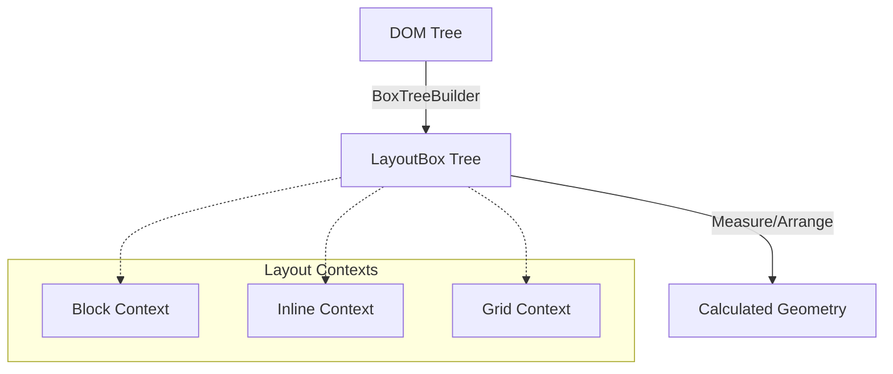
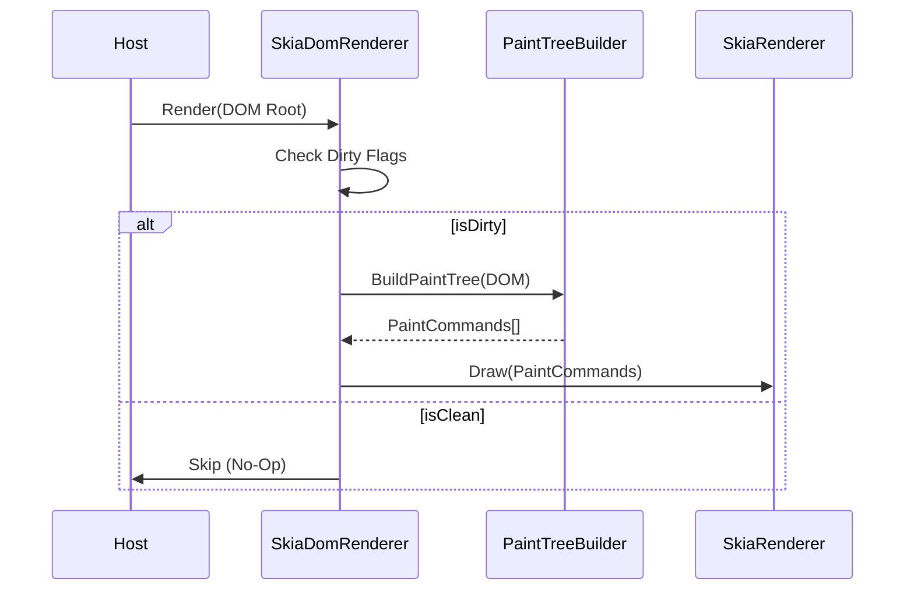

# FenBrowser Codex - Volume III: The Engine Room

**State as of:** 2026-02-18
**Codex Version:** 1.0

## 1. Overview

`FenBrowser.FenEngine` is the core logic assembly of the browser. It is responsible for the entire pipeline from HTML source code to pixels on the screen. It integrates Parsing, Layout, Scripting, and Rendering into a coherent loop.

## 2. The Layout Engine (`FenBrowser.FenEngine.Layout`)

The layout engine acts as a pure function: `(DOM Tree + Styles + Viewport) -> Geometry`.

### 2.1 The Pipeline

1.  **Box Tree Construction**: The `BoxTreeBuilder` traverses the DOM and generates a `LayoutBox` tree.
    - _Note:_ One DOM node can generate multiple boxes (e.g., specific for `display: list-item` markers).
2.  **Context Resolution**: The engine determines the **Formatting Context** for each box.
    - `BlockFormattingContext`: Vertical stacking.
    - `InlineFormattingContext`: Horizontal flow with line breaking.
    - `Grid/Flex`: Advanced 2D layouts.
3.  **Measure & Arrange**:
    - **Measure Pass**: Calculates desired sizes (Intrinsic/Extrinsic).
    - **Arrange Pass**: Assigns final X/Y coordinates relative to the parent.
4.  **Absolute Logic**: The `LayoutEngine` post-processes the tree to calculate absolute screen coordinates for the renderer.

### 2.2 Key Components

- `LayoutEngine.cs`: The facade that drives the process.
- `BoxModel.cs`: The data structure holding the 4 boxes (Content, Padding, Border, Margin).
- `FloatingExclusion`: Manages "floats" (elements taken out of normal flow).

---

## 3. The Rendering Pipeline (`FenBrowser.FenEngine.Rendering`)

Rendering is the process of converting the Layout Tree into Skia draw commands.

### 3.1 SkiaDomRenderer

The main entry point (`Render()` method).

- **Re-entrancy Guard**: Prevents recursive paint calls.
- **Dirty Checks**: Optimally skips layout if no relevant state changed.
- **Layering**: Coordinates the `InputOverlay` system (native controls for `<input>`) on top of the Skia canvas.

### 3.2 The Paint Tree

Unlike the Layout Tree (which is about geometry), the Paint Tree is about **Z-Order** and **Stacking Contexts**.

- **NewPaintTreeBuilder**: Converts layout boxes into a flat list of draw commands, sorted by CSS `z-index` and painting order rules (background -> border -> content -> outline).

#### 3.2.1 Rendering Updates (2026-02-16)
- Gradient backgrounds are parsed into `SKShader` instances during paint-node creation (`FenBrowser.FenEngine/Rendering/PaintTree/NewPaintTreeBuilder.cs:1440-1570`), enabling linear/radial gradients in the new pipeline.
- Stacking contexts now carry `filter`/`backdrop-filter`; `SkiaRenderer` parses them via `CssFilterParser` and applies Skia save-layers (`SkiaRenderer.cs:198-245`, `SkiaRenderer.cs:275-286`).
- Input placeholders honor `::placeholder` computed color/opacity when rendering (`NewPaintTreeBuilder.cs:2290-2335`).
- Animated GIFs are decoded frame-by-frame with `SKCodec` (including `RequiredFrame` compositing) and cached in `ImageLoader` (`FenBrowser.FenEngine/Rendering/ImageLoader.cs:650-870`). A 50 ms timer calls `RequestRepaint` directly, and `SkiaDomRenderer.Render` forces paint-dirty whenever `HasActiveAnimatedImages` is true (`SkiaDomRenderer.cs:280-302`), enabling in-paint GIF animation without re-layout.
- Engine targets `net8.0` (solution unified via global.json).
- UA safety net: anchors with `aria-label="Sign in"` get a fallback inline-block button style (blue background, white text, padding, radius) to guarantee visibility when author CSS is skipped (`Rendering/UserAgent/UAStyleProvider.cs`).

### 3.3 Backend (`SkiaRenderer`)

A stateless drawer that takes the Paint Tree and executes SkiaSharp API calls (`canvas.DrawRect`, `canvas.DrawText`).

---

## 4. The Scripting Engine (`FenBrowser.FenEngine.Scripting`)

FenBrowser runs a custom JavaScript environment integration.

### 4.1 JavaScriptEngine

A massive facilitator class that bridges the JS runtime (Jint/V8 abstraction) with the C# DOM.

- **DOM Bindings**: Implements standards like `document.getElementById`, `element.addEventListener`.
- **Event Loop**: Drives the browser pulse via `RequestAnimationFrame` and `SetTimeout`.
- **Sandboxing**: Enforces permissions (network, sensors) via `SandboxBlockRecord`.

### 4.2 BrowserHost (in `BrowserApi.cs`)

The high-level controller used by the UI.

- Implements `IBrowser` interface.
- Manages **Navigation History** (Back/Forward).
- Handles **Resource Loading** coordination.
- TLS handling: `BrowserHost` records certificate details and respects `NetworkConfiguration.IgnoreCertificateErrors` (default: strict/false) so production builds remain secure-by-default; explicit opt-in is required to bypass.
- Provides **WebDriver** hooks for automation.

---

## 5. Interaction Model

### 5.1 Hit Testing

The engine supports a "Reverse Pipeline" to detect which element is under the mouse.

- **Process**: `HitTest(x, y)` traverses the Paint Tree (top-down visual order) to find the topmost element.
- **Events**: The `BrowserHost` captures OS mouse events and dispatches them to the DOM via `JavaScriptEngine.DispatchEvent`.

### 5.2 Scroll Management

- `Rendering/Interaction/ScrollManager` honors CSS `scroll-snap-type` on both axes and `scroll-snap-align` on children, choosing the nearest snap target and animating via smooth scrolling.

### 5.3 Input Overlays

Because drawing text inputs via Skia is complex (cursor, selection, IME), the engine renders `<input>` elements as **Native Overlays** floating above the browser canvas. The `SkiaDomRenderer` calculates their position during layout and reports it to the Host UI.

### 5.4 Recent Interaction Hardening (2026-02-07)

- `BrowserApi.DispatchInputEvent(...)` now runs click activation through `HandleElementClick(...)` for all click targets (not only anchor default-action fallback), ensuring focus/default behavior is applied consistently for controls.
- Focus synchronization now occurs on both `mousedown` and `click` paths, preventing host/input-sequencing differences from dropping focus.
- Cursor initialization and typing now handle `contenteditable="true"` elements using `TextContent`, in addition to `<input>/<textarea>`, reducing "click but cannot type" regressions on modern DOM structures.
- Pointer input dispatch now executes immediately (instead of being queued), and `mousemove` updates `ElementStateManager` hover chain with repaint trigger, restoring `:hover` visual feedback and interactive responsiveness.
- `Rendering/Interaction/ScrollManager` now guards null element access in scroll-state APIs, preventing `ArgumentNullException (Parameter 'key')` during paint-tree build when scroll queries receive a transient null element.

---

## 6. Comprehensive Source Encyclopedia

This section maps **every key file** in the FenEngine library, covering the Layout, Rendering, and Scripting subsystems.

### 6.1 Layout Subsystem (`FenBrowser.FenEngine.Layout`)

#### `MinimalLayoutComputer.cs` (Lines 1-2976)

The implementation of the User Agent CSS and Layout Algorithms.

- **Lines 57-191**: **Style Computation**: `GetStyle` resolving UA defaults and explicit styles.
- **Lines 1536-1833**: **`ArrangeBlockInternal`**: The core Block formatting context algorithm.
- **Lines 2373-2404**: **`MeasureBlock`**: Determines intrinsic sizes.
- **Lines 2661-2765**: **`ShouldHide`**: Visibility logic (`display: none`, `visibility: hidden`).

#### `GridLayoutComputer.cs` (Lines 1-1011)

CSS Grid implementation.

- **Lines 113-366**: **`ComputePlacements`**: The auto-placement algorithm (sparse/dense).
- **Lines 485-585**: **`Measure`**: Track sizing (fr/auto/px).

#### `InlineLayoutComputer.cs` (Lines 1-980)

Inline Formatting Context (Text & Inline-Block).

- **Lines 31-940**: **`Compute`**: Handles line breaking, bidi reordering, and float exclusions.
- **Lines 100-220, 240-360**: `FlushLine` now applies `text-overflow: ellipsis` by trimming overflowing runs and appending an ellipsis glyph within the available band, honoring container fonts.

#### `FlexFormattingContext.cs` (Lines 1-1605)

Flex formatting context (row/column).

- **Lines 40-476**: Measurement, intrinsic probing, and main-axis grow/shrink resolution for flex items.
- **Lines 436-463, 1254-1420**: Collapsed flex-item recovery now handles near-zero widths and uses deep descendant extents to restore control/icon clusters that would otherwise collapse in intrinsic probe passes.
- **Lines 493-852**: Wrap logic splits items into flex lines, supports `flex-wrap: wrap` and `flex-wrap: wrap-reverse`, and positions lines in cross-axis order. Per-line `justify-content` and auto margins are applied; align-items `stretch` reflows children to the line's cross size.
- **Lines 881-1157**: `ResolveContainerDimensions` covers explicit/percent/expression sizing, min/max constraints, and intrinsic fallbacks for controls/replaced elements under flex sizing.

#### `Contexts/InlineFormattingContext.cs` (Lines 1-960)

Inline formatting context for text runs and atomic inline boxes.

- **Lines 322-385**: Final atomic placement now re-layouts controls/replaced inline candidates with final size inputs and enforces monotonic line-item ordering to prevent post-measure overlap.
- **Lines 427-463**: `TryLayoutReplacedInlineBox` applies intrinsic replaced-element sizing with proper box-model sync.
- **Lines 598-626**: `ShouldRelayoutAtomicInline` identifies intrinsic/replaced inline candidates (`input`, `button`, `img`, `svg`, etc.) for final stabilization.
- **Lines 897-929**: `ResolveContextWidth` now prefers containing-block width for unconstrained probes and subtracts non-content spacing before final content width assignment.

#### `Contexts/BlockFormattingContext.cs` (Lines 1-592)

Block formatting context implementation for vertical flow and floats.

- **Lines 109-131**: Right-float placement now clamps unresolved/probe widths to avoid negative-X placement during shrink-to-fit passes.
- **Lines 224-253**: Shrink-to-fit auto-width pass computes widest in-flow child width while ignoring out-of-flow descendants.

#### `LayoutEngine.cs` (Lines 1-383)

The public facade for the layout system.

- **Lines 63-153**: **`ComputeLayout`**: Orchestrates the 2-pass Measure/Arrange protocol.
- **Lines 296-360**: **`HitTest`**: Converts physical coordinates (x,y) back to DOM nodes.

#### `BoxTreeBuilder.cs` (Lines 1-520)

**Core Pipeline Stage**. Converts DOM Nodes to Layout Boxes.

- **Lines 80-150**: **`BuildBox`**: Determines if a node needs a box (`display != none`).
- **Lines 200-250**: **`CreateAnonymousBlocks`**: Fixes malformed block/inline hierarchies.

#### `BoxModel.cs` (Lines 1-120)

Data structure representing the CSS Box Model (Content, Padding, Border, Margin).

#### `FloatExclusion.cs` (Lines 1-220)

Manages the geometry of floating elements (`float: left/right`) and collision detection.

#### `ContainingBlockResolver.cs` (Lines 1-250)

Determines the reference rectangle for sizing calculations (handling `position: absolute/fixed`).

#### `MarginCollapseComputer.cs` (Lines 1-180)

Implements the complex CSS margin collapsing rules for Block contexts.

#### `TableLayoutComputer.cs` (Lines 1-600)

Implements HTML Table layout (Auto and Fixed algorithms).

#### `TextLayoutComputer.cs` (Lines 1-400)

Handles text measurement, shaping (via Skia), and line height calculations.

### 6.2 CSS Subsystem (`FenBrowser.FenEngine.Rendering.Css`)

#### `CssParser.cs` (Lines 1-500)

Implements the primary CSS parser path with broad CSS Syntax support. Some Level 4 constructs (e.g. range context syntax in media features) are tracked as follow-up work.

- **Lines 50-120**: **`ParseStylesheet`**: Top-level entry point.
- **Lines 200-300**: **`ParseRule`**: Handles selectors and declarations.
- **Lines 350-450**: **`ConsumeBlock`**: Tokenizer consumption logic for `{ ... }`.

#### `CssLoader.cs` (Lines 1-3900+)

Builds computed style objects from cascaded declarations and applies compatibility overrides used by the layout pipeline.

- Includes targeted Google surface compatibility guards, including search/homepage alignment normalization.

### 6.3 Rendering Subsystem (`FenBrowser.FenEngine.Rendering`)

#### `BrowserApi.cs` (Lines 1-2446)

The monolithic Interface Layer between Host and Engine.

- **Lines 187-2440**: **`BrowserHost`**: Manages the `EngineLoop`, Navigation, and DOM connectivity.
- **Lines 597-883**: **`NavigateAsync`**: The central navigation controller.
- **Lines 1110-1119**: **`Pulse`**: Drives the Event Loop (Tasks and Microtasks).

#### `SkiaRenderer.cs` (Lines 1-839)

The final painting stage.

- **Lines 52-99**: **`Render`**: Entry point for drawing a Paint Tree to a Skia canvas.
- **Lines 151-286**: **`DrawNode`**: Recursive visitor processing Display List commands.
- **Lines 515-615**: **`DrawText`**: Text rendering with anti-aliasing.

#### `RenderCommands.cs` (Lines 1-503)

The Display List command definitions.

- Defines `DrawRect`, `DrawText`, `DrawImage`, `SaveLayer` (opacity/blending).

#### `CustomHtmlEngine.cs` (Lines 1-1419)

Alternative legacy/wrapper engine for specialized environments.

- **Lines 1065-1283**: **`RenderAsync`**: Direct HTML-to-Visual pipeline.

### 6.3 Scripting Subsystem (`FenBrowser.FenEngine.Scripting`)

#### `JavaScriptEngine.cs` (Lines 1-3087)

The custom logic runtime and bridge.

- **Lines 515-708**: **`SetupPermissions`**: Sandbox security enforcement.
- **Lines 1311-1340**: **`RequestAnimationFrame`**: Timing loop implementation.
- **Lines 1141-1254**: **Event Dispatch**: Bridge between internal C# events and JS `DispatchEvent`.

#### Recent Hardening Notes (2026-02-06)

- `ElementWrapper.focus()` and `ElementWrapper.blur()` now update `document.activeElement` and dispatch non-bubbling focus/blur events through the DOM event pipeline.
- `LayoutEngine` debug tree dump markers now log at debug level instead of error level to reduce false-positive error noise in runtime diagnostics.
- `ErrorPageRenderer` SSL and connection templates were normalized to ASCII-safe literals to prevent mojibake artifacts in `dom_dump.txt` and rendered text diagnostics.
- `EngineLoop` now drains V2 dirty flags (`Style`, `Layout`, `Paint`) through a deadline-checked tree traversal, reducing repeated stale-dirty frame churn.
- `CSSStyleDeclaration.Keys()` in `ElementWrapper` now enumerates parsed inline style property names, fixing empty-key enumeration in JS style reflection paths.
- `BrowserApi` now registers rendered text length and active DOM node count from `GetTextContent()` into `ContentVerifier`, aligning verification metrics with exported `rendered_text_*.txt` output.
- `CssAnimationEngine.StartAnimation` now handles comma-separated `animation-name` lists and index-aligned animation sub-properties, resolving false `Keyframes not found` logs for multi-animation declarations (e.g., `fillunfill, rot`).
- `BoxTreeBuilder` now enforces closed-`
` behavior at box construction time (`details:not([open]) > :not(summary)`), preventing hidden disclosure descendants from entering the Box Tree.
- `MinimalLayoutComputer` now applies closed-`
` visibility rules for direct children in `ShouldHide`, and routes `DETAILS` measurement through `MeasureDetails` to avoid incorrect flow sizing.
- `Layout.Algorithms.LayoutHelpers.ShouldHide` now mirrors the same closed-`
` rule so delegated `BlockLayoutAlgorithm` passes do not reintroduce hidden disclosure children into measured layout flow.
- Closed-`
` suppression now resolves parent via `ParentElement` or `ParentNode as Element` across `BoxTreeBuilder`, `LayoutHelpers`, and `MinimalLayoutComputer`, closing a path where direct text/comment adjacency could bypass disclosure hiding.
- `BoxTreeBuilder` and `MinimalLayoutComputer.ShouldHide` now drop whitespace-only text nodes for non-inline, non-`pre*` containers, preventing indentation/newline nodes from inflating block/flex heights.
- `Rendering.Interaction.HitTester` now ignores non-hit-testable candidates (`pointer-events:none`, `visibility:hidden/collapse`, `display:none`) before selecting a target, reducing overlay interception and restoring clicks to underlying controls.
- `Rendering.Interaction.HitTester` now also excludes `hidden` elements and fully transparent (`opacity:0`) elements from hit eligibility, preventing invisible overlays from stealing hover/click focus.
- `Rendering.BrowserApi.DispatchInputEvent` now syncs pointer hits into BrowserApi focus state on `mousedown`, including promotion from wrapper containers to descendant editable controls (`input`/`textarea`/`contenteditable`) so typing works after click in modern wrapped search fields.
- `Interaction.InputManager.ProcessEvent(...)` now resolves hit-test targets for `mouseup` (and touch move/end) in addition to down/move/click, so DOM `mouseup` reliably dispatches to controls and JS click state machines no longer miss release-phase events.
- `NewPaintTreeBuilder` single-line fallback text now early-returns for whitespace-only runs and uses resolved draw bounds without mutating `box.ContentBox`, removing ghost fallback text nodes and stabilizing paint geometry.
- `FenEngine.HTML.HtmlTreeBuilder` now uses `SetAttributeUnsafe` during tree construction (active-formatting reconstruction and element insertion paths), aligning parsed-HTML attribute preservation with Core parser semantics.
- `Core.Parser.ParseImportExpression` now parses `import(...)` using argument-list semantics instead of grouped-expression semantics, fixing false `expected ... RParen` parse errors in dynamic-import tests.
- `Core.Parser` module syntax handling now correctly accepts and advances `export * from ...`, `export * as <IdentifierName> from ...`, and `import { default as x } from ...` forms by treating `IdentifierName` tokens (including keywords like `default`) as valid export/import names where grammar allows them.
- `Testing.Test262Runner` now parses `flags` metadata (`onlyStrict`, `noStrict`, `async`) and applies `onlyStrict` by injecting a strict directive in the test prelude, improving conformance setup parity for strict-mode Test262 cases.
- `Core.Lexer.ReadIdentifier` now advances after successful `\uHHHH` escape decoding, preventing accidental re-consumption of the final hex digit in escaped identifiers.
- `Layout.LayoutHelper.GetRenderableTextContent*` now excludes non-renderable text containers (`style`, `script`, `template`, `noscript`) from intrinsic control-label measurement, preventing style/script text from inflating `<button>` intrinsic widths.
- `Layout.LayoutPositioningLogic` and `Layout.MinimalLayoutComputer` now use `GetRenderableTextContentTrimmed(...)` for button intrinsic-label fallbacks, keeping control width heuristics aligned across legacy and formatting-context paths.
- `Contexts.InlineFormattingContext` now re-layouts atomic inline/replaced controls before final line placement and applies a monotonic post-pass to prevent overlap when intrinsic widths expand after probe measurement.
- `Contexts.FlexFormattingContext` now recovers near-zero row-item widths using deep descendant extents (not only direct children), fixing collapsed control clusters and footer link groups under intrinsic probe passes.
- `Contexts.BlockFormattingContext` now clamps right-float placement when probe-time container width is unresolved, preventing transient negative-X anchor placement in header action rows.
- `Rendering.Css.CssLoader` no longer forces `.FPdoLc`/`.lJ9FBc` to `display:inline-block`; those Google search-action wrappers are now kept block-level with `text-align:center`, restoring centered placement of the `Google Search` / `I'm Feeling Lucky` controls.

#### `JavaScriptEngine.Dom.cs` (Lines 1-1203)

The DOM bindings (JS Objects wrapping C# Components).

- **Lines 399-906**: **`JsDomElement`**: Implements element properties and methods (`innerHTML`, `setAttribute`).

#### `CanvasRenderingContext2D.cs` (Lines 1-800)

Bridge for the `<canvas>` 2D API.

- **Lines 100-300**: **`DrawImage`**: Interop with SkiaSharp for bitmap rendering.
- **Lines 400-500**: **`FillRect/StrokeRect`**: Geometry primitives.

#### `ModuleLoader.cs` (Lines 1-200)

Handles `import` / `export` ES6 module resolution.

- **Lines 50-100**: **`ResolvePath`**: Normalizes relative paths.

#### `ProxyAPI.cs` (Lines 1-100) & `ReflectAPI.cs` (Lines 1-150)

Implementation of JS Proxy/Reflect built-ins.

### 6.6 Supplemental Files (Gap Fill)

#### Layout Infrastructure (`FenBrowser.FenEngine.Layout`)

- **`LayoutResult.cs`**: The output object of a layout pass.
- **`LayoutValidator.cs`**: Debugging assertions for layout integrity.
- **`ScrollAnchoring.cs`**: Prevents scroll jumps during layout reflows.
- **`TransformParsed.cs`**: Parsed representation of CSS `transform` matrices.
- **`Contexts/BlockFormattingContext.cs`**: Manages float exclusion zones and margin collapse state.
- **`Contexts/InlineFormattingContext.cs`**: Manages line boxes and text runs.
- **`Coordinates/ViewportPoint.cs`**: Struct for converting betwen Page/Client/Screen coordinates.
- **`Tree/LayoutBox.cs`**: The base node for the layout tree (replaces RenderObject).
- **`Tree/AnonymousBox.cs`**: Boxes generated by the engine (e.g., surrounding raw text in a block).
- **`Algorithms/BidiAlgorithm.cs`**: Unicode Bidirectional Algorithm implementation (partial).

#### Rendering Utils (`FenBrowser.FenEngine.Rendering`)

- **`InputOverlay.cs`**: Manages native text inputs hovering over canvas.
- **`LayerBuilder.cs`**: Optimizes z-index sorting for the paint tree.
- **`DirtyRects/DamageTracker.cs`**: Tracks which parts of the screen need repainting.

#### Generic Utilities

- **`MiniJs.cs`**: Minimal JS interpreter fallback (when Jint is disabled).
- **`JsRuntimeAbstraction.cs`**: Interface for swapping JS engines (V8/Jint).

_End of Volume III_

### 6.7 Test262 Hardening Notes (2026-02-10)

- `Core/Lexer.cs`: Expanded identifier start/part classification for broader Unicode coverage (including `Other_ID_Start`/`Other_ID_Continue` and surrogate tolerance for astral identifiers).
- `Core/Parser.cs`: Added script-goal early-error checks (`import`/`export`), top-level `return` rejection, `new.target` context validation, and stricter `super`/private-identifier context checks.
- `Core/Parser.cs`: Added async/generator nesting context tracking and stricter `yield`/`await` parsing constraints.
- `Core/Parser.cs`: Enforced rest-element placement/initializer rules in binding-pattern validation.
- `Core/ModuleLoader.cs`: Parser created with module goal (`isModule: true`) for module source parsing.
- `Core/Parser.cs`: Added class-element early-error validation sweep (duplicate constructors/private names, `#constructor` bans, static `prototype` bans, `super()` placement checks, `super.#name` and `delete` private-reference checks, class-field `Contains(super())`/`Contains(arguments)` checks, and stricter method/accessor parameter early-errors).
- `Core/Parser.cs`: Added nested private-name scope tracking for class parsing and broadened `extends` parsing to accept general superclass expressions.
- `Testing/Test262Runner.cs`: Parse-phase `SyntaxError` negatives now treat any parser-produced parse error as pass, avoiding false negatives from diagnostic text mismatch.

### 6.4 Contributor Cookbook: Implementing a New CSS Property

So you want to add `border-radius`? Follow these steps:

1.  **Define the Property**:
    - Add the property key to `FenBrowser.Core.Css.CssPropertyNames`.
    - Add the storage field to `FenBrowser.Core.Css.CssComputed` (e.g., `public CssLength? BorderRadius { get; set; }`).

2.  **Parse the Value**:
    - In `FenBrowser.FenEngine.Css.CssParser.ParseProperty`, add a `case` for your property.
    - Use helper methods like `ParseLength` or `ParseColor`.

3.  **Apply to Layout**:
    - In `MinimalLayoutComputer.GetStyle`, ensure the computed value is read from the matched rules.
    - Update `ArrangeBlockInternal` or `DrawNode` to utilize the new value (e.g., passing it to `canvas.DrawRoundRect`).

### 6.5 Quick Reference: API Surface

#### BrowserHost (`FenBrowser.FenEngine.Rendering.BrowserApi`)

| Method               | Description                                | Thread |
| :------------------- | :----------------------------------------- | :----- |
| `NavigateAsync(url)` | Loads a new page.                          | Engine |
| `Resize(w, h)`       | Updates viewport and triggers layout.      | Engine |
| `RecordFrame()`      | Generates a new display list.              | Engine |
| `InputKey(evt)`      | Dispatches keyboard event to focused node. | Engine |
| `Dispose()`          | Cleans up GL context and threads.          | UI     |

### 6.8 Test262 Wave 3 Notes (2026-02-10)

- `Core/Parser.cs`
  - Added nested statement-list tracking to enforce module-only top-level placement for `import`/`export`.
  - Added module early-error sweep for top-level `var`/lexical declaration name collisions.
  - Added module-top-level `yield` early error.
  - Hardened `export default` parsing:
    - proper default `function`/`class`/`async function` handling,
    - rejection of immediate invocation after anonymous default declaration,
    - corrected `class extends` optional-name lookahead.
  - Added support for string `ModuleExportName` forms in import/export specifiers.
  - Added import-attributes parsing (`with { ... }`) for `import ... from` and `export ... from`.
  - Added duplicate key detection in import-attributes object literals.

- `Core/Lexer.cs`
  - Added strict validation for escaped identifier code points; invalid escaped punctuator forms are now tokenized as `Illegal`.

- `Core/Interpreter.cs`
  - Added missing-export checks for module named imports and named re-exports.

- `Core/ModuleLoader.cs`
  - Added `ThrowOnEvaluationError` mode (used by Test262 negative-module paths only) to surface module-evaluation error values as exceptions when needed.

- `Testing/Test262Runner.cs`
  - Module-goal detection for Test262 now follows metadata module flags directly.
  - Negative module tests enable strict module-evaluation error surfacing without affecting positive test execution mode.

### 6.9 Test262 Rebaseline Notes (2026-02-11)

- `Core/Lexer.cs`
  - Hardened JS whitespace and line-terminator handling (`CR/LF/LS/PS`, Unicode space separators, BOM) in token skipping and comment scanning.
  - Added unterminated block-comment detection (`/* ... EOF`) to emit `Illegal` token instead of silently accepting EOF.
  - Reworked numeric literal scanner:
    - strict separator placement validation,
    - proper `.DecimalDigits` and dot-leading exponent forms,
    - BigInt shape validation (`0e0n`, leading-zero decimal BigInt forms),
    - identifier-tail rejection after numeric literals.
  - Tightened regex tokenization safety checks for:
    - line terminators inside regex literal bodies,
    - invalid/duplicate regex flags,
    - quantified lookbehind assertion early-error patterns.

- `Core/Parser.cs`
  - Added targeted unary/statement early-error diagnostics for malformed recovery paths:
    - missing unary operand (`typeof = 1`, `void = 1`, etc.),
    - missing throw expression / illegal newline after `throw`,
    - invalid trailing tokens after `break` / `continue`,
    - missing constructor target in `new` expressions,
    - invalid declaration identifier diagnostics in `var`/`let`/`const` declarations.

- `test262_results.md`
  - Added full 52,871-test rebaseline and refreshed 53-chunk table.
  - Current full-suite result: `50,388 / 52,871` passed (`95.30%`).

### 6.10 Parser Control-Flow Hardening (2026-02-14)

- `Core/Parser.cs`
  - Removed double-advance in `ParseProgram` and tightened `ParseBlockStatement` token progression so inner `}` is consumed once, preventing the first token after block-based statements from being skipped (fixes `+=` being misparsed as a prefix in Test262 harness code).
  - `ParseStatement` now routes `var`/`let`/`const` through `ParseLetStatement` and ensures function declarations bind a parsed `FunctionLiteral`, restoring buildable, deterministic statement parsing in Annex B paths.
  - `ParseStatement` now dispatches statement keywords (`try`, `throw`, `for`, `while`, `do`, `break`, `continue`) to their dedicated parsers, eliminating prefix-parse fallthrough errors in Test262 harness control-flow.

### 6.11 Phase-0 Security Hardening (2026-02-18)

- `Rendering/ImageLoader.cs`
  - Removed permissive TLS override in image fetch path (`ServerCertificateCustomValidationCallback => true`).
  - Image network requests now use platform certificate validation by default.

- `Adapters/ISvgRenderer.cs`
  - Aligned default SVG safety limits to project hard constraints:
    - `MaxRecursionDepth = 32`
    - `MaxFilterCount = 10`
    - `MaxRenderTimeMs = 100`

### 6.12 Phase-1 Correctness and Wiring (2026-02-18)

- `Core/ExecutionContext.cs`
  - Fixed default `ScheduleCallback` behavior to invoke callback exactly once after delay (removed duplicate invocation).

- `Core/EventLoop/EventLoopCoordinator.cs`
  - Added explicit `try/finally` phase closure for:
    - task JS execution
    - layout callback phase
    - observer callback phase
    - RAF callback JS execution phase
  - Added idle-phase recovery guard (`EnsureIdlePhase`) to detect and recover from leaked phase state.

- `Rendering/SkiaDomRenderer.cs`
  - Wired `PipelineContext` frame lifecycle into render path:
    - `BeginFrame` / `EndFrame`
    - viewport propagation via `SetViewport`
  - Wired stage snapshots into active style/layout/paint transitions:
    - `SetStyleSnapshot(...)`
    - `SetLayoutSnapshot(...)`
    - `SetPaintSnapshot(...)`
  - Wired corresponding dirty-flag invalidation through `PipelineContext.DirtyFlags` during stage work.

### 6.13 Phase-2 Path Hygiene and Diagnostics Wiring (2026-02-18)

- `Rendering/SkiaDomRenderer.cs`
  - Replaced hardcoded absolute debug artifact path with `DiagnosticPaths.AppendRootText(...)`.

- `Rendering/PaintTree/NewPaintTreeBuilder.cs`
  - Replaced hardcoded absolute debug artifact path with `DiagnosticPaths.AppendRootText(...)`.

- `Layout/LayoutEngine.cs`
  - Replaced hardcoded absolute layout-debug file writes with `DiagnosticPaths.AppendRootText(...)`.

- `Rendering/SkiaRenderer.cs`
  - Replaced hardcoded screenshot target with `DiagnosticPaths.GetRootArtifactPath("debug_screenshot.png")`.
  - `ContentVerifier.RegisterScreenshot(...)` now receives centralized artifact path.

- `Core/FenRuntime.cs`
  - Replaced hardcoded script execution log path with `DiagnosticPaths.GetLogArtifactPath("script_execution.log")`.

- `Rendering/Css/CssLoader.cs`
  - Removed absolute `C:\Users\...` path literals from debug callsites and normalized debug filenames.
  - Routed debug writes through centralized diagnostics helpers.
  - File diagnostics are now compile-gated to debug builds only.

- `Scripting/JavaScriptEngine.cs`
  - Replaced hardcoded `js_debug.log` writes with `DiagnosticPaths.AppendRootText(...)`.

- `WebAPIs/FetchApi.cs`
  - Replaced hardcoded `js_debug.log` writes with `DiagnosticPaths.AppendRootText(...)`.

- `Rendering/CustomHtmlEngine.cs`
  - Replaced hardcoded `dom_dump.txt` write target with `DiagnosticPaths.GetRootArtifactPath("dom_dump.txt")`.

- `Layout/MinimalLayoutComputer.cs`
  - Replaced hardcoded `debug_layout_dims.txt` writes with `DiagnosticPaths.AppendRootText(...)`.

- `Rendering/ImageLoader.cs`
  - Replaced hardcoded SVG debug bitmap write path with `DiagnosticPaths.GetRootArtifactPath("svg_debug_bitmap.png")`.
  - Wrapped SVG debug bitmap file writes in `#if DEBUG` so release builds do not emit ad-hoc artifacts.

- `Rendering/Css/CssLoader.cs`
  - Removed machine-specific absolute UA stylesheet fallback path and replaced it with workspace-relative candidate paths.

### 6.14 Phase-3 Verification Truthfulness (2026-02-18)

- `Testing/WPTTestRunner.cs`
  - Hardened single-test verdict logic: success now requires non-zero assertions plus a completion signal.
  - Added explicit failure modes for:
    - no testharness assertions
    - timeout while waiting for async completion
    - missing completion signals.
  - Completion signal tracking now records whether completion came from:
    - `testRunner.notifyDone`
    - parsed harness-status console output
    - settled `testRunner.reportResult` output.

### 6.15 Phase-5 Storage Wiring (2026-02-18)

- `WebAPIs/StorageApi.cs`
  - Added explicit storage-clear APIs:
    - `ClearLocalStorage(bool deletePersistentFile = true)`
    - `ClearAllStorage(bool deletePersistentFile = true)`
  - `CreateSessionStorage(...)` now partitions storage by runtime instance and origin key to avoid cross-instance bleed.

- `Core/FenRuntime.cs`
  - `sessionStorage` binding now passes current origin provider into `StorageApi.CreateSessionStorage(...)`.

- `Rendering/BrowserApi.cs`
  - `ClearBrowsingData()` now clears storage alongside cookies and cache (`Cookies + Cache + Storage`).

### 6.16 Phase-5 Storage/Policy Wiring - Tranche B (2026-02-18)

- `WebAPIs/StorageApi.cs`
  - Added direct coordinator APIs used by non-DOM callers:
    - local/session `Get*`, `Set*`, `Remove*`, `Clear*`, `GetAll*`
    - `BuildSessionScope(partitionId, origin)` for deterministic session partitioning.

- `DevTools/DevToolsCore.cs`
  - DevTools storage API (`Get/Set/Clear` local/session) now routes through `StorageApi` rather than separate private dictionaries.

- `Scripting/JavaScriptEngine.cs`
  - Legacy local/session storage access paths now route through `StorageApi` with origin + session-scope keys.
  - Added popup policy enforcement for `window.open(...)` in the script-eval bridge path.

- `Core/FenRuntime.cs`
  - `navigator.doNotTrack` now reflects `BrowserSettings.SendDoNotTrack`.
  - Added `window.open` policy gate bound to `BrowserSettings.BlockPopups` with same-window fallback behavior.

### 6.17 Remaining Findings Tranche - Navigation/Module Hardening (2026-02-19)

- `Rendering/NavigationManager.cs`
  - Added explicit navigation intent model:
    - `NavigationRequestKind.UserInput`
    - `NavigationRequestKind.Programmatic`
  - Rooted local-path auto-conversion is now limited to trusted user-input flow.
  - Added `file://` capability gate with automation deny-by-default behavior.

- `Rendering/BrowserApi.cs`
  - Added `NavigateUserInputAsync(...)` path to preserve address-bar normalization while keeping default navigation programmatic.

- `Core/ModuleLoader.cs`
  - Added URI policy callback to allow/deny module loads before content fetch.

- `Scripting/JavaScriptEngine.cs`
- `Scripting/JavaScriptEngine.Methods.cs`
  - Removed raw `HttpClient` fallback for module/script fetch paths.
  - Module content fetch now prefers centralized browser fetch delegates and blocks unsupported fallback paths.

- `Rendering/CustomHtmlEngine.cs`
  - CSP subresource + nonce checks now pass explicit base-document origin context.

### 6.18 Phase-Completion Tranche - WPT Structured Signals and Module Conformance (2026-02-19)

- `WebAPIs/TestHarnessAPI.cs`
  - Added structured execution snapshot API (`GetExecutionSnapshot`) for runner-side completion logic.
  - Added explicit harness-status reporting path (`reportHarnessStatus`) and completion provenance tracking.

- `Testing/WPTTestRunner.cs`
  - Completion loop now prioritizes structured `TestHarnessAPI` signals.
  - Console parsing remains as compatibility fallback only when structured signals are absent.

- `Rendering/BrowserApi.cs`
  - WPT bridge injection now emits structured harness completion via `testRunner.reportHarnessStatus('complete', ...)` before `notifyDone()`.

- `Core/ModuleLoader.cs`
  - Added import-map support (`SetImportMap`) with exact and prefix match resolution.
  - Added extensionless HTTP module normalization (`.js` append for relative module specifiers).

- `Scripting/JavaScriptEngine.cs`
  - Runtime now parses `<script type="importmap">` and applies entries to the core module loader.
  - Added same-origin guard for http(s) module loads when explicit CORS pipeline is not available.

### 6.19 Phase-6 Security/Isolation Hardening (2026-02-19)

- `Core/FenRuntime.cs`
  - Added centralized `NetworkFetchHandler` delegate for runtime-side network operations.
  - Routed runtime `fetch(...)` and XHR construction through centralized network delegate path.
  - Worker constructor wiring now receives worker-script fetch + policy delegates from runtime.

- `WebAPIs/XMLHttpRequest.cs`
  - Removed direct per-request `HttpClient` usage.
  - Added injected network delegate path (`Func<HttpRequestMessage, Task<HttpResponseMessage>>`) as the only send path.

- `Workers/WorkerConstructor.cs`
  - Added strict URL resolution and scheme gating for worker scripts.
  - Non-http(s) script URLs are denied before runtime creation.

- `Workers/WorkerRuntime.cs`
  - Removed raw `HttpClient` and local-file fallback script loading.
  - Added centralized fetcher requirement for worker script bootstrap.
  - Added service-worker fetch-event dispatch path (`DispatchServiceWorkerFetchAsync`).

- `Workers/ServiceWorkerManager.cs`
  - Added injected script fetcher/policy wiring.
  - Service-worker runtime startup now validates/resolves script URLs.
  - `DispatchFetchEvent(...)` now dispatches into runtime instead of hardcoded false.

- `WebAPIs/FetchApi.cs`
  - Added ServiceWorker fetch-event dispatch call prior to normal network fallback.

- `Storage/FileStorageBackend.cs`
  - Added storage path sanitization for origin/database names.
  - Added normalized root-containment assertion to block IndexedDB path traversal.

- `Scripting/JavaScriptEngine.cs`
  - Removed legacy `IndexedDBService.Register(...)` override to preserve runtime `indexedDB` as canonical implementation.

- `Rendering/BrowserApi.cs`
  - Removed eager `ResourceManager` field initialization; now initialized once in constructor path.
