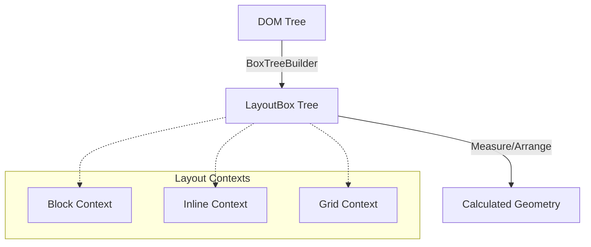
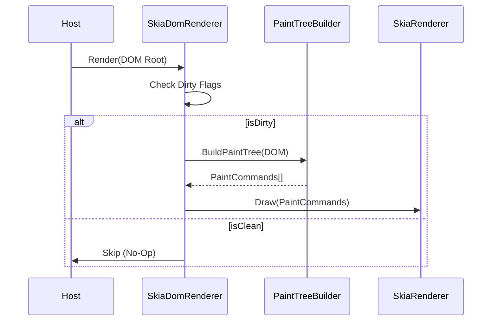

# FenBrowser Codex - Volume III: The Engine Room

**State as of:** 2026-02-06
**Codex Version:** 1.0

## 1. Overview

`FenBrowser.FenEngine` is the core logic assembly of the browser. It is responsible for the entire pipeline from HTML source code to pixels on the screen. It integrates Parsing, Layout, Scripting, and Rendering into a coherent loop.

## 2. The Layout Engine (`FenBrowser.FenEngine.Layout`)

The layout engine acts as a pure function: `(DOM Tree + Styles + Viewport) -> Geometry`.

### 2.1 The Pipeline

1.  **Box Tree Construction**: The `BoxTreeBuilder` traverses the DOM and generates a `LayoutBox` tree.
    - _Note:_ One DOM node can generate multiple boxes (e.g., specific for `display: list-item` markers).
2.  **Context Resolution**: The engine determines the **Formatting Context** for each box.
    - `BlockFormattingContext`: Vertical stacking.
    - `InlineFormattingContext`: Horizontal flow with line breaking.
    - `Grid/Flex`: Advanced 2D layouts.
3.  **Measure & Arrange**:
    - **Measure Pass**: Calculates desired sizes (Intrinsic/Extrinsic).
    - **Arrange Pass**: Assigns final X/Y coordinates relative to the parent.
4.  **Absolute Logic**: The `LayoutEngine` post-processes the tree to calculate absolute screen coordinates for the renderer.

### 2.2 Key Components

- `LayoutEngine.cs`: The facade that drives the process.
- `BoxModel.cs`: The data structure holding the 4 boxes (Content, Padding, Border, Margin).
- `FloatingExclusion`: Manages "floats" (elements taken out of normal flow).

---

## 3. The Rendering Pipeline (`FenBrowser.FenEngine.Rendering`)

Rendering is the process of converting the Layout Tree into Skia draw commands.

### 3.1 SkiaDomRenderer

The main entry point (`Render()` method).

- **Re-entrancy Guard**: Prevents recursive paint calls.
- **Dirty Checks**: Optimally skips layout if no relevant state changed.
- **Layering**: Coordinates the `InputOverlay` system (native controls for `<input>`) on top of the Skia canvas.

### 3.2 The Paint Tree

Unlike the Layout Tree (which is about geometry), the Paint Tree is about **Z-Order** and **Stacking Contexts**.

- **NewPaintTreeBuilder**: Converts layout boxes into a flat list of draw commands, sorted by CSS `z-index` and painting order rules (background -> border -> content -> outline).

### 3.3 Backend (`SkiaRenderer`)

A stateless drawer that takes the Paint Tree and executes SkiaSharp API calls (`canvas.DrawRect`, `canvas.DrawText`).

---

## 4. The Scripting Engine (`FenBrowser.FenEngine.Scripting`)

FenBrowser runs a custom JavaScript environment integration.

### 4.1 JavaScriptEngine

A massive facilitator class that bridges the JS runtime (Jint/V8 abstraction) with the C# DOM.

- **DOM Bindings**: Implements standards like `document.getElementById`, `element.addEventListener`.
- **Event Loop**: Drives the browser pulse via `RequestAnimationFrame` and `SetTimeout`.
- **Sandboxing**: Enforces permissions (network, sensors) via `SandboxBlockRecord`.

### 4.2 BrowserHost (in `BrowserApi.cs`)

The high-level controller used by the UI.

- Implements `IBrowser` interface.
- Manages **Navigation History** (Back/Forward).
- Handles **Resource Loading** coordination.
- Provides **WebDriver** hooks for automation.

---

## 5. Interaction Model

### 5.1 Hit Testing

The engine supports a "Reverse Pipeline" to detect which element is under the mouse.

- **Process**: `HitTest(x, y)` traverses the Paint Tree (top-down visual order) to find the topmost element.
- **Events**: The `BrowserHost` captures OS mouse events and dispatches them to the DOM via `JavaScriptEngine.DispatchEvent`.

### 5.2 Input Overlays

Because drawing text inputs via Skia is complex (cursor, selection, IME), the engine renders `<input>` elements as **Native Overlays** floating above the browser canvas. The `SkiaDomRenderer` calculates their position during layout and reports it to the Host UI.

### 5.3 Recent Interaction Hardening (2026-02-07)

- `BrowserApi.DispatchInputEvent(...)` now runs click activation through `HandleElementClick(...)` for all click targets (not only anchor default-action fallback), ensuring focus/default behavior is applied consistently for controls.
- Focus synchronization now occurs on both `mousedown` and `click` paths, preventing host/input-sequencing differences from dropping focus.
- Cursor initialization and typing now handle `contenteditable="true"` elements using `TextContent`, in addition to `<input>/<textarea>`, reducing "click but cannot type" regressions on modern DOM structures.
- Pointer input dispatch now executes immediately (instead of being queued), and `mousemove` updates `ElementStateManager` hover chain with repaint trigger, restoring `:hover` visual feedback and interactive responsiveness.
- `Rendering/Interaction/ScrollManager` now guards null element access in scroll-state APIs, preventing `ArgumentNullException (Parameter 'key')` during paint-tree build when scroll queries receive a transient null element.

---

## 6. Comprehensive Source Encyclopedia

This section maps **every key file** in the FenEngine library, covering the Layout, Rendering, and Scripting subsystems.

### 6.1 Layout Subsystem (`FenBrowser.FenEngine.Layout`)

#### `MinimalLayoutComputer.cs` (Lines 1-2976)

The implementation of the User Agent CSS and Layout Algorithms.

- **Lines 57-191**: **Style Computation**: `GetStyle` resolving UA defaults and explicit styles.
- **Lines 1536-1833**: **`ArrangeBlockInternal`**: The core Block formatting context algorithm.
- **Lines 2373-2404**: **`MeasureBlock`**: Determines intrinsic sizes.
- **Lines 2661-2765**: **`ShouldHide`**: Visibility logic (`display: none`, `visibility: hidden`).

#### `GridLayoutComputer.cs` (Lines 1-1011)

CSS Grid implementation.

- **Lines 113-366**: **`ComputePlacements`**: The auto-placement algorithm (sparse/dense).
- **Lines 485-585**: **`Measure`**: Track sizing (fr/auto/px).

#### `InlineLayoutComputer.cs` (Lines 1-921)

Inline Formatting Context (Text & Inline-Block).

- **Lines 31-904**: **`Compute`**: Handles line breaking, bidi reordering, and float exclusions.

#### `LayoutEngine.cs` (Lines 1-383)

The public facade for the layout system.

- **Lines 63-153**: **`ComputeLayout`**: Orchestrates the 2-pass Measure/Arrange protocol.
- **Lines 296-360**: **`HitTest`**: Converts physical coordinates (x,y) back to DOM nodes.

#### `BoxTreeBuilder.cs` (Lines 1-520)

**Core Pipeline Stage**. Converts DOM Nodes to Layout Boxes.

- **Lines 80-150**: **`BuildBox`**: Determines if a node needs a box (`display != none`).
- **Lines 200-250**: **`CreateAnonymousBlocks`**: Fixes malformed block/inline hierarchies.

#### `BoxModel.cs` (Lines 1-120)

Data structure representing the CSS Box Model (Content, Padding, Border, Margin).

#### `FloatExclusion.cs` (Lines 1-220)

Manages the geometry of floating elements (`float: left/right`) and collision detection.

#### `ContainingBlockResolver.cs` (Lines 1-250)

Determines the reference rectangle for sizing calculations (handling `position: absolute/fixed`).

#### `MarginCollapseComputer.cs` (Lines 1-180)

Implements the complex CSS margin collapsing rules for Block contexts.

#### `TableLayoutComputer.cs` (Lines 1-600)

Implements HTML Table layout (Auto and Fixed algorithms).

#### `TextLayoutComputer.cs` (Lines 1-400)

Handles text measurement, shaping (via Skia), and line height calculations.

### 6.2 CSS Subsystem (`FenBrowser.FenEngine.Rendering.Css`)

#### `CssParser.cs` (Lines 1-500)

Implements the primary CSS parser path with broad CSS Syntax support. Some Level 4 constructs (e.g. range context syntax in media features) are tracked as follow-up work.

- **Lines 50-120**: **`ParseStylesheet`**: Top-level entry point.
- **Lines 200-300**: **`ParseRule`**: Handles selectors and declarations.
- **Lines 350-450**: **`ConsumeBlock`**: Tokenizer consumption logic for `{ ... }`.

### 6.3 Rendering Subsystem (`FenBrowser.FenEngine.Rendering`)

#### `BrowserApi.cs` (Lines 1-2446)

The monolithic Interface Layer between Host and Engine.

- **Lines 187-2440**: **`BrowserHost`**: Manages the `EngineLoop`, Navigation, and DOM connectivity.
- **Lines 597-883**: **`NavigateAsync`**: The central navigation controller.
- **Lines 1110-1119**: **`Pulse`**: Drives the Event Loop (Tasks and Microtasks).

#### `SkiaRenderer.cs` (Lines 1-839)

The final painting stage.

- **Lines 52-99**: **`Render`**: Entry point for drawing a Paint Tree to a Skia canvas.
- **Lines 151-286**: **`DrawNode`**: Recursive visitor processing Display List commands.
- **Lines 515-615**: **`DrawText`**: Text rendering with anti-aliasing.

#### `RenderCommands.cs` (Lines 1-503)

The Display List command definitions.

- Defines `DrawRect`, `DrawText`, `DrawImage`, `SaveLayer` (opacity/blending).

#### `CustomHtmlEngine.cs` (Lines 1-1419)

Alternative legacy/wrapper engine for specialized environments.

- **Lines 1065-1283**: **`RenderAsync`**: Direct HTML-to-Visual pipeline.

### 6.3 Scripting Subsystem (`FenBrowser.FenEngine.Scripting`)

#### `JavaScriptEngine.cs` (Lines 1-3087)

The custom logic runtime and bridge.

- **Lines 515-708**: **`SetupPermissions`**: Sandbox security enforcement.
- **Lines 1311-1340**: **`RequestAnimationFrame`**: Timing loop implementation.
- **Lines 1141-1254**: **Event Dispatch**: Bridge between internal C# events and JS `DispatchEvent`.

#### Recent Hardening Notes (2026-02-06)

- `ElementWrapper.focus()` and `ElementWrapper.blur()` now update `document.activeElement` and dispatch non-bubbling focus/blur events through the DOM event pipeline.
- `LayoutEngine` debug tree dump markers now log at debug level instead of error level to reduce false-positive error noise in runtime diagnostics.
- `ErrorPageRenderer` SSL and connection templates were normalized to ASCII-safe literals to prevent mojibake artifacts in `dom_dump.txt` and rendered text diagnostics.
- `EngineLoop` now drains V2 dirty flags (`Style`, `Layout`, `Paint`) through a deadline-checked tree traversal, reducing repeated stale-dirty frame churn.
- `CSSStyleDeclaration.Keys()` in `ElementWrapper` now enumerates parsed inline style property names, fixing empty-key enumeration in JS style reflection paths.
- `BrowserApi` now registers rendered text length and active DOM node count from `GetTextContent()` into `ContentVerifier`, aligning verification metrics with exported `rendered_text_*.txt` output.
- `CssAnimationEngine.StartAnimation` now handles comma-separated `animation-name` lists and index-aligned animation sub-properties, resolving false `Keyframes not found` logs for multi-animation declarations (e.g., `fillunfill, rot`).
- `BoxTreeBuilder` now enforces closed-`
` behavior at box construction time (`details:not([open]) > :not(summary)`), preventing hidden disclosure descendants from entering the Box Tree.
- `MinimalLayoutComputer` now applies closed-`
` visibility rules for direct children in `ShouldHide`, and routes `DETAILS` measurement through `MeasureDetails` to avoid incorrect flow sizing.
- `Layout.Algorithms.LayoutHelpers.ShouldHide` now mirrors the same closed-`
` rule so delegated `BlockLayoutAlgorithm` passes do not reintroduce hidden disclosure children into measured layout flow.
- Closed-`
` suppression now resolves parent via `ParentElement` or `ParentNode as Element` across `BoxTreeBuilder`, `LayoutHelpers`, and `MinimalLayoutComputer`, closing a path where direct text/comment adjacency could bypass disclosure hiding.
- `BoxTreeBuilder` and `MinimalLayoutComputer.ShouldHide` now drop whitespace-only text nodes for non-inline, non-`pre*` containers, preventing indentation/newline nodes from inflating block/flex heights.
- `Rendering.Interaction.HitTester` now ignores non-hit-testable candidates (`pointer-events:none`, `visibility:hidden/collapse`, `display:none`) before selecting a target, reducing overlay interception and restoring clicks to underlying controls.
- `Rendering.Interaction.HitTester` now also excludes `hidden` elements and fully transparent (`opacity:0`) elements from hit eligibility, preventing invisible overlays from stealing hover/click focus.
- `Rendering.BrowserApi.DispatchInputEvent` now syncs pointer hits into BrowserApi focus state on `mousedown`, including promotion from wrapper containers to descendant editable controls (`input`/`textarea`/`contenteditable`) so typing works after click in modern wrapped search fields.
- `Interaction.InputManager.ProcessEvent(...)` now resolves hit-test targets for `mouseup` (and touch move/end) in addition to down/move/click, so DOM `mouseup` reliably dispatches to controls and JS click state machines no longer miss release-phase events.
- `NewPaintTreeBuilder` single-line fallback text now early-returns for whitespace-only runs and uses resolved draw bounds without mutating `box.ContentBox`, removing ghost fallback text nodes and stabilizing paint geometry.
- `FenEngine.HTML.HtmlTreeBuilder` now uses `SetAttributeUnsafe` during tree construction (active-formatting reconstruction and element insertion paths), aligning parsed-HTML attribute preservation with Core parser semantics.

#### `JavaScriptEngine.Dom.cs` (Lines 1-1203)

The DOM bindings (JS Objects wrapping C# Components).

- **Lines 399-906**: **`JsDomElement`**: Implements element properties and methods (`innerHTML`, `setAttribute`).

#### `CanvasRenderingContext2D.cs` (Lines 1-800)

Bridge for the `<canvas>` 2D API.

- **Lines 100-300**: **`DrawImage`**: Interop with SkiaSharp for bitmap rendering.
- **Lines 400-500**: **`FillRect/StrokeRect`**: Geometry primitives.

#### `ModuleLoader.cs` (Lines 1-200)

Handles `import` / `export` ES6 module resolution.

- **Lines 50-100**: **`ResolvePath`**: Normalizes relative paths.

#### `ProxyAPI.cs` (Lines 1-100) & `ReflectAPI.cs` (Lines 1-150)

Implementation of JS Proxy/Reflect built-ins.

### 6.6 Supplemental Files (Gap Fill)

#### Layout Infrastructure (`FenBrowser.FenEngine.Layout`)

- **`LayoutResult.cs`**: The output object of a layout pass.
- **`LayoutValidator.cs`**: Debugging assertions for layout integrity.
- **`ScrollAnchoring.cs`**: Prevents scroll jumps during layout reflows.
- **`TransformParsed.cs`**: Parsed representation of CSS `transform` matrices.
- **`Contexts/BlockFormattingContext.cs`**: Manages float exclusion zones and margin collapse state.
- **`Contexts/InlineFormattingContext.cs`**: Manages line boxes and text runs.
- **`Coordinates/ViewportPoint.cs`**: Struct for converting betwen Page/Client/Screen coordinates.
- **`Tree/LayoutBox.cs`**: The base node for the layout tree (replaces RenderObject).
- **`Tree/AnonymousBox.cs`**: Boxes generated by the engine (e.g., surrounding raw text in a block).
- **`Algorithms/BidiAlgorithm.cs`**: Unicode Bidirectional Algorithm implementation (partial).

#### Rendering Utils (`FenBrowser.FenEngine.Rendering`)

- **`InputOverlay.cs`**: Manages native text inputs hovering over canvas.
- **`LayerBuilder.cs`**: Optimizes z-index sorting for the paint tree.
- **`DirtyRects/DamageTracker.cs`**: Tracks which parts of the screen need repainting.

#### Generic Utilities

- **`MiniJs.cs`**: Minimal JS interpreter fallback (when Jint is disabled).
- **`JsRuntimeAbstraction.cs`**: Interface for swapping JS engines (V8/Jint).

_End of Volume III_

### 6.4 Contributor Cookbook: Implementing a New CSS Property

So you want to add `border-radius`? Follow these steps:

1.  **Define the Property**:
    - Add the property key to `FenBrowser.Core.Css.CssPropertyNames`.
    - Add the storage field to `FenBrowser.Core.Css.CssComputed` (e.g., `public CssLength? BorderRadius { get; set; }`).

2.  **Parse the Value**:
    - In `FenBrowser.FenEngine.Css.CssParser.ParseProperty`, add a `case` for your property.
    - Use helper methods like `ParseLength` or `ParseColor`.

3.  **Apply to Layout**:
    - In `MinimalLayoutComputer.GetStyle`, ensure the computed value is read from the matched rules.
    - Update `ArrangeBlockInternal` or `DrawNode` to utilize the new value (e.g., passing it to `canvas.DrawRoundRect`).

### 6.5 Quick Reference: API Surface

#### BrowserHost (`FenBrowser.FenEngine.Rendering.BrowserApi`)

| Method               | Description                                | Thread |
| :------------------- | :----------------------------------------- | :----- |
| `NavigateAsync(url)` | Loads a new page.                          | Engine |
| `Resize(w, h)`       | Updates viewport and triggers layout.      | Engine |
| `RecordFrame()`      | Generates a new display list.              | Engine |
| `InputKey(evt)`      | Dispatches keyboard event to focused node. | Engine |
| `Dispose()`          | Cleans up GL context and threads.          | UI     |
