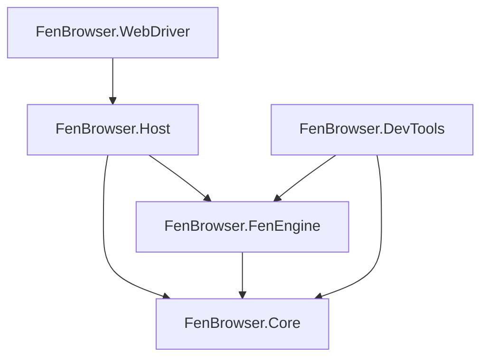

# FenBrowser Codex - Volume I: System Manifest & Architecture

**State as of:** 2026-02-20
**Codex Version:** 1.0

## 1. Introduction

- **[Volume I: System Manifest (This Document)](./VOLUME_I_SYSTEM_MANIFEST.md)**
  - High-level architecture, build instructions, and roadmap.
- **[Volume II: The Core Foundation](./VOLUME_II_CORE.md)**
  - _Scope:_ `FenBrowser.Core`
  - _Content:_ Basic types, DOM primitives, Networking interfaces, CSS value types.
- **[Volume III: The Engine Room](./VOLUME_III_FENENGINE.md)**
  - _Scope:_ `FenBrowser.FenEngine`
  - _Content:_ The Layout Engine (Block/Inline/Float formatting), CSS Cascade, Script Execution (CustomHtmlEngine), and Rendering Pipeline (SkiaDomRenderer).
- **[Volume IV: The Host Application](./VOLUME_IV_HOST.md)**
  - _Scope:_ `FenBrowser.Host`
  - _Content:_ Process entry point, Window management, Input routing, and Operating System integration.
- **[Volume V: Developer Tools](./VOLUME_V_DEVTOOLS.md)**
  - _Scope:_ `FenBrowser.DevTools`
  - _Content:_ The internal inspector, debugging overlays, and performance profiling tools.
- **[Volume VI: Extensions & Verification](./VOLUME_VI_EXTENSIONS_VERIFICATION.md)**
  - _Scope:_ `FenBrowser.WebDriver`, `FenBrowser.Tests`, `FenBrowser.Test262`, verification scripts
  - _Content:_ Test strategies, automation interfaces, compliance specifications, and runner operating guides.

## 3. High-Level Architecture

### 3.1 Layer Responsibilities

#### Layer 0: FenBrowser.Core

The "standard library" of the browser. It contains:

- **DOM Nodes**: `HtmlNode`, `Element`, `Document`.
- **CSS Types**: `CssLength`, `CssColor`, `BoxModel`.
- **Networking**: `IResourceFetcher`, `HttpUtils`.
- **Utilities**: Logging, geometric primitives (`Rect`, `Point`).

#### Layer 1: FenBrowser.FenEngine

The logic center. It consumes the Core and produces pixels.

- **Parser**: Converts HTML/CSS text into DOM trees.
- **Style Engine**: Resolves CSS rules against DOM nodes.
- **Layout**: Calculates geometry (x, y, width, height) for render trees.
- **Paint**: Issues draw commands to a Skia canvas.
- **Scripting**: Executes JavaScript via FenEngine bytecode compiler + VM.
  - Intrinsic repair note (2026-03-11): `Function.prototype` now carries spec-shaped `name` / `Symbol.hasInstance` metadata in the active runtime initialization path, and symbol stringification no longer breaks Test262 descriptor helpers.

#### Layer 2: FenBrowser.Host

The executable wrapper.

- **Windowing**: Creating the OS window.
- **Input**: Capturing mouse/keyboard and forwarding to the Engine.
- **Event Loop**: Driving the frame timer.

## 4. How to Read This Codebase (For AI Agents)

- **Entry Point**: Start at `FenBrowser.Host/Program.cs` to see the initialization sequence.
- **The "Frame"**: Follow the `EventLoop` in `FenBrowser.Host` which calls `Update()` and `Render()` on the Engine.
- **Layout Logic**: The complex logic lives in `FenBrowser.FenEngine/Layout/`. Start with `MinimalLayoutComputer.cs`.

## 5. Build & Debug

- **Solution**: `FenBrowser.sln`
- **Target Framework (all projects)**: `net8.0` (global.json pinned to SDK 8.0.416, rollForward=latestPatch)
- **Output**: `bin/Debug/net8.0-windows`
- **CI Build Artifact**: `.github/workflows/build-fenbrowser-exe.yml` restores and publishes `FenBrowser.Host` for `win-x64` in `Release` as a self-contained single-file executable (with full content self-extraction enabled for runtime native dependencies) and uploads artifact `fenbrowser-win-x64`.
- **Logs**: Checked in `Videos/FENBROWSER/logs`. `debug_screenshot.png` is the visual truth.
- **Root Diagnostics**: Root-level debug artifacts (`dom_dump.txt`, `debug_log.txt`, `layout_engine_debug.txt`, `js_debug.log`, screenshot/text dumps, captured JS payload files) are cleaned by `clean_root.ps1` before fresh repro runs so visual/log analysis is not polluted by stale artifacts.

## 6. Process Model & Build Notes (2026-02-20)

- **Process Model Baseline**:
  - FenBrowser remains **in-process** today, but host-side process-model interfaces now exist to prevent architecture lock-in.
  - New host abstraction path:
    - `FenBrowser.Host.ProcessIsolation.IProcessIsolationCoordinator`
    - `InProcessIsolationCoordinator` (default)
    - `BrokeredProcessIsolationCoordinator` (`FEN_PROCESS_ISOLATION=brokered`)
    - `ProcessIsolationCoordinatorFactory` (`FEN_PROCESS_ISOLATION` switch).
  - Brokered mode now includes:
    - origin-strict assignment/reassignment policy
    - registry-backed isolation state machine (`RendererTabIsolationRegistry`)
    - bounded renderer crash restart/backoff
    - stable-run restart reset + crash-loop quarantine gating
    - disconnected-session IPC buffering for critical navigation/control envelopes
    - child startup capability/sandbox assertions
    - expanded frame metadata contract (`surface*` + dirty-region markers).
  - PAL update (2026-03-07):
    - Linux/macOS no longer route baseline PAL shared-memory operations through an unsupported-platform throw path.
    - `PlatformLayerFactory` now resolves non-Windows hosts to `PosixPlatformLayer`, which provides deterministic file-backed mapped shared memory and process memory queries.
    - OS-native sandbox enforcement on non-Windows remains an open hardening item; this tranche closes PAL/IPC baseline fallback behavior only.
  - POSIX sandbox launcher update (2026-03-07):
    - non-Windows sandbox factory creation now detects native helper-backed launch paths (`bwrap`, `sandbox-exec`) and uses them for child-process profiles when available,
    - broker remains unsandboxed by design,
    - helper absence still degrades explicitly to `NullSandbox`, so remaining unsupported hosts are visible rather than silently misreported.

- **Navigation Lifecycle Baseline**:
  - Top-level navigation now flows through deterministic lifecycle states (`Requested -> Fetching -> ResponseReceived -> Committing -> Interactive -> Complete`) via `NavigationLifecycleTracker`.
  - Host structured navigation events consume these transitions directly (instead of timer/forced-event fallback paths).
  - NL-2 extension adds redirect/commit-source metadata, staged render telemetry in interactive transitions, and bounded settle-aware completion signaling before `Complete`.
  - NL-3 extension includes webfont pending-load state in completion settle gating to reduce early-complete layout-shift risk.
  - NL-4 extension adds navigation-scoped render subresource accounting for completion gating (per-navigation pending counts and explicit stale-navigation cleanup).
  - NL-5 extension adds script/module fetch accounting into navigation-scoped render subresource tracking, completing top-level lifecycle settle coverage for render-time dependency classes.
  - Host reliability extension (NL-6 sustain) hardens loading-state invalidation/wake behavior so first-frame commit and loading indicators do not depend on incidental hover/input repaint triggers.
  - 2026-03-12 compatibility hardening separates top-level document fetch semantics from subresource fetch semantics and restores runtime-backed window.location redirects into the host navigation path.
  - 2026-03-12 Google search-box hardening keeps <textarea> current value synchronized across BrowserHost editing, JS element.value, and overlay rendering so form/typing state stays coherent on wrapper-heavy search UIs.

- **HTML Parsing Baseline (HP-1)**:
  - Core parser now emits staged parse metrics with checkpoint counts (`HtmlParseBuildMetrics`).
  - Runtime parse flow now enters explicit pipeline parse stages (`Tokenizing -> Parsing`) through `BuildWithPipelineStages(...)`.
  - Interactive lifecycle telemetry now includes parse checkpoint visibility for diagnostics.
  - HP-2 extends this with incremental document checkpoint signaling (`ParseDocumentCheckpointCallback`) and runtime `domParseCheckpoints` telemetry.
  - HP-3 adds `DocumentReadyTokenCount` / `docReadyToken` milestone telemetry for deterministic early-render readiness analysis.
  - HP-4 adds bounded incremental parse repaint checkpoints via cloned DOM snapshots, surfaced as `parseRepaints` telemetry.
  - HP-5 adds a controlled streaming preparse assist path (large-document gate) with telemetry (`streamPreparse`, `streamCheckpoints`, `streamRepaints`) and bounded snapshot-based repaint emissions before final parse commit.
  - HP-6 promotes the production parser to interleaved tokenize/parse execution (`InterleavedTokenBatchSize`) for large documents and adds telemetry (`interleaved`, `interleavedBatch`, `interleavedChunks`) to lifecycle diagnostics.
  - HP-7 adds interleaved-parse conformance guardrails (baseline vs interleaved equivalence tests) and runtime retry fallback to non-interleaved parse on interleaved failure (`interleavedFallback` telemetry).

- **CSS/Cascade/Selector Baseline (CSS-1, 2026-02-20)**:
  - Engine matcher now covers key Selectors-4 behaviors required for production dynamic compatibility:
    - `nth-child(... of <selector-list>)`
    - relational `:has(...)` with combinator-aware relative traversal (`>`, `+`, `~`, descendant)
    - spec-correct `:empty` handling
    - robust attribute selector parsing/flags.
  - Core selector path parity improved for `nth-child(... of ...)` and attribute `i/s` flags.
  - CSS-1.1 extension hardens Media Queries Level 4 range-context parsing in `Rendering/Css/CssLoader.cs`, including `width OP value` and `value OP width` forms used by responsive breakpoints.
  - CSS-1.2 extension hardens `background` shorthand color extraction for function-heavy modern syntax (`oklab/oklch`, modern `rgb/hsl` forms with slash-alpha), preserving last-layer color semantics in multi-layer backgrounds.
  - CSS-1.3 extension adds modern space/slash `rgb()/rgba()` color parsing in `Rendering/Css/CssParser.cs`, aligning parser behavior with CSS Color 4 tokens consumed by shorthand extraction.
  - CSS-1.4 extension clamps negative padding out of used geometry during computed style resolution and enforces the `border-style: none` default for width-only shorthands, restoring standards compliance for CSS box-model geometry (`CssLoader.cs`, `Tests/Rendering/Css/BorderAndPaddingSemanticsTests.cs`).
  - New regression packs:
    - `Tests/Engine/SelectorMatcherConformanceTests.cs`
    - `Tests/DOM/SelectorEngineConformanceTests.cs`.

- **Layout Baseline (L-1, 2026-02-20)**:
  - Grid auto-repeat parser no longer uses placeholder semantics for `repeat(auto-fill/auto-fit, ...)`.
  - Multi-track repeat width/gap accounting is now deterministic.
  - Unresolved intrinsic auto-repeat minima now use conservative single-repeat fallback (prevents explosive track expansion).
  - Regression coverage added in `Tests/Layout/GridTrackSizingTests.cs`.
  - L-2 extension aligns grid row intrinsic/auto sizing between measure and arrange passes to keep row offsets stable for content-sized rows.
  - L-3 extension adds explicit `auto-fill`/`auto-fit` track-mode tagging and collapses unused trailing explicit `auto-fit` repeat tracks during sizing.
  - L-4 extension removes placeholder margin-style collapse helper behavior and adds writing-mode-aware block-axis margin pairing regressions.
  - L-5 extension resolves auto-repeat breadth from definite max-track sizing (`minmax(auto, <definite>)`) to avoid conservative single-repeat fallback.
  - L-6 extension resolves `fit-content(%)` limits against container inline size and preserves percent-origin metadata in `GridTrackSize` for spec-consistent grid track clamp behavior.
  - L-7 extension replaces flex row baseline placeholder behavior with per-line baseline synthesis (`align-items/align-self: baseline`), harmonizes `CssFlexLayout` baseline resolution, and adds regression guards in `Tests/Layout/FlexLayoutTests.cs`.
  - L-8 extension fixes grid content-alignment double-offset during arrange, corrects document-root fallback traversal in block layout helpers, keeps `Document` nodes layout-visible so document-root layout flows produce descendant boxes, and adds a table auto-layout participating-column non-zero guard to prevent zero-width cell collapse (`GridLayoutComputer.cs`, `LayoutHelpers.cs`, `MinimalLayoutComputer.cs`, `TableLayoutComputer.cs`) with integration hardening in `Tests/Layout/Acid2LayoutTests.cs` and `Tests/Layout/TableLayoutIntegrationTests.cs`.
  - 2026-04-11 engine/cascade hardening now resolves `font: inherit` shorthand into parent computed font longhands at style resolution time, preventing descendant relative-font compounding on standards pages such as the Acid2 intro gate (`CssLoader.cs`, `Tests/Engine/CascadeModernTests.cs`, `Tests/Layout/Acid2LayoutTests.cs`).
  - 2026-04-12 engine/cascade hardening now treats root `font` shorthand as the authoritative root font-size source for both `rem` resolution and later used-value sync passes, and stops positioned `top/right/bottom/left` reparsing from falling back to `16px` after the element already resolved a different computed font basis (`CssLoader.cs`, `Tests/Engine/CascadeModernTests.cs`).
  - 2026-04-12 engine/cascade loader optimization eliminates ThreadPool starvation (the 20-second timeout on complex pages) by throttling parallel runs with a global `SemaphoreSlim` limit and eliminating duplicate parsing via a shared `_inFlightParses` task cache. The CSS syntax parsing output is now natively converted to a `StyleSet` explicitly preserving asynchronous rule origin mapping (`CssLoader.cs`).
  - L-9 extension hardens table slot attribution and rowspan sizing semantics: column contributions now map via `TableCellSlot.ColumnIndex` for rowspan/colspan correctness, row heights now distribute rowspan-required height across spanned rows, table row/cell extraction is case-insensitive in the table core (`TableLayoutComputer.cs`), `MinimalLayoutComputer.ShouldHide(...)` preserves table semantics/text-only cell content during measurement, and inline traversal now uses `ChildNodes` + pseudo-aware sources so text-only inline/table-cell content contributes intrinsic width (`InlineLayoutComputer.cs`, `MinimalLayoutComputer.cs`), with regressions in `Tests/Layout/TableLayoutIntegrationTests.cs`.
  - L-10 extension removes the legacy simplified `GridFormattingContext` algorithm by delegating box-tree grid layout to `GridLayoutComputer` (typed computed-style semantics + shared placement/sizing behavior), with integration regressions in `Tests/Layout/GridFormattingContextIntegrationTests.cs`; owner verification on 2026-02-20 confirmed `GridFormattingContextIntegrationTests` 2/2 and `FenBrowser.Tests.Layout` 90/90.
  - L-11 extension propagates SVG `viewBox` intrinsic sizing through replaced-element fallback paths in inline/block/flex positioning contexts (`LayoutPositioningLogic.cs`, `Contexts/InlineFormattingContext.cs`, `Contexts/BlockFormattingContext.cs`, `Contexts/FlexFormattingContext.cs`) so icon-only SVG controls do not regress to 300x150 fallback geometry when explicit CSS sizing is absent.
  - L-12 extension hardens document scroll extents and post-script selector correctness: `LayoutEngine` now derives `LayoutResult.ContentHeight` from full descendant geometry rather than root-box height approximation, and `CustomHtmlEngine` now refreshes CSS before the post-script visual-tree rebuild when live DOM mutations leave style-dirty or newly unstyled nodes behind.
  - L-13 extension hardens auto-height CSS Grid shells with flexible block-axis tracks: `GridLayoutComputer` now measures intrinsic content contributions for `fr` rows and only resolves block-axis flex tracks against available height when the grid container itself has a definite block size, preventing Wikipedia-style footer/page-tools chrome from collapsing upward in `min-content 1fr min-content` page shells.
  - L-14 extension hardens inline replaced-element measurement so `InlineFormattingContext` treats inline SVGs as atomic replaced boxes before aggregating descendant inline children, preventing Google-style wordmark SVGs with multiple `path` descendants from collapsing into synthetic `60x10` fallback geometry.
  - L-15 extension hardens inline button measurement so `InlineFormattingContext` stops treating `<button>` as an early replaced inline box, allowing nested flex/button descendants to lay out before the outer button is measured; this preserves Google-style upload and AI-mode pill content geometry instead of leaving child labels/icons at zero or fallback sizes.
  - L-16 extension restores `vertical-align` handling in the active inline formatting path: `InlineFormattingContext` now synthesizes per-line ascent/descent, positions text from the line baseline, and honors `vertical-align` for mixed-height inline controls so Google-style header/control rows stop drifting onto different centerlines.
  - L-17 extension restores final-pass `position: relative` behavior in the formatting-context pipeline: block/flex/grid/inline placement now uses subtree-aware positioning via `LayoutBoxOps.PositionSubtree(...)`, so authored `left/right/top/bottom` nudges survive parent placement and shift descendants together without changing sibling flow slots.
  - 2026-04-11 Acid2 face hardening now keeps in-flow descendants attached when an absolutely/fixed positioned ancestor is resolved in the final pass (`LayoutPositioningLogic.cs`, `LayoutBoxOps.cs`), introduces active-pipeline `display: table` row/cell layout for the Acid2 tail (`TableFormattingContext.cs`, `FormattingContext.cs`), rejects invalid later `width` / `background` declarations at cascade time (`CascadeEngine.cs`), and preserves `%` `min-height` / `max-height` semantics as percent fields instead of viewport-evaluated expressions so the Acid2 nose no longer expands to viewport-scale height (`CssLoader.cs`). Regressions landed in `Tests/Layout/AbsolutePositionTests.cs`, `Tests/Layout/Acid2LayoutTests.cs`, and `Tests/Engine/CascadeModernTests.cs`.
  - 2026-04-13 Acid2 cascade correction tranche additionally normalizes `font: inherit` to inherited computed font data (avoids relative-unit compounding), projects `background-attachment`/`background-repeat` from shorthand fallback tokens, and keeps `%` min/max-height in typed percent fields for definite-containing-block checks; targeted Acid2 regressions and the full `FullyQualifiedName~Acid2` suite pass on this revision (`CssLoader.cs`, `Tests/Layout/Acid2LayoutTests.cs`, `Tests/Rendering/Acid2PropertiesTests.cs`).
  - 2026-04-13 parser-conformance tightening now rejects malformed declaration values containing stray `!` tokens that are not terminal `!important`, so Acid2 parser-trap declarations (e.g. `border: ... ! error`) no longer override previously valid border state (`CssSyntaxParser.cs`, `Tests/Rendering/Acid2PropertiesTests.cs`).
  - 2026-04-13 float-clearance correction removes the `currentY` clamp in `FloatManager.GetClearanceY(...)`, allowing negative clear deltas in collapsed-margin scenarios (Acid2 lower-face clear/float interactions), with regression coverage in `Tests/Layout/BlockFormattingContextFloatTests.cs`.
  - 2026-04-13 Acid2 tooling URL correction now uses `http://acid2.acidtests.org/#top` for single-shot captures so the harness no longer lands on HTTPS certificate-name-mismatch interstitials; regression guard added in `Tests/Testing/AcidTestRunnerTests.cs` (`Testing/AcidTestRunner.cs`).
  - 2026-04-13 tooling diagnostics now add `acid2-compare` (live Acid2 raster vs local reference snapshot) and bounded timeout budgets for Acid2 tooling capture loops, preventing multi-minute hangs during conformance triage (`Tooling/Program.cs`).
  - 2026-04-14 Acid2 face-slice live regression hardening: `clear` declarations are now propagated into `CssComputed` and block-clearance margin-edge math now uses collapsed top-margin edges, improving live Acid2 compare similarity from ~97.5% to ~98.1% (`Rendering/Css/CssLoader.cs`, `Layout/Contexts/BlockFormattingContext.cs`).

- **Paint/Compositing Baseline (PC-1, 2026-02-20)**:
  - `RenderPipeline` now enforces strict phase invariants (warning-only recovery removed from production path), with explicit `Composite -> Present -> Idle` lifecycle and frame-budget telemetry (`FrameSequence`, `LastFrameDuration`).
  - `SkiaDomRenderer` now enters present stage explicitly before frame close and wires paint stability controls into paint-tree rebuild decisions.
  - New compositing primitives:
    - `Rendering/Compositing/PaintCompositingStabilityController.cs` (invalidation-burst guard with bounded forced rebuild windows)
    - `Rendering/Compositing/PaintDamageTracker.cs` (viewport-clamped paint damage regions with bounded region collapse policy)
  - Regression coverage added:
    - `Tests/Rendering/RenderPipelineInvariantTests.cs`
    - `Tests/Rendering/PaintCompositingStabilityControllerTests.cs`
    - `Tests/Rendering/PaintDamageTrackerTests.cs`.
  - PC-1.1 regression hardening:
    - `Rendering/FontRegistry.cs` now resolves full `@font-face src` fallback chains (`local(...)` and `url(...)` in source order).
    - `Layout/MinimalLayoutComputer.cs` + `Core/Dom/V2/PseudoElement.cs` now keep pseudo generated-text behavior stable for reused pseudo instances.
    - `Rendering/Css/CssLoader.cs` UA stylesheet fallback now includes `Resources/ua.css` candidate paths and explicit `mark` fallback defaults.
  - PC-1.2 font-load determinism:
    - `Rendering/FontRegistry.cs` now starts load tasks directly from `RegisterFontFace(...)` (no extra `Task.Run` scheduling hop).
    - local font lookup now falls back from style-specific to plain family-name resolution.
  - PC-1.3 group-bound hardening prevents delayed dynamic pages from disappearing under paint-tree wrapper culling: `NewPaintTreeBuilder` now computes aggregate bounds for stacking/opacity wrappers, and `SkiaRenderer` no longer culls grouping nodes solely by their own approximate bounds before recursing into children.
  - PC-1.4 root debug screenshot capture now runs on both full-frame and damage-raster paint paths, with explicit skip/failure diagnostics and a five-second artifact-based throttle in `SkiaRenderer`, so `debug_screenshot.png` remains trustworthy without forcing a full offscreen PNG encode on every repaint.
  - PC-1.5 interaction-state repaint hardening: hover/focus state is now part of `ImmutablePaintTree` style diffing so damage tracking can localize those visual restyles, `ElementStateManager` reserves one-shot full repaint fallback for states not yet encoded in the paint tree (`:active` and checked-state), `SkiaDomRenderer` still upgrades those fallback frames to full-viewport damage, and `BrowserApi` no longer emits an eager pre-recascade hover repaint that made pointer movement look like full content refresh.
  - PC-1.6 active-document repaint loop hardening: `Element.StyleAttributeChanged` now carries the mutated element so `BrowserApi` can scope CSS recascade to connected nodes in the active render tree, while `BrowserIntegration` no longer emits delayed backup invalidations or direct Compositor pulses after a committed styled frame exists.
  - PC-1.7 document-root canvas background resolution: `SkiaDomRenderer` now resolves the frame-clear color from `Document.documentElement` and `Document.body` as well as element roots, so body-authored page backgrounds propagate to the full canvas on normal document renders instead of being clipped to the centered body box. Regression coverage lives in `FenBrowser.Tests/Rendering/CanvasBackgroundResolutionTests.cs`.
  - PC-1.8 float shrink-to-fit occupied-width sizing: `BlockFormattingContext` now uses the furthest occupied child inline edge from the unconstrained probe pass when collapsing auto-width shrink-to-fit blocks, preventing right-floated nav wrappers from shrinking to a single floated item and restacking horizontal float rows vertically.
  - PC-1.9 build-integrity recovery (2026-04-13): repaired malformed control flow in `NewPaintTreeBuilder`, aligned `CssAnimationEngine` with current keyframe types and frame-tick signaling, and moved paint-cache stability metadata into `PaintNodeCache` side tables so the full solution build clears compile-time engine/host breakages without reintroducing namespace/type collisions.
  - PC-1.10 navigation-speed recovery (2026-04-13): CSS rule parsing now uses a bounded wait budget on the first-pass cascade path (instead of a fixed 20-second stall window), oversized external page scripts are deferred on initial load, and temporary parser/CSS debug traces are gated behind explicit debug flags. This reduces first-render latency on script-heavy pages (e.g., google.com repro moved from ~22s first render to ~4.8s in a clean run).
  - PC-1.11 hot-path logging containment (2026-04-13): per-frame host transition logs and high-volume inline/block layout diagnostic traces are now deep-debug gated (`EnableDeepDebug` + subsystem flags), preventing normal navigation runs from paying repeated string-format + file-I/O cost in repaint/layout loops while keeping diagnostics available for targeted investigations.
  - PC-1.12 Acid2 reference-alignment tranche (2026-04-13): paint-tree background-image metadata now preserves `background-clip`/`background-origin`/`background-position`/`background-attachment: fixed` semantics end-to-end, object replaced-content rendering now survives nested fallback chains, border side colors/styles now preserve CSS `border-color` shorthand and side overrides, and shrink-to-fit float width probing removed an unconditional +1px expansion that was skewing inline float wrappers.
  - PC-1.13 fragment-first frame ordering (2026-04-14): `Host/BrowserIntegration.cs` now seeds pending fragment navigation during `RepaintReady` (from `_browser.CurrentUri`) before the first frame request, so fragment anchors remain deterministic when `RepaintReady` arrives before `Navigated` (Acid2 `#top` regression path).
  - PC-1.14 cross-navigation scroll reset (2026-04-14): `Host/BrowserIntegration.cs` now resets host scroll/content-height state at each top-level navigation start, preventing previous-document scroll carry-over from blanking short follow-up captures (Acid2 live page to `reference.html` compare path).
  - PC-1.15 Acid2 shorthand-background normalization (2026-04-14): `CssLoader` now extracts `url(...)` from shorthand `background` text before paint-node construction, preserves first-pass `em`-aware positioned offsets (no late default-base overwrite), and applies shorthand fallback extraction for `background-position` where initial defaults masked authored offsets.
  - PC-1.16 hover-ancestor visual isolation (2026-04-17): `NewPaintTreeBuilder` now marks synthetic paint-time hover state only on the direct hovered element (via `ElementStateManager.HoveredElement`) instead of the entire ancestor chain, preserving CSS ancestor `:hover` matching while stopping full-surface hover tint shifts on internal pages such as `fen://newtab`; regression coverage added in `FenBrowser.Tests/Engine/NewTabPageLayoutTests.cs` (`Hovering_NewTab_Input_Does_Not_Modulate_Page_Backdrop`).
  - PC-1.17 input-overlay text legibility fallback (2026-04-17): `SkiaDomRenderer` now resolves a visible `TextColor` for native input/textarea overlays by falling back from transparent/sentinel element color to ancestor foreground color (then black fallback), preventing invisible typed text on Google-style search surfaces where page CSS drives transparent control text states. Regression coverage added in `FenBrowser.Tests/Rendering/InputOverlayColorTests.cs` (`TransparentInputText_UsesVisibleOverlayFallbackColor`).
  - PC-1.18 typing-focus recovery for wrapper click targets (2026-04-17): `BrowserApi.HandleKeyPress(...)` now recovers editable focus from recent click target ancestry/descendants (plus active document fallback) when `_focusedElement` is null, so wrapper-first search UIs (e.g. Google `#APjFqb` container clicks) continue routing typed characters into the real textarea/input. Regression coverage added in `FenBrowser.Tests/Rendering/BrowserHostTextareaStateTests.cs` (`HandleKeyPress_RecoversFocusableTextareaFromLastClickWrapper`).
  - PC-1.19 Google submit activation parity for Enter/click wrapper targets (2026-04-17): `BrowserApi.HandleElementClick(...)` now promotes wrapper hits to descendant submit controls when needed, and `HandleKeyPress(...)` now submits forms on Enter for focused `input` and Google-style search `textarea` controls while preserving newline insertion for regular textareas. Regression coverage added in `FenBrowser.Tests/Rendering/BrowserHostTextareaStateTests.cs` (`HandleKeyPress_EnterInRegularTextarea_InsertsNewline`) with targeted submit suite validation via `BrowserHostFormSubmissionTests`.
  - 2026-04-11 Acid2 face pre-paint hardening: `ReplacedElementSizing`, `BoxTreeBuilder`, `MinimalLayoutComputer`, `BlockFormattingContext`, `InlineFormattingContext`, `LayoutPositioningLogic`, and `AbsolutePositionSolver` now allow `<object>` fallback content to stay in the Box Tree when the object payload is not directly renderable, and re-probe floated auto-width boxes against the available inline band during shrink-to-fit layout so the Acid2 eye stack and smile subtree no longer explode from the legacy `300x150` object fallback and unconstrained float probe widths.
  - PC-2 damage-region consumption:
    - `Rendering/Compositing/DamageRasterizationPolicy.cs` introduces strict partial-raster gating.
    - `Rendering/SkiaRenderer.cs` adds `RenderDamaged(...)` clip-based damage redraw.
    - `Host/BrowserIntegration.cs` now seeds recording from previous frame to enable safe damage-only redraws.
  - Interaction hardening extension:
    - `Rendering/Interaction/ScrollManager.cs` now computes axis-specific snap targets, applies `scroll-padding`/`scroll-margin` offsets, and biases target selection with recent scroll direction to reduce carousel snap jitter.
    - `Rendering/PaintTree/NewPaintTreeBuilder.cs` now seeds scroll bounds from descendant geometry and triggers snap resolution during scrollable paint-tree construction so runtime snap behavior is exercised in the renderer path.
    - Scroll-snap triggering in paint-tree construction now requires recent (time-bounded) user input hints, preventing stale deltas from causing delayed or surprise snap jumps.

- **Build Resolver Stabilization Notes**:
  - Repository includes `Directory.Build.props` restore/resolver safety overrides to improve determinism on machines exhibiting silent project-graph failures.
  - Known machine-specific issue can still surface as `Build FAILED (0 warnings, 0 errors)` during full host/tests builds; component-level build validation should be used when this occurs.

## P0 Architecture Closure (2026-03-29)

- Runtime/tooling ownership:
  - `FenBrowser.Host/Program.cs` is now a browser-or-child-process entrypoint only.
  - Test262, WPT, Acid, debug-css, and related harness workflows moved behind the dedicated `FenBrowser.Tooling` assembly instead of remaining host startup modes.
- Parser ownership:
  - `FenBrowser.Core/Parsing/*` is now the single runtime HTML parser authority.
  - The duplicate `FenBrowser.FenEngine/HTML/*` runtime compilation path was removed, and conformance/tests now consume the canonical core parser.
- Renderer ownership:
  - `FenBrowser.FenEngine/Rendering/SkiaDomRenderer.cs` now implements the explicit `IRenderFramePipeline` contract and no longer carries transitional-pipeline posture.
- Security/logging ownership:
  - `FenBrowser.Core/Security/BrowserSecurityPolicy.cs`, `SecurityDecision.cs`, and `Sandbox/SandboxLaunchPolicy.cs` centralize navigation/network/remote-debug and sandbox-launch decisions with observable deny paths.
  - `FenBrowser.Core/Logging/LogContext.cs`, `FenLogger.cs`, and `LogManager.cs` now provide ambient correlation scopes, structured mirrors, archive trimming, and stable categories for `Security`, `Accessibility`, `ProcessIsolation`, and `DevTools`.
- Accessibility ownership:
  - Linux AT-SPI now emits through a bounded broker (`LinuxAtSpiEventBroker.cs`) with explicit failure logging instead of remaining a placeholder bridge.
- Solution-graph impact:
  - `FenBrowser.Tooling` is now the assembly owner for linked harness sources (`FenBrowser.FenEngine/Testing/*`, `TestHarnessAPI.cs`, `TestConsoleCapture.cs`, `TestFenEngine.cs`), while `FenBrowser.WPT`, `FenBrowser.Test262`, `FenBrowser.Conformance`, and `FenBrowser.Tests` reference that tooling assembly instead of runtime-owned harness compilation.
- Verification:
  - `dotnet build FenBrowser.sln -nologo` completed successfully on `2026-03-29`.

---

_End of Volume I_
  - POSIX sandbox enforcement update (2026-03-07):
    - native helper-backed Linux/macOS child sandboxes now generate capability-scoped filesystem and network rules instead of broad read-everything launch wrappers,
    - renderer/network/utility profiles only receive working-directory, executable-directory, temp, home, and network access that is implied by their explicit `OsSandboxCapabilities`,
    - macOS child sandboxes now deny `process-fork` unless spawning is explicitly granted.
