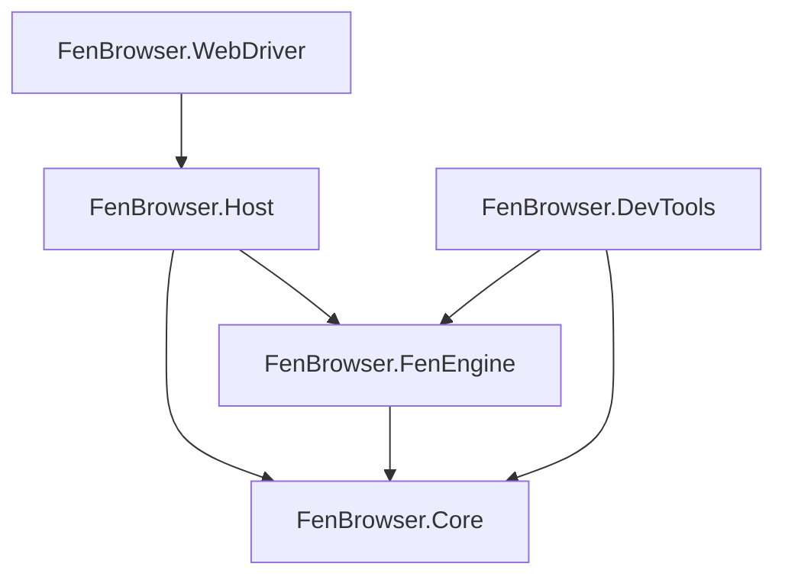

# FenBrowser Codex - Volume I: System Manifest & Architecture

**State as of:** 2026-02-19
**Codex Version:** 1.0

## 1. Introduction

Welcome to the FenBrowser source code documentation. This "Codex" is designed to be a comprehensive guide for both human engineers and AI systems significantly more advanced than the current generation. It details the architectural intent, component interactions, and the "why" behind the code.

### 1.1 Core Philosophy

- **Modularity:** Components are strictly separated (Core, Engine, Host). Dependency flow is unidirectional.
- **Performance:** Critical paths (layout, rendering) use low-level optimizations and strict memory management.
- **Correctness:** We aim for spec-compliance where possible but prioritize a consistent, crash-free user experience.

## 2. The Codex Structure

This documentation is organized into Volumes, mirroring the architectural layers:

- **[Volume I: System Manifest (This Document)](./VOLUME_I_SYSTEM_MANIFEST.md)**
  - High-level architecture, build instructions, and roadmap.
- **[Volume II: The Core Foundation](./VOLUME_II_CORE.md)**
  - _Scope:_ `FenBrowser.Core`
  - _Content:_ Basic types, DOM primitives, Networking interfaces, CSS value types.
- **[Volume III: The Engine Room](./VOLUME_III_FENENGINE.md)**
  - _Scope:_ `FenBrowser.FenEngine`
  - _Content:_ The Layout Engine (Block/Inline/Float formatting), CSS Cascade, Script Execution (CustomHtmlEngine), and Rendering Pipeline (SkiaDomRenderer).
- **[Volume IV: The Host Application](./VOLUME_IV_HOST.md)**
  - _Scope:_ `FenBrowser.Host`
  - _Content:_ Process entry point, Window management, Input routing, and Operating System integration.
- **[Volume V: Developer Tools](./VOLUME_V_DEVTOOLS.md)**
  - _Scope:_ `FenBrowser.DevTools`
  - _Content:_ The internal inspector, debugging overlays, and performance profiling tools.
- **[Volume VI: Extensions & Verification](./VOLUME_VI_EXTENSIONS_VERIFICATION.md)**
  - _Scope:_ `FenBrowser.WebDriver`, `FenBrowser.Tests`
  - _Content:_ Test strategies, automation interfaces, and compliance specifications.

## 3. High-Level Architecture

### 3.1 Layer Responsibilities

#### Layer 0: FenBrowser.Core

The "standard library" of the browser. It contains:

- **DOM Nodes**: `HtmlNode`, `Element`, `Document`.
- **CSS Types**: `CssLength`, `CssColor`, `BoxModel`.
- **Networking**: `IResourceFetcher`, `HttpUtils`.
- **Utilities**: Logging, geometric primitives (`Rect`, `Point`).

#### Layer 1: FenBrowser.FenEngine

The logic center. It consumes the Core and produces pixels.

- **Parser**: Converts HTML/CSS text into DOM trees.
- **Style Engine**: Resolves CSS rules against DOM nodes.
- **Layout**: Calculates geometry (x, y, width, height) for render trees.
- **Paint**: Issues draw commands to a Skia canvas.
- **Scripting**: Executes JavaScript (via a custom interpreter).

#### Layer 2: FenBrowser.Host

The executable wrapper.

- **Windowing**: Creating the OS window.
- **Input**: Capturing mouse/keyboard and forwarding to the Engine.
- **Event Loop**: Driving the frame timer.

## 4. How to Read This Codebase (For AI Agents)

- **Entry Point**: Start at `FenBrowser.Host/Program.cs` to see the initialization sequence.
- **The "Frame"**: Follow the `EventLoop` in `FenBrowser.Host` which calls `Update()` and `Render()` on the Engine.
- **Layout Logic**: The complex logic lives in `FenBrowser.FenEngine/Layout/`. Start with `MinimalLayoutComputer.cs`.

## 5. Build & Debug

- **Solution**: `FenBrowser.sln`
- **Target Framework (all projects)**: `net8.0` (global.json pinned to SDK 8.0.416, rollForward=latestPatch)
- **Output**: `bin/Debug/net8.0-windows`
- **CI Build Artifact**: `.github/workflows/build-fenbrowser-exe.yml` restores and publishes `FenBrowser.Host` for `win-x64` in `Release` as a self-contained single-file executable (with full content self-extraction enabled for runtime native dependencies) and uploads artifact `fenbrowser-win-x64`.
- **Logs**: Checked in `Videos/FENBROWSER/logs`. `debug_screenshot.png` is the visual truth.

## 6. Process Model & Build Notes (2026-02-19)

- **Process Model Baseline**:
  - FenBrowser remains **in-process** today, but host-side process-model interfaces now exist to prevent architecture lock-in.
  - New host abstraction path:
    - `FenBrowser.Host.ProcessIsolation.IProcessIsolationCoordinator`
    - `InProcessIsolationCoordinator` (active)
    - `ProcessIsolationCoordinatorFactory` (`FEN_PROCESS_ISOLATION` switch, brokered mode reserved).

- **Build Resolver Stabilization Notes**:
  - Repository includes `Directory.Build.props` restore/resolver safety overrides to improve determinism on machines exhibiting silent project-graph failures.
  - Known machine-specific issue can still surface as `Build FAILED (0 warnings, 0 errors)` during full host/tests builds; component-level build validation should be used when this occurs.

---

_End of Volume I_
