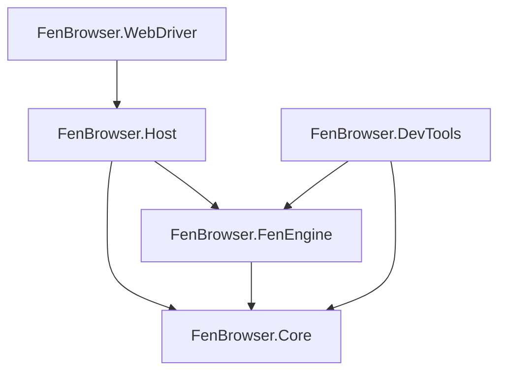

# FenBrowser Codex - Volume I: System Manifest & Architecture

**State as of:** 2026-02-20
**Codex Version:** 1.0

## 1. Introduction

Welcome to the FenBrowser source code documentation. This "Codex" is designed to be a comprehensive guide for both human engineers and AI systems significantly more advanced than the current generation. It details the architectural intent, component interactions, and the "why" behind the code.

### 1.1 Core Philosophy

- **Modularity:** Components are strictly separated (Core, Engine, Host). Dependency flow is unidirectional.
- **Performance:** Critical paths (layout, rendering) use low-level optimizations and strict memory management.
- **Correctness:** We aim for spec-compliance where possible but prioritize a consistent, crash-free user experience.

## 2. The Codex Structure

This documentation is organized into Volumes, mirroring the architectural layers:

- **[Volume I: System Manifest (This Document)](./VOLUME_I_SYSTEM_MANIFEST.md)**
  - High-level architecture, build instructions, and roadmap.
- **[Volume II: The Core Foundation](./VOLUME_II_CORE.md)**
  - _Scope:_ `FenBrowser.Core`
  - _Content:_ Basic types, DOM primitives, Networking interfaces, CSS value types.
- **[Volume III: The Engine Room](./VOLUME_III_FENENGINE.md)**
  - _Scope:_ `FenBrowser.FenEngine`
  - _Content:_ The Layout Engine (Block/Inline/Float formatting), CSS Cascade, Script Execution (CustomHtmlEngine), and Rendering Pipeline (SkiaDomRenderer).
- **[Volume IV: The Host Application](./VOLUME_IV_HOST.md)**
  - _Scope:_ `FenBrowser.Host`
  - _Content:_ Process entry point, Window management, Input routing, and Operating System integration.
- **[Volume V: Developer Tools](./VOLUME_V_DEVTOOLS.md)**
  - _Scope:_ `FenBrowser.DevTools`
  - _Content:_ The internal inspector, debugging overlays, and performance profiling tools.
- **[Volume VI: Extensions & Verification](./VOLUME_VI_EXTENSIONS_VERIFICATION.md)**
  - _Scope:_ `FenBrowser.WebDriver`, `FenBrowser.Tests`
  - _Content:_ Test strategies, automation interfaces, and compliance specifications.

## 3. High-Level Architecture

### 3.1 Layer Responsibilities

#### Layer 0: FenBrowser.Core

The "standard library" of the browser. It contains:

- **DOM Nodes**: `HtmlNode`, `Element`, `Document`.
- **CSS Types**: `CssLength`, `CssColor`, `BoxModel`.
- **Networking**: `IResourceFetcher`, `HttpUtils`.
- **Utilities**: Logging, geometric primitives (`Rect`, `Point`).

#### Layer 1: FenBrowser.FenEngine

The logic center. It consumes the Core and produces pixels.

- **Parser**: Converts HTML/CSS text into DOM trees.
- **Style Engine**: Resolves CSS rules against DOM nodes.
- **Layout**: Calculates geometry (x, y, width, height) for render trees.
- **Paint**: Issues draw commands to a Skia canvas.
- **Scripting**: Executes JavaScript (via a custom interpreter).

#### Layer 2: FenBrowser.Host

The executable wrapper.

- **Windowing**: Creating the OS window.
- **Input**: Capturing mouse/keyboard and forwarding to the Engine.
- **Event Loop**: Driving the frame timer.

## 4. How to Read This Codebase (For AI Agents)

- **Entry Point**: Start at `FenBrowser.Host/Program.cs` to see the initialization sequence.
- **The "Frame"**: Follow the `EventLoop` in `FenBrowser.Host` which calls `Update()` and `Render()` on the Engine.
- **Layout Logic**: The complex logic lives in `FenBrowser.FenEngine/Layout/`. Start with `MinimalLayoutComputer.cs`.

## 5. Build & Debug

- **Solution**: `FenBrowser.sln`
- **Target Framework (all projects)**: `net8.0` (global.json pinned to SDK 8.0.416, rollForward=latestPatch)
- **Output**: `bin/Debug/net8.0-windows`
- **CI Build Artifact**: `.github/workflows/build-fenbrowser-exe.yml` restores and publishes `FenBrowser.Host` for `win-x64` in `Release` as a self-contained single-file executable (with full content self-extraction enabled for runtime native dependencies) and uploads artifact `fenbrowser-win-x64`.
- **Logs**: Checked in `Videos/FENBROWSER/logs`. `debug_screenshot.png` is the visual truth.

## 6. Process Model & Build Notes (2026-02-20)

- **Process Model Baseline**:
  - FenBrowser remains **in-process** today, but host-side process-model interfaces now exist to prevent architecture lock-in.
  - New host abstraction path:
    - `FenBrowser.Host.ProcessIsolation.IProcessIsolationCoordinator`
    - `InProcessIsolationCoordinator` (default)
    - `BrokeredProcessIsolationCoordinator` (`FEN_PROCESS_ISOLATION=brokered`)
    - `ProcessIsolationCoordinatorFactory` (`FEN_PROCESS_ISOLATION` switch).
  - Brokered mode now includes:
    - origin-strict assignment/reassignment policy
    - registry-backed isolation state machine (`RendererTabIsolationRegistry`)
    - bounded renderer crash restart/backoff
    - stable-run restart reset + crash-loop quarantine gating
    - disconnected-session IPC buffering for critical navigation/control envelopes
    - child startup capability/sandbox assertions
    - expanded frame metadata contract (`surface*` + dirty-region markers).

- **Navigation Lifecycle Baseline**:
  - Top-level navigation now flows through deterministic lifecycle states (`Requested -> Fetching -> ResponseReceived -> Committing -> Interactive -> Complete`) via `NavigationLifecycleTracker`.
  - Host structured navigation events consume these transitions directly (instead of timer/forced-event fallback paths).
  - NL-2 extension adds redirect/commit-source metadata, staged render telemetry in interactive transitions, and bounded settle-aware completion signaling before `Complete`.
  - NL-3 extension includes webfont pending-load state in completion settle gating to reduce early-complete layout-shift risk.
  - NL-4 extension adds navigation-scoped render subresource accounting for completion gating (per-navigation pending counts and explicit stale-navigation cleanup).
  - NL-5 extension adds script/module fetch accounting into navigation-scoped render subresource tracking, completing top-level lifecycle settle coverage for render-time dependency classes.
  - Host reliability extension (NL-6 sustain) hardens loading-state invalidation/wake behavior so first-frame commit and loading indicators do not depend on incidental hover/input repaint triggers.

- **HTML Parsing Baseline (HP-1)**:
  - Core parser now emits staged parse metrics with checkpoint counts (`HtmlParseBuildMetrics`).
  - Runtime parse flow now enters explicit pipeline parse stages (`Tokenizing -> Parsing`) through `BuildWithPipelineStages(...)`.
  - Interactive lifecycle telemetry now includes parse checkpoint visibility for diagnostics.
  - HP-2 extends this with incremental document checkpoint signaling (`ParseDocumentCheckpointCallback`) and runtime `domParseCheckpoints` telemetry.
  - HP-3 adds `DocumentReadyTokenCount` / `docReadyToken` milestone telemetry for deterministic early-render readiness analysis.
  - HP-4 adds bounded incremental parse repaint checkpoints via cloned DOM snapshots, surfaced as `parseRepaints` telemetry.
  - HP-5 adds a controlled streaming preparse assist path (large-document gate) with telemetry (`streamPreparse`, `streamCheckpoints`, `streamRepaints`) and bounded snapshot-based repaint emissions before final parse commit.
  - HP-6 promotes the production parser to interleaved tokenize/parse execution (`InterleavedTokenBatchSize`) for large documents and adds telemetry (`interleaved`, `interleavedBatch`, `interleavedChunks`) to lifecycle diagnostics.
  - HP-7 adds interleaved-parse conformance guardrails (baseline vs interleaved equivalence tests) and runtime retry fallback to non-interleaved parse on interleaved failure (`interleavedFallback` telemetry).

- **CSS/Cascade/Selector Baseline (CSS-1, 2026-02-20)**:
  - Engine matcher now covers key Selectors-4 behaviors required for production dynamic compatibility:
    - `nth-child(... of <selector-list>)`
    - relational `:has(...)` with combinator-aware relative traversal (`>`, `+`, `~`, descendant)
    - spec-correct `:empty` handling
    - robust attribute selector parsing/flags.
  - Core selector path parity improved for `nth-child(... of ...)` and attribute `i/s` flags.
  - CSS-1.1 extension hardens Media Queries Level 4 range-context parsing in `Rendering/Css/CssLoader.cs`, including `width OP value` and `value OP width` forms used by responsive breakpoints.
  - CSS-1.2 extension hardens `background` shorthand color extraction for function-heavy modern syntax (`oklab/oklch`, modern `rgb/hsl` forms with slash-alpha), preserving last-layer color semantics in multi-layer backgrounds.
  - CSS-1.3 extension adds modern space/slash `rgb()/rgba()` color parsing in `Rendering/Css/CssParser.cs`, aligning parser behavior with CSS Color 4 tokens consumed by shorthand extraction.
  - New regression packs:
    - `Tests/Engine/SelectorMatcherConformanceTests.cs`
    - `Tests/DOM/SelectorEngineConformanceTests.cs`.

- **Layout Baseline (L-1, 2026-02-20)**:
  - Grid auto-repeat parser no longer uses placeholder semantics for `repeat(auto-fill/auto-fit, ...)`.
  - Multi-track repeat width/gap accounting is now deterministic.
  - Unresolved intrinsic auto-repeat minima now use conservative single-repeat fallback (prevents explosive track expansion).
  - Regression coverage added in `Tests/Layout/GridTrackSizingTests.cs`.
  - L-2 extension aligns grid row intrinsic/auto sizing between measure and arrange passes to keep row offsets stable for content-sized rows.
  - L-3 extension adds explicit `auto-fill`/`auto-fit` track-mode tagging and collapses unused trailing explicit `auto-fit` repeat tracks during sizing.
  - L-4 extension removes placeholder margin-style collapse helper behavior and adds writing-mode-aware block-axis margin pairing regressions.
  - L-5 extension resolves auto-repeat breadth from definite max-track sizing (`minmax(auto, <definite>)`) to avoid conservative single-repeat fallback.
  - L-6 extension resolves `fit-content(%)` limits against container inline size and preserves percent-origin metadata in `GridTrackSize` for spec-consistent grid track clamp behavior.
  - L-7 extension replaces flex row baseline placeholder behavior with per-line baseline synthesis (`align-items/align-self: baseline`), harmonizes `CssFlexLayout` baseline resolution, and adds regression guards in `Tests/Layout/FlexLayoutTests.cs`.
  - L-8 extension fixes grid content-alignment double-offset during arrange, corrects document-root fallback traversal in block layout helpers, keeps `Document` nodes layout-visible so document-root layout flows produce descendant boxes, and adds a table auto-layout participating-column non-zero guard to prevent zero-width cell collapse (`GridLayoutComputer.cs`, `LayoutHelpers.cs`, `MinimalLayoutComputer.cs`, `TableLayoutComputer.cs`) with integration hardening in `Tests/Layout/Acid2LayoutTests.cs` and `Tests/Layout/TableLayoutIntegrationTests.cs`.
  - L-9 extension hardens table slot attribution and rowspan sizing semantics: column contributions now map via `TableCellSlot.ColumnIndex` for rowspan/colspan correctness, row heights now distribute rowspan-required height across spanned rows, table row/cell extraction is case-insensitive in the table core (`TableLayoutComputer.cs`), `MinimalLayoutComputer.ShouldHide(...)` preserves table semantics/text-only cell content during measurement, and inline traversal now uses `ChildNodes` + pseudo-aware sources so text-only inline/table-cell content contributes intrinsic width (`InlineLayoutComputer.cs`, `MinimalLayoutComputer.cs`), with regressions in `Tests/Layout/TableLayoutIntegrationTests.cs`.
  - L-10 extension removes the legacy simplified `GridFormattingContext` algorithm by delegating box-tree grid layout to `GridLayoutComputer` (typed computed-style semantics + shared placement/sizing behavior), with integration regressions in `Tests/Layout/GridFormattingContextIntegrationTests.cs`; owner verification on 2026-02-20 confirmed `GridFormattingContextIntegrationTests` 2/2 and `FenBrowser.Tests.Layout` 90/90.
  - L-11 extension propagates SVG `viewBox` intrinsic sizing through replaced-element fallback paths in inline/block/flex positioning contexts (`LayoutPositioningLogic.cs`, `Contexts/InlineFormattingContext.cs`, `Contexts/BlockFormattingContext.cs`, `Contexts/FlexFormattingContext.cs`) so icon-only SVG controls do not regress to 300x150 fallback geometry when explicit CSS sizing is absent.

- **Paint/Compositing Baseline (PC-1, 2026-02-20)**:
  - `RenderPipeline` now enforces strict phase invariants (warning-only recovery removed from production path), with explicit `Composite -> Present -> Idle` lifecycle and frame-budget telemetry (`FrameSequence`, `LastFrameDuration`).
  - `SkiaDomRenderer` now enters present stage explicitly before frame close and wires paint stability controls into paint-tree rebuild decisions.
  - New compositing primitives:
    - `Rendering/Compositing/PaintCompositingStabilityController.cs` (invalidation-burst guard with bounded forced rebuild windows)
    - `Rendering/Compositing/PaintDamageTracker.cs` (viewport-clamped paint damage regions with bounded region collapse policy)
  - Regression coverage added:
    - `Tests/Rendering/RenderPipelineInvariantTests.cs`
    - `Tests/Rendering/PaintCompositingStabilityControllerTests.cs`
    - `Tests/Rendering/PaintDamageTrackerTests.cs`.
  - PC-1.1 regression hardening:
    - `Rendering/FontRegistry.cs` now resolves full `@font-face src` fallback chains (`local(...)` and `url(...)` in source order).
    - `Layout/MinimalLayoutComputer.cs` + `Core/Dom/V2/PseudoElement.cs` now keep pseudo generated-text behavior stable for reused pseudo instances.
    - `Rendering/Css/CssLoader.cs` UA stylesheet fallback now includes `Resources/ua.css` candidate paths and explicit `mark` fallback defaults.
  - PC-1.2 font-load determinism:
    - `Rendering/FontRegistry.cs` now starts load tasks directly from `RegisterFontFace(...)` (no extra `Task.Run` scheduling hop).
    - local font lookup now falls back from style-specific to plain family-name resolution.
  - PC-2 damage-region consumption:
    - `Rendering/Compositing/DamageRasterizationPolicy.cs` introduces strict partial-raster gating.
    - `Rendering/SkiaRenderer.cs` adds `RenderDamaged(...)` clip-based damage redraw.
    - `Host/BrowserIntegration.cs` now seeds recording from previous frame to enable safe damage-only redraws.
  - Interaction hardening extension:
    - `Rendering/Interaction/ScrollManager.cs` now computes axis-specific snap targets, applies `scroll-padding`/`scroll-margin` offsets, and biases target selection with recent scroll direction to reduce carousel snap jitter.
    - `Rendering/PaintTree/NewPaintTreeBuilder.cs` now seeds scroll bounds from descendant geometry and triggers snap resolution during scrollable paint-tree construction so runtime snap behavior is exercised in the renderer path.
    - Scroll-snap triggering in paint-tree construction now requires recent (time-bounded) user input hints, preventing stale deltas from causing delayed or surprise snap jumps.

- **Build Resolver Stabilization Notes**:
  - Repository includes `Directory.Build.props` restore/resolver safety overrides to improve determinism on machines exhibiting silent project-graph failures.
  - Known machine-specific issue can still surface as `Build FAILED (0 warnings, 0 errors)` during full host/tests builds; component-level build validation should be used when this occurs.

---

_End of Volume I_
